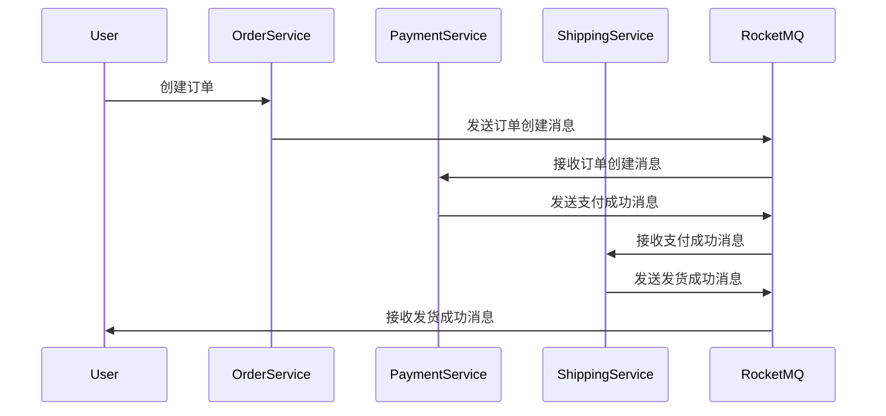

# RocketMQ 电商订单系统

## 介绍

在电商系统中，订单处理是一个核心功能。订单系统需要处理大量的并发请求，并且需要保证数据的一致性和可靠性。RocketMQ 是一个分布式消息中间件，能够帮助我们在高并发场景下实现异步处理、解耦系统、以及保证消息的可靠传递。

在本教程中，我们将通过一个简单的电商订单系统来展示如何使用 RocketMQ 来处理订单的创建、支付、发货等流程。我们将逐步讲解如何搭建 RocketMQ 环境、编写生产者与消费者代码，并通过实际案例展示 RocketMQ 在电商系统中的应用。

## RocketMQ 基础概念

在开始之前，我们需要了解一些 RocketMQ 的基本概念：

- **Producer（生产者）**：负责发送消息到 RocketMQ 的应用程序。
- **Consumer（消费者）**：负责从 RocketMQ 接收消息并处理的应用程序。
- **Topic（主题）**：消息的分类，生产者将消息发送到特定的主题，消费者订阅该主题以接收消息。
- **Broker**：RocketMQ 的服务器，负责存储和转发消息。
- **NameServer**：RocketMQ 的服务发现组件，负责管理 Broker 的地址信息。

## 搭建 RocketMQ 环境

首先，我们需要搭建一个 RocketMQ 的环境。你可以通过以下步骤来安装和启动 RocketMQ：

1. 下载 RocketMQ 的二进制包。
2. 解压并进入 RocketMQ 的目录。
3. 启动 NameServer：
   ```bash
   nohup sh bin/mqnamesrv &
   ```
4. 启动 Broker：
   ```bash
   nohup sh bin/mqbroker -n localhost:9876 &
   ```

## 创建订单系统

### 1. 订单创建

在电商系统中，订单创建是一个关键步骤。我们可以通过 RocketMQ 来实现订单创建的异步处理。

#### 生产者代码示例

```java
import org.apache.rocketmq.client.producer.DefaultMQProducer;
import org.apache.rocketmq.common.message.Message;

public class OrderProducer {
    public static void main(String[] args) throws Exception {
        // 实例化一个生产者
        DefaultMQProducer producer = new DefaultMQProducer("order_producer_group");
        // 设置 NameServer 地址
        producer.setNamesrvAddr("localhost:9876");
        // 启动生产者
        producer.start();

        // 创建订单消息
        String orderId = "ORDER_123456";
        String orderInfo = "{\"orderId\":\"" + orderId + "\",\"amount\":100.0}";
        Message msg = new Message("OrderTopic", "OrderCreate", orderId, orderInfo.getBytes());

        // 发送消息
        producer.send(msg);
        System.out.println("订单创建消息已发送: " + orderInfo);

        // 关闭生产者
        producer.shutdown();
    }
}
```

#### 消费者代码示例

```java
import org.apache.rocketmq.client.consumer.DefaultMQPushConsumer;
import org.apache.rocketmq.client.consumer.listener.ConsumeConcurrentlyContext;
import org.apache.rocketmq.client.consumer.listener.ConsumeConcurrentlyStatus;
import org.apache.rocketmq.client.consumer.listener.MessageListenerConcurrently;
import org.apache.rocketmq.common.message.MessageExt;

import java.util.List;

public class OrderConsumer {
    public static void main(String[] args) throws Exception {
        // 实例化一个消费者
        DefaultMQPushConsumer consumer = new DefaultMQPushConsumer("order_consumer_group");
        // 设置 NameServer 地址
        consumer.setNamesrvAddr("localhost:9876");
        // 订阅主题
        consumer.subscribe("OrderTopic", "OrderCreate");

        // 注册消息监听器
        consumer.registerMessageListener(new MessageListenerConcurrently() {
            @Override
            public ConsumeConcurrentlyStatus consumeMessage(List<MessageExt> msgs, ConsumeConcurrentlyContext context) {
                for (MessageExt msg : msgs) {
                    System.out.println("收到订单创建消息: " + new String(msg.getBody()));
                }
                return ConsumeConcurrentlyStatus.CONSUME_SUCCESS;
            }
        });

        // 启动消费者
        consumer.start();
        System.out.println("订单消费者已启动...");
    }
}
```

### 2. 订单支付

订单支付是订单处理流程中的另一个重要环节。我们可以通过 RocketMQ 来实现支付成功后的异步通知。

#### 生产者代码示例

```java
import org.apache.rocketmq.client.producer.DefaultMQProducer;
import org.apache.rocketmq.common.message.Message;

public class PaymentProducer {
    public static void main(String[] args) throws Exception {
        DefaultMQProducer producer = new DefaultMQProducer("payment_producer_group");
        producer.setNamesrvAddr("localhost:9876");
        producer.start();

        String orderId = "ORDER_123456";
        String paymentInfo = "{\"orderId\":\"" + orderId + "\",\"status\":\"PAID\"}";
        Message msg = new Message("OrderTopic", "PaymentSuccess", orderId, paymentInfo.getBytes());

        producer.send(msg);
        System.out.println("支付成功消息已发送: " + paymentInfo);

        producer.shutdown();
    }
}
```

#### 消费者代码示例

```java
import org.apache.rocketmq.client.consumer.DefaultMQPushConsumer;
import org.apache.rocketmq.client.consumer.listener.ConsumeConcurrentlyContext;
import org.apache.rocketmq.client.consumer.listener.ConsumeConcurrentlyStatus;
import org.apache.rocketmq.client.consumer.listener.MessageListenerConcurrently;
import org.apache.rocketmq.common.message.MessageExt;

import java.util.List;

public class PaymentConsumer {
    public static void main(String[] args) throws Exception {
        DefaultMQPushConsumer consumer = new DefaultMQPushConsumer("payment_consumer_group");
        consumer.setNamesrvAddr("localhost:9876");
        consumer.subscribe("OrderTopic", "PaymentSuccess");

        consumer.registerMessageListener(new MessageListenerConcurrently() {
            @Override
            public ConsumeConcurrentlyStatus consumeMessage(List<MessageExt> msgs, ConsumeConcurrentlyContext context) {
                for (MessageExt msg : msgs) {
                    System.out.println("收到支付成功消息: " + new String(msg.getBody()));
                }
                return ConsumeConcurrentlyStatus.CONSUME_SUCCESS;
            }
        });

        consumer.start();
        System.out.println("支付消费者已启动...");
    }
}
```

### 3. 订单发货

订单发货是订单处理流程的最后一步。我们可以通过 RocketMQ 来实现发货成功后的异步通知。

#### 生产者代码示例

```java
import org.apache.rocketmq.client.producer.DefaultMQProducer;
import org.apache.rocketmq.common.message.Message;

public class ShippingProducer {
    public static void main(String[] args) throws Exception {
        DefaultMQProducer producer = new DefaultMQProducer("shipping_producer_group");
        producer.setNamesrvAddr("localhost:9876");
        producer.start();

        String orderId = "ORDER_123456";
        String shippingInfo = "{\"orderId\":\"" + orderId + "\",\"status\":\"SHIPPED\"}";
        Message msg = new Message("OrderTopic", "ShippingSuccess", orderId, shippingInfo.getBytes());

        producer.send(msg);
        System.out.println("发货成功消息已发送: " + shippingInfo);

        producer.shutdown();
    }
}
```

#### 消费者代码示例

```java
import org.apache.rocketmq.client.consumer.DefaultMQPushConsumer;
import org.apache.rocketmq.client.consumer.listener.ConsumeConcurrentlyContext;
import org.apache.rocketmq.client.consumer.listener.ConsumeConcurrentlyStatus;
import org.apache.rocketmq.client.consumer.listener.MessageListenerConcurrently;
import org.apache.rocketmq.common.message.MessageExt;

import java.util.List;

public class ShippingConsumer {
    public static void main(String[] args) throws Exception {
        DefaultMQPushConsumer consumer = new DefaultMQPushConsumer("shipping_consumer_group");
        consumer.setNamesrvAddr("localhost:9876");
        consumer.subscribe("OrderTopic", "ShippingSuccess");

        consumer.registerMessageListener(new MessageListenerConcurrently() {
            @Override
            public ConsumeConcurrentlyStatus consumeMessage(List<MessageExt> msgs, ConsumeConcurrentlyContext context) {
                for (MessageExt msg : msgs) {
                    System.out.println("收到发货成功消息: " + new String(msg.getBody()));
                }
                return ConsumeConcurrentlyStatus.CONSUME_SUCCESS;
            }
        });

        consumer.start();
        System.out.println("发货消费者已启动...");
    }
}
```

## 实际案例

假设我们有一个电商平台，用户在平台上创建订单后，系统需要依次处理订单创建、支付、发货等流程。通过 RocketMQ，我们可以将这些流程解耦，使得每个流程可以独立处理，从而提高系统的可扩展性和可靠性。

### 流程图



## 总结

通过本教程，我们学习了如何使用 RocketMQ 构建一个电商订单系统。我们了解了 RocketMQ 的基本概念，并通过实际的代码示例展示了如何实现订单创建、支付、发货等流程的异步处理。RocketMQ 的强大功能使得我们能够轻松应对高并发场景，并保证系统的可靠性和可扩展性。

## 附加资源

- [RocketMQ 官方文档](https://rocketmq.apache.org/docs/)
- [RocketMQ GitHub 仓库](https://github.com/apache/rocketmq)

## 练习

1. 尝试扩展本教程中的订单系统，增加订单取消功能。
2. 使用 RocketMQ 的事务消息功能，确保订单创建和支付操作的原子性。
3. 部署 RocketMQ 集群，并测试在高并发场景下的性能表现。
