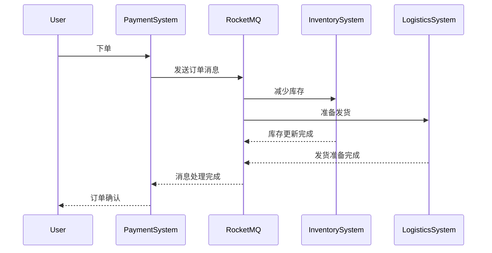

# RocketMQ 支付系统集成

在现代支付系统中，高效、可靠的消息传递是确保系统稳定性和可扩展性的关键。RocketMQ作为一款高性能、高可用的分布式消息中间件，能够很好地满足支付系统的需求。本文将带你了解如何将RocketMQ集成到支付系统中，并通过实际案例展示其应用场景。

## 什么是RocketMQ？

RocketMQ是阿里巴巴开源的一款分布式消息中间件，具有高吞吐量、低延迟、高可用性等特点。它广泛应用于电商、金融、物流等领域，特别适合处理高并发场景下的消息传递。

## 为什么选择RocketMQ？

在支付系统中，消息传递的可靠性和实时性至关重要。RocketMQ提供了以下优势：

- **高吞吐量**：支持每秒数百万条消息的处理。
- **低延迟**：消息传递延迟低至毫秒级。
- **高可用性**：支持主从架构，确保消息不丢失。
- **事务消息**：支持分布式事务，确保数据一致性。

## RocketMQ 支付系统集成步骤

### 1. 安装和配置RocketMQ

首先，你需要在服务器上安装RocketMQ。可以通过以下命令下载并安装：

```bash
wget https://archive.apache.org/dist/rocketmq/4.9.0/rocketmq-all-4.9.0-bin-release.zip
unzip rocketmq-all-4.9.0-bin-release.zip
cd rocketmq-4.9.0
```

接下来，配置RocketMQ的`broker.conf`文件，设置Broker的IP地址和端口：

```bash
brokerIP1 = 192.168.1.100
listenPort = 10911
```

### 2. 创建支付系统的消息生产者

在支付系统中，消息生产者负责将支付订单信息发送到RocketMQ。以下是一个简单的Java代码示例：

```java
import org.apache.rocketmq.client.producer.DefaultMQProducer;
import org.apache.rocketmq.common.message.Message;

public class PaymentProducer {
    public static void main(String[] args) throws Exception {
        DefaultMQProducer producer = new DefaultMQProducer("PaymentProducerGroup");
        producer.setNamesrvAddr("192.168.1.100:9876");
        producer.start();

        Message msg = new Message("PaymentTopic", "PaymentTag", "Order12345".getBytes());
        producer.send(msg);

        producer.shutdown();
    }
}
```

### 3. 创建支付系统的消息消费者

消息消费者负责从RocketMQ中接收支付订单信息并进行处理。以下是一个简单的Java代码示例：

```java
import org.apache.rocketmq.client.consumer.DefaultMQPushConsumer;
import org.apache.rocketmq.client.consumer.listener.ConsumeConcurrentlyStatus;
import org.apache.rocketmq.client.consumer.listener.MessageListenerConcurrently;
import org.apache.rocketmq.common.message.MessageExt;

public class PaymentConsumer {
    public static void main(String[] args) throws Exception {
        DefaultMQPushConsumer consumer = new DefaultMQPushConsumer("PaymentConsumerGroup");
        consumer.setNamesrvAddr("192.168.1.100:9876");
        consumer.subscribe("PaymentTopic", "*");

        consumer.registerMessageListener((MessageListenerConcurrently) (msgs, context) -> {
            for (MessageExt msg : msgs) {
                System.out.println("Received payment order: " + new String(msg.getBody()));
            }
            return ConsumeConcurrentlyStatus.CONSUME_SUCCESS;
        });

        consumer.start();
    }
}
```

### 4. 处理支付订单

在支付系统中，订单处理通常涉及多个步骤，如订单创建、支付确认、库存更新等。通过RocketMQ的事务消息，可以确保这些步骤的原子性。以下是一个事务消息的示例：

```java
import org.apache.rocketmq.client.producer.TransactionMQProducer;
import org.apache.rocketmq.client.producer.LocalTransactionState;
import org.apache.rocketmq.client.producer.TransactionListener;
import org.apache.rocketmq.common.message.Message;
import org.apache.rocketmq.common.message.MessageExt;

public class PaymentTransactionProducer {
    public static void main(String[] args) throws Exception {
        TransactionMQProducer producer = new TransactionMQProducer("PaymentTransactionGroup");
        producer.setNamesrvAddr("192.168.1.100:9876");
        producer.setTransactionListener(new TransactionListener() {
            @Override
            public LocalTransactionState executeLocalTransaction(Message msg, Object arg) {
                // 执行本地事务
                return LocalTransactionState.COMMIT_MESSAGE;
            }

            @Override
            public LocalTransactionState checkLocalTransaction(MessageExt msg) {
                // 检查本地事务状态
                return LocalTransactionState.COMMIT_MESSAGE;
            }
        });

        producer.start();

        Message msg = new Message("PaymentTopic", "PaymentTag", "Order12345".getBytes());
        producer.sendMessageInTransaction(msg, null);

        producer.shutdown();
    }
}
```

## 实际案例：电商支付系统

假设我们正在开发一个电商支付系统，用户下单后需要立即通知库存系统减少库存，并通知物流系统准备发货。通过RocketMQ，我们可以将订单信息异步发送到库存和物流系统，确保系统的高效运行。



## 总结

通过本文的学习，你应该已经掌握了如何将RocketMQ集成到支付系统中。RocketMQ的高性能和高可用性使其成为支付系统的理想选择。通过事务消息和异步处理，可以确保支付系统的高效运行和数据一致性。

## 附加资源

- [RocketMQ官方文档](https://rocketmq.apache.org/docs/)
- [RocketMQ GitHub仓库](https://github.com/apache/rocketmq)
- [分布式系统设计模式](https://en.wikipedia.org/wiki/Distributed_computing)

## 练习

1. 尝试在本地环境中安装并配置RocketMQ。
2. 编写一个简单的支付系统，使用RocketMQ进行订单消息的发送和接收。
3. 扩展支付系统，增加库存和物流系统的集成，确保订单处理的完整性。

:::tip
在实际项目中，建议使用Spring Boot等框架来简化RocketMQ的集成和管理。
:::