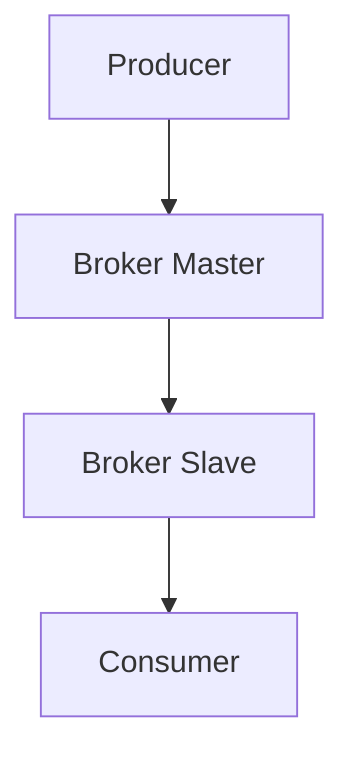

# RocketMQ 高可用部署实战

## 介绍

RocketMQ 是一款高性能、高吞吐量的分布式消息中间件，广泛应用于大规模分布式系统中。在生产环境中，确保 RocketMQ 的高可用性是至关重要的。高可用性意味着系统能够在部分节点故障的情况下继续正常运行，从而保证业务的连续性。

本文将逐步讲解如何实现 RocketMQ 的高可用部署，涵盖主从架构、集群配置、故障转移机制等内容，并通过实际案例展示其应用场景。

## RocketMQ 高可用架构

RocketMQ 的高可用性主要通过主从架构和集群部署来实现。主从架构确保了在 Master 节点故障时，Slave 节点可以接管服务；而集群部署则通过多节点冗余来避免单点故障。

### 主从架构

在 RocketMQ 中，每个 Broker 都可以配置为 Master 或 Slave。Master 负责处理所有的读写请求，而 Slave 则作为备份，实时同步 Master 的数据。当 Master 节点发生故障时，Slave 可以接管服务，确保消息的持续处理。



### 集群配置

为了实现高可用性，通常需要部署多个 Broker 节点，并将它们配置为一个集群。RocketMQ 支持多种集群模式，包括：

- **单 Master 模式**：只有一个 Master 节点，适用于测试环境。
- **多 Master 模式**：多个 Master 节点，无 Slave 节点，适用于对可用性要求不高的场景。
- **多 Master 多 Slave 模式**：多个 Master 节点，每个 Master 节点都有对应的 Slave 节点，适用于高可用性要求较高的生产环境。

## 高可用部署实战

### 1. 环境准备

在开始部署之前，确保你已经准备好以下环境：

- 至少两台服务器，分别用于部署 Master 和 Slave 节点。
- 安装 JDK 1.8 或更高版本。
- 下载并解压 RocketMQ 的最新版本。

### 2. 配置 Master 节点

在 Master 节点的 `conf` 目录下，编辑 `broker.conf` 文件，配置如下：

```properties
brokerClusterName=DefaultCluster
brokerName=broker-a
brokerId=0
deleteWhen=04
fileReservedTime=48
brokerRole=ASYNC_MASTER
flushDiskType=ASYNC_FLUSH
```

### 3. 配置 Slave 节点

在 Slave 节点的 `conf` 目录下，编辑 `broker.conf` 文件，配置如下：

```properties
brokerClusterName=DefaultCluster
brokerName=broker-a
brokerId=1
deleteWhen=04
fileReservedTime=48
brokerRole=SLAVE
flushDiskType=ASYNC_FLUSH
```

### 4. 启动 Broker

分别在 Master 和 Slave 节点上启动 Broker：

```bash
# 在 Master 节点上启动
nohup sh bin/mqbroker -c conf/broker.conf &

# 在 Slave 节点上启动
nohup sh bin/mqbroker -c conf/broker.conf &
```

### 5. 验证高可用性

为了验证高可用性，可以手动停止 Master 节点，观察 Slave 节点是否能够接管服务。同时，可以通过 RocketMQ 的控制台查看集群状态。

## 实际案例

假设我们有一个电商系统，订单服务通过 RocketMQ 发送消息给库存服务。为了确保订单消息不丢失，我们采用了多 Master 多 Slave 的部署模式。当某个 Master 节点发生故障时，Slave 节点能够立即接管，确保订单消息的持续处理。

:::tip
在实际生产环境中，建议定期进行故障演练，确保高可用机制的有效性。
:::

## 总结

通过本文的学习，你应该已经掌握了如何在生产环境中实现 RocketMQ 的高可用部署。高可用性是分布式系统设计中的重要一环，合理的主从架构和集群配置能够有效避免单点故障，确保系统的稳定运行。

## 附加资源

- [RocketMQ 官方文档](https://rocketmq.apache.org/docs/)
- [RocketMQ 高可用性最佳实践](https://rocketmq.apache.org/docs/best-practices/)

## 练习

1. 尝试在你的本地环境中部署一个多 Master 多 Slave 的 RocketMQ 集群。
2. 模拟 Master 节点故障，观察 Slave 节点是否能够成功接管服务。
3. 通过 RocketMQ 控制台查看集群状态，并记录故障转移的时间。

:::caution
在进行故障演练时，请确保不会影响到生产环境的正常运行。
:::