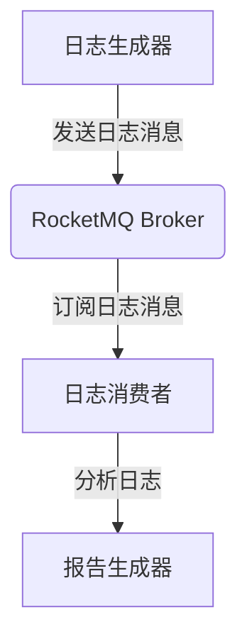

# RocketMQ 实时数据分析

## 介绍

RocketMQ 是一款高性能、高吞吐量的分布式消息中间件，广泛应用于实时数据处理场景。实时数据分析是指对数据流进行实时处理和分析，以便快速做出决策或生成实时报告。RocketMQ 提供了强大的消息传递机制，能够支持大规模的实时数据分析任务。

在本教程中，我们将探讨如何使用 RocketMQ 进行实时数据分析，并通过一个实际案例来演示其应用。

## RocketMQ 核心概念

在开始之前，我们需要了解 RocketMQ 的一些核心概念：

- **Producer**：消息的生产者，负责将消息发送到 RocketMQ 的 Broker。
- **Consumer**：消息的消费者，负责从 Broker 订阅并消费消息。
- **Topic**：消息的主题，用于对消息进行分类。
- **Broker**：RocketMQ 的消息存储和转发服务器。
- **Message Queue**：消息队列，用于存储消息。

## 实时数据分析的实现步骤

### 1. 创建 Producer

首先，我们需要创建一个 Producer 来发送消息。以下是一个简单的 Java 示例：

```java
import org.apache.rocketmq.client.producer.DefaultMQProducer;
import org.apache.rocketmq.common.message.Message;

public class RocketMQProducer {
    public static void main(String[] args) throws Exception {
        // 实例化一个生产者
        DefaultMQProducer producer = new DefaultMQProducer("producer_group");
        // 设置 NameServer 地址
        producer.setNamesrvAddr("localhost:9876");
        // 启动生产者
        producer.start();

        // 创建消息实例，指定 Topic 和消息体
        Message msg = new Message("analysis_topic", "TagA", "Hello RocketMQ".getBytes());
        // 发送消息
        producer.send(msg);

        // 关闭生产者
        producer.shutdown();
    }
}
```

### 2. 创建 Consumer

接下来，我们需要创建一个 Consumer 来消费消息并进行实时分析。以下是一个简单的 Java 示例：

```java
import org.apache.rocketmq.client.consumer.DefaultMQPushConsumer;
import org.apache.rocketmq.client.consumer.listener.ConsumeConcurrentlyContext;
import org.apache.rocketmq.client.consumer.listener.ConsumeConcurrentlyStatus;
import org.apache.rocketmq.client.consumer.listener.MessageListenerConcurrently;
import org.apache.rocketmq.common.message.MessageExt;

import java.util.List;

public class RocketMQConsumer {
    public static void main(String[] args) throws Exception {
        // 实例化一个消费者
        DefaultMQPushConsumer consumer = new DefaultMQPushConsumer("consumer_group");
        // 设置 NameServer 地址
        consumer.setNamesrvAddr("localhost:9876");
        // 订阅 Topic
        consumer.subscribe("analysis_topic", "*");

        // 注册消息监听器
        consumer.registerMessageListener(new MessageListenerConcurrently() {
            @Override
            public ConsumeConcurrentlyStatus consumeMessage(List<MessageExt> msgs, ConsumeConcurrentlyContext context) {
                for (MessageExt msg : msgs) {
                    // 处理消息
                    System.out.println("Received message: " + new String(msg.getBody()));
                }
                return ConsumeConcurrentlyStatus.CONSUME_SUCCESS;
            }
        });

        // 启动消费者
        consumer.start();
    }
}
```

### 3. 实时数据分析

在 Consumer 中，我们可以对接收到的消息进行实时分析。例如，我们可以统计消息的数量、计算平均值或进行其他复杂的计算。

```java
import java.util.concurrent.atomic.AtomicInteger;

public class RocketMQConsumer {
    private static AtomicInteger messageCount = new AtomicInteger(0);

    public static void main(String[] args) throws Exception {
        // 实例化一个消费者
        DefaultMQPushConsumer consumer = new DefaultMQPushConsumer("consumer_group");
        // 设置 NameServer 地址
        consumer.setNamesrvAddr("localhost:9876");
        // 订阅 Topic
        consumer.subscribe("analysis_topic", "*");

        // 注册消息监听器
        consumer.registerMessageListener(new MessageListenerConcurrently() {
            @Override
            public ConsumeConcurrentlyStatus consumeMessage(List<MessageExt> msgs, ConsumeConcurrentlyContext context) {
                for (MessageExt msg : msgs) {
                    // 处理消息
                    int count = messageCount.incrementAndGet();
                    System.out.println("Received message: " + new String(msg.getBody()) + ", Total messages: " + count);
                }
                return ConsumeConcurrentlyStatus.CONSUME_SUCCESS;
            }
        });

        // 启动消费者
        consumer.start();
    }
}
```

## 实际案例：实时日志分析

假设我们有一个日志系统，需要实时分析日志数据并生成报告。我们可以使用 RocketMQ 来实现这一需求。

1. **日志生成**：日志生成器将日志消息发送到 RocketMQ 的 `log_topic`。
2. **日志消费**：日志消费者从 `log_topic` 订阅消息，并进行实时分析。
3. **报告生成**：消费者将分析结果存储到数据库或生成实时报告。



## 总结

通过本教程，我们学习了如何使用 RocketMQ 进行实时数据分析。我们从 Producer 和 Consumer 的创建开始，逐步实现了实时数据分析的功能，并通过一个实际案例展示了 RocketMQ 在实时日志分析中的应用。

RocketMQ 提供了强大的消息传递机制，能够支持大规模的实时数据处理任务。希望本教程能帮助你更好地理解 RocketMQ 的实时数据分析功能，并在实际项目中应用这些知识。

## 附加资源

- [RocketMQ 官方文档](https://rocketmq.apache.org/docs/)
- [RocketMQ GitHub 仓库](https://github.com/apache/rocketmq)
- [RocketMQ 示例代码](https://github.com/apache/rocketmq-examples)

## 练习

1. 修改 Producer 代码，使其能够发送不同类型的消息（例如，包含不同标签的消息）。
2. 修改 Consumer 代码，使其能够根据消息标签进行不同的处理。
3. 尝试将分析结果存储到数据库中，并生成实时报告。

:::tip
在完成练习时，可以参考 RocketMQ 的官方文档和示例代码，以获得更多帮助。
:::