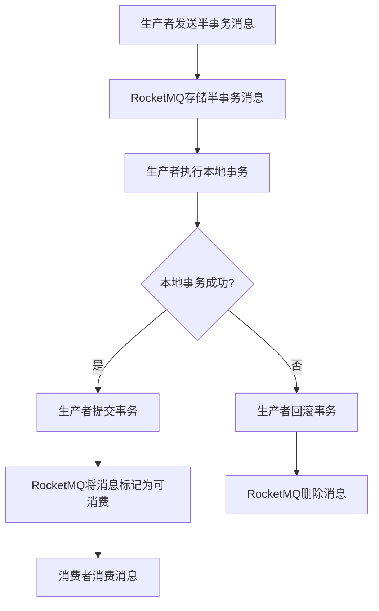

# RocketMQ 分布式事务案例

## 介绍

在分布式系统中，事务的一致性是一个非常重要的挑战。传统的单机事务在分布式环境中无法直接应用，因为多个服务可能分布在不同的机器上，甚至可能跨越不同的网络。RocketMQ 提供了一种分布式事务的解决方案，允许我们在分布式环境中实现事务的一致性。

本文将介绍 RocketMQ 的分布式事务机制，并通过一个实际案例来展示如何使用 RocketMQ 实现分布式事务。

## 什么是分布式事务？

分布式事务是指事务的参与者、资源服务器以及事务管理器分别位于不同的分布式系统的不同节点之上。分布式事务需要保证多个操作在不同节点上的一致性，通常通过两阶段提交（2PC）或消息队列等方式来实现。

RocketMQ 的分布式事务解决方案基于消息队列，通过消息的可靠传递来保证事务的最终一致性。

## RocketMQ 分布式事务机制

RocketMQ 的分布式事务机制主要分为以下几个步骤：

1. **事务消息发送**：生产者发送一条半事务消息到 RocketMQ。
2. **本地事务执行**：生产者执行本地事务。
3. **事务状态确认**：根据本地事务的执行结果，生产者向 RocketMQ 提交或回滚事务。
4. **消息消费**：消费者消费消息并执行相应的业务逻辑。

### 事务消息的生命周期



## 实际案例：订单支付系统

假设我们有一个订单支付系统，用户下单后需要完成支付操作。支付成功后，系统需要更新订单状态并发送通知。这个过程中涉及到多个服务，包括订单服务、支付服务和通知服务。

### 系统架构


### 实现步骤

1. **订单服务发送半事务消息**：订单服务在用户下单后，发送一条半事务消息到 RocketMQ。
2. **支付服务执行本地事务**：支付服务接收到消息后，执行支付操作。
3. **支付服务确认事务状态**：支付服务根据支付结果，向 RocketMQ 提交或回滚事务。
4. **通知服务消费消息**：如果事务提交成功，通知服务消费消息并发送通知。

### 代码示例

#### 订单服务发送半事务消息

```java
// 订单服务代码
public class OrderService {
    private TransactionMQProducer producer;

    public void placeOrder(Order order) {
        // 发送半事务消息
        Message msg = new Message("OrderTopic", "OrderTag", order.toString().getBytes());
        TransactionSendResult sendResult = producer.sendMessageInTransaction(msg, null);
        if (sendResult.getLocalTransactionState() == LocalTransactionState.COMMIT_MESSAGE) {
            System.out.println("订单创建成功，消息已提交");
        } else {
            System.out.println("订单创建失败，消息已回滚");
        }
    }
}
```

#### 支付服务执行本地事务

```java
// 支付服务代码
public class PaymentService implements TransactionListener {
    @Override
    public LocalTransactionState executeLocalTransaction(Message msg, Object arg) {
        try {
            // 执行支付操作
            boolean paymentSuccess = processPayment(msg);
            if (paymentSuccess) {
                return LocalTransactionState.COMMIT_MESSAGE;
            } else {
                return LocalTransactionState.ROLLBACK_MESSAGE;
            }
        } catch (Exception e) {
            return LocalTransactionState.UNKNOW;
        }
    }

    @Override
    public LocalTransactionState checkLocalTransaction(MessageExt msg) {
        // 检查本地事务状态
        return LocalTransactionState.COMMIT_MESSAGE;
    }

    private boolean processPayment(Message msg) {
        // 模拟支付操作
        return true;
    }
}
```

#### 通知服务消费消息

```java
// 通知服务代码
public class NotificationService {
    private DefaultMQPushConsumer consumer;

    public void start() throws Exception {
        consumer.subscribe("OrderTopic", "*");
        consumer.registerMessageListener((MessageListenerConcurrently) (msgs, context) -> {
            for (MessageExt msg : msgs) {
                System.out.println("收到订单支付成功通知: " + new String(msg.getBody()));
            }
            return ConsumeConcurrentlyStatus.CONSUME_SUCCESS;
        });
        consumer.start();
    }
}
```

## 总结

通过本文的介绍和案例，我们了解了 RocketMQ 的分布式事务机制及其在实际项目中的应用。RocketMQ 通过事务消息的方式，确保了分布式系统中事务的最终一致性，非常适合用于需要高可靠性的业务场景。

## 附加资源

- [RocketMQ 官方文档](https://rocketmq.apache.org/docs/)
- [分布式事务详解](https://en.wikipedia.org/wiki/Distributed_transaction)
- [RocketMQ 事务消息示例](https://github.com/apache/rocketmq/tree/master/example/src/main/java/org/apache/rocketmq/example/transaction)

## 练习

1. 尝试在本地搭建一个 RocketMQ 环境，并运行本文中的案例代码。
2. 修改案例代码，模拟支付失败的情况，观察 RocketMQ 如何处理事务回滚。
3. 研究 RocketMQ 的事务消息机制，尝试实现一个更复杂的分布式事务场景。
