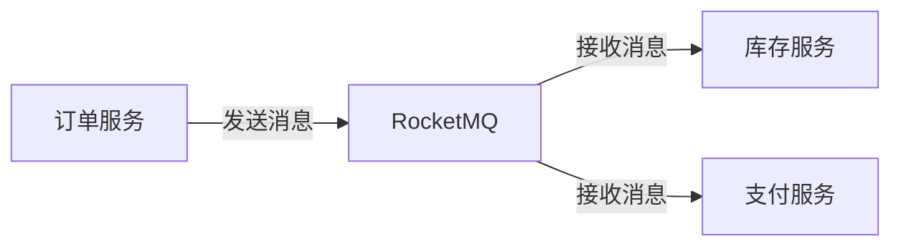
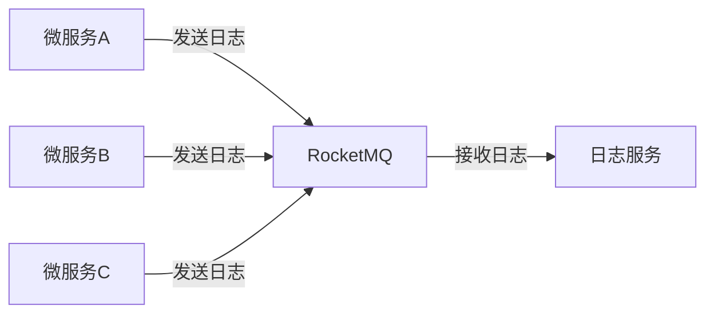

# RocketMQ 微服务通信

在现代分布式系统中，微服务架构已经成为主流。微服务之间的通信是构建高效、可扩展系统的关键。RocketMQ作为一款高性能、高可用的分布式消息中间件，为微服务之间的异步通信提供了强大的支持。本文将详细介绍如何使用RocketMQ实现微服务通信，并通过实际案例展示其应用场景。

## 什么是RocketMQ？

RocketMQ是阿里巴巴开源的一款分布式消息中间件，具有高吞吐量、低延迟、高可用性等特点。它广泛应用于电商、金融、物流等领域，支持异步通信、消息队列、消息广播等多种模式。

## 微服务通信的核心概念

在微服务架构中，服务之间的通信通常分为同步和异步两种方式。同步通信通常通过HTTP或RPC实现，而异步通信则依赖于消息中间件。RocketMQ正是为异步通信而设计的。

### 异步通信的优势

- **解耦**：服务之间通过消息队列进行通信，降低了服务之间的耦合度。
- **弹性**：消息队列可以缓冲消息，避免服务因瞬时高负载而崩溃。
- **可靠性**：RocketMQ提供了消息持久化、重试机制等，确保消息不丢失。

## RocketMQ 的核心组件

RocketMQ主要由以下几个核心组件组成：

- **Producer**：消息生产者，负责发送消息。
- **Consumer**：消息消费者，负责接收消息。
- **Broker**：消息代理，负责存储和转发消息。
- **NameServer**：服务发现组件，负责管理Broker的地址信息。

## 如何使用RocketMQ实现微服务通信

### 1. 安装和配置RocketMQ

首先，你需要在本地或服务器上安装RocketMQ。可以从[官方网站](https://rocketmq.apache.org/)下载并安装。

### 2. 创建生产者

以下是一个简单的RocketMQ生产者示例，使用Java编写：

```java
import org.apache.rocketmq.client.producer.DefaultMQProducer;
import org.apache.rocketmq.common.message.Message;

public class Producer {
    public static void main(String[] args) throws Exception {
        // 实例化生产者
        DefaultMQProducer producer = new DefaultMQProducer("ProducerGroup");
        // 设置NameServer地址
        producer.setNamesrvAddr("localhost:9876");
        // 启动生产者
        producer.start();

        // 创建消息
        Message msg = new Message("TopicTest", "TagA", "Hello RocketMQ".getBytes());
        // 发送消息
        producer.send(msg);

        // 关闭生产者
        producer.shutdown();
    }
}
```

### 3. 创建消费者

以下是一个简单的RocketMQ消费者示例，同样使用Java编写：

```java
import org.apache.rocketmq.client.consumer.DefaultMQPushConsumer;
import org.apache.rocketmq.client.consumer.listener.ConsumeConcurrentlyContext;
import org.apache.rocketmq.client.consumer.listener.ConsumeConcurrentlyStatus;
import org.apache.rocketmq.client.consumer.listener.MessageListenerConcurrently;
import org.apache.rocketmq.common.message.MessageExt;

import java.util.List;

public class Consumer {
    public static void main(String[] args) throws Exception {
        // 实例化消费者
        DefaultMQPushConsumer consumer = new DefaultMQPushConsumer("ConsumerGroup");
        // 设置NameServer地址
        consumer.setNamesrvAddr("localhost:9876");
        // 订阅Topic和Tag
        consumer.subscribe("TopicTest", "*");

        // 注册消息监听器
        consumer.registerMessageListener(new MessageListenerConcurrently() {
            @Override
            public ConsumeConcurrentlyStatus consumeMessage(List<MessageExt> msgs, ConsumeConcurrentlyContext context) {
                for (MessageExt msg : msgs) {
                    System.out.println("Received message: " + new String(msg.getBody()));
                }
                return ConsumeConcurrentlyStatus.CONSUME_SUCCESS;
            }
        });

        // 启动消费者
        consumer.start();
    }
}
```

### 4. 运行示例

运行生产者和消费者代码后，你将看到消费者接收到生产者发送的消息。

## 实际应用场景

### 电商订单系统

在电商系统中，订单服务需要通知库存服务、支付服务等多个微服务。使用RocketMQ，订单服务可以将订单信息发送到消息队列，其他服务通过订阅相应的Topic来接收消息并处理。



### 日志收集系统

在分布式系统中，日志收集是一个常见的需求。各个微服务可以将日志信息发送到RocketMQ，日志服务通过订阅消息队列来收集和处理日志。



## 总结

RocketMQ为微服务之间的异步通信提供了强大的支持。通过消息队列，服务之间可以实现解耦、弹性扩展和可靠通信。本文介绍了RocketMQ的核心概念、代码示例以及实际应用场景，帮助你快速上手RocketMQ微服务通信。

## 附加资源

- [RocketMQ官方文档](https://rocketmq.apache.org/docs/)
- [RocketMQ GitHub仓库](https://github.com/apache/rocketmq)
- [微服务架构设计模式](https://microservices.io/)

## 练习

1. 尝试修改生产者代码，发送不同类型的消息（如JSON格式的消息）。
2. 在消费者代码中，添加对消息的处理逻辑，如将消息存储到数据库。
3. 部署RocketMQ集群，并测试其高可用性。

:::tip
在实际生产环境中，建议使用RocketMQ的集群模式，以提高系统的可用性和可靠性。
:::