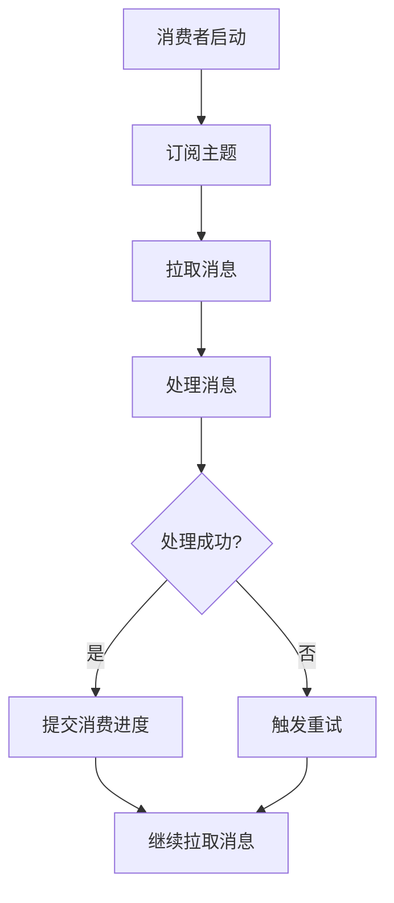

# RocketMQ 消费者最佳实践

RocketMQ是一款高性能、高可用的分布式消息中间件，广泛应用于大规模分布式系统中。消费者是RocketMQ中负责从消息队列中拉取消息并进行处理的组件。为了确保消费者能够高效、稳定地运行，遵循一些最佳实践是非常重要的。

## 1. 消费者简介

在RocketMQ中，消费者通过订阅主题（Topic）来接收消息。消费者可以是集群模式（Clustering）或广播模式（Broadcasting）。在集群模式下，同一个消费者组中的多个消费者实例会分摊消息的消费；而在广播模式下，每个消费者实例都会接收到所有消息。

## 2. 消费者最佳实践

### 2.1 合理设置消费者组

消费者组（Consumer Group）是RocketMQ中非常重要的概念。同一个消费者组中的消费者实例会共同消费消息。因此，合理设置消费者组可以提高消息的消费效率。

```java
DefaultMQPushConsumer consumer = new DefaultMQPushConsumer("my_consumer_group");
consumer.subscribe("my_topic", "*");
```

:::tip
建议为每个业务场景设置不同的消费者组，避免不同业务之间的消息消费相互影响。
:::

### 2.2 使用集群模式

在大多数场景下，建议使用集群模式。集群模式下，同一个消费者组中的多个消费者实例会分摊消息的消费，从而提高消费能力。

```java
consumer.setMessageModel(MessageModel.CLUSTERING);
```

### 2.3 设置合理的并发消费线程数

RocketMQ消费者默认会使用多个线程并发消费消息。通过设置合理的并发消费线程数，可以充分利用系统资源，提高消费速度。

```java
consumer.setConsumeThreadMin(20);
consumer.setConsumeThreadMax(64);
```

:::caution
并发线程数设置过高可能会导致系统资源耗尽，设置过低则可能导致消费速度跟不上消息生产速度。
:::

### 2.4 处理消费失败的消息

在实际应用中，消费者可能会遇到消息处理失败的情况。RocketMQ提供了重试机制，消费者可以通过返回 `RECONSUME_LATER` 来触发消息重试。

```java
consumer.registerMessageListener((MessageListenerConcurrently) (msgs, context) -> {
    for (MessageExt msg : msgs) {
        try {
            // 处理消息
            processMessage(msg);
        } catch (Exception e) {
            // 处理失败，触发重试
            return ConsumeConcurrentlyStatus.RECONSUME_LATER;
        }
    }
    return ConsumeConcurrentlyStatus.CONSUME_SUCCESS;
});
```

:::warning
重试次数过多可能会导致消息堆积，建议在重试一定次数后将消息记录到日志或数据库中，进行人工处理。
:::

### 2.5 监控消费者状态

为了确保消费者能够稳定运行，建议定期监控消费者的状态。可以通过RocketMQ提供的管理工具或自定义监控系统来监控消费者的消费速度、消息堆积情况等。



## 3. 实际案例

假设我们有一个订单处理系统，订单消息通过RocketMQ进行传递。我们可以通过以下步骤来实现一个高效的消费者：

1. **创建消费者组**：为订单处理系统创建一个独立的消费者组，例如 `order_consumer_group`。
2. **订阅订单主题**：消费者订阅订单主题 `order_topic`。
3. **设置并发消费线程数**：根据系统资源设置合理的并发消费线程数，例如20到64之间。
4. **处理订单消息**：在消息处理逻辑中，处理订单并记录处理结果。如果处理失败，触发重试机制。
5. **监控消费者状态**：定期监控消费者的消费速度和消息堆积情况，确保系统稳定运行。

```java
DefaultMQPushConsumer consumer = new DefaultMQPushConsumer("order_consumer_group");
consumer.subscribe("order_topic", "*");
consumer.setConsumeThreadMin(20);
consumer.setConsumeThreadMax(64);
consumer.registerMessageListener((MessageListenerConcurrently) (msgs, context) -> {
    for (MessageExt msg : msgs) {
        try {
            // 处理订单消息
            processOrder(msg);
        } catch (Exception e) {
            // 处理失败，触发重试
            return ConsumeConcurrentlyStatus.RECONSUME_LATER;
        }
    }
    return ConsumeConcurrentlyStatus.CONSUME_SUCCESS;
});
consumer.start();
```

## 4. 总结

通过遵循上述最佳实践，您可以构建一个高效、稳定的RocketMQ消费者。合理设置消费者组、使用集群模式、设置合理的并发消费线程数、处理消费失败的消息以及监控消费者状态，都是确保消费者稳定运行的关键。

## 5. 附加资源与练习

- **RocketMQ官方文档**：了解更多关于RocketMQ的详细信息和高级用法。
- **练习**：尝试在自己的项目中实现一个RocketMQ消费者，并监控其运行状态。
- **扩展阅读**：学习如何通过RocketMQ实现消息的顺序消费和事务消息。

:::note
通过不断实践和优化，您将能够更好地掌握RocketMQ消费者的使用技巧，并在实际项目中发挥其强大的功能。
:::