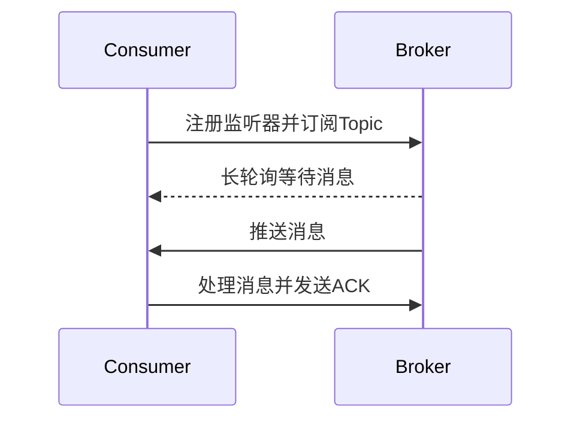

# RocketMQ 推送模式

RocketMQ 是一款高性能、高吞吐量的分布式消息中间件，广泛应用于大规模分布式系统中。在 RocketMQ 中，消费者有两种主要的消息消费模式：**拉取模式（Pull）** 和 **推送模式（Push）**。本文将重点介绍 RocketMQ 的推送模式，帮助初学者理解其工作原理、使用场景以及如何在实际项目中应用。

## 什么是推送模式？

推送模式是 RocketMQ 中消费者主动从消息队列中获取消息的一种方式。在这种模式下，RocketMQ 的 Broker（消息代理）会将消息主动推送给消费者，消费者无需主动拉取消息。推送模式的核心思想是让消费者尽可能快地处理消息，从而提高系统的实时性和吞吐量。

:::note
推送模式并不是真正的“推送”，而是 RocketMQ 在内部实现了一个长轮询机制，模拟了推送的效果。
:::

## 推送模式的工作原理

在推送模式下，RocketMQ 的消费者会向 Broker 注册一个监听器（Listener），当 Broker 中有新消息到达时，会通过长轮询的方式将消息推送给消费者。消费者接收到消息后，会立即进行处理。

### 工作流程

1. **消费者启动**：消费者启动时，会向 Broker 注册一个监听器，并订阅感兴趣的主题（Topic）。
2. **消息到达**：当 Broker 中有新消息到达时，会通过长轮询的方式将消息推送给消费者。
3. **消息处理**：消费者接收到消息后，会立即调用注册的监听器进行处理。
4. **消息确认**：消费者处理完消息后，会向 Broker 发送确认（ACK），表示消息已成功处理。



## 推送模式的代码示例

以下是一个简单的 RocketMQ 推送模式的代码示例，展示了如何使用 RocketMQ 的 Java 客户端实现消息的推送消费。

```java
import org.apache.rocketmq.client.consumer.DefaultMQPushConsumer;
import org.apache.rocketmq.client.consumer.listener.ConsumeConcurrentlyStatus;
import org.apache.rocketmq.client.consumer.listener.MessageListenerConcurrently;
import org.apache.rocketmq.client.exception.MQClientException;
import org.apache.rocketmq.common.message.MessageExt;

public class PushConsumerExample {
    public static void main(String[] args) throws MQClientException {
        // 创建消费者实例，指定消费者组名
        DefaultMQPushConsumer consumer = new DefaultMQPushConsumer("example_group");

        // 指定NameServer地址
        consumer.setNamesrvAddr("localhost:9876");

        // 订阅Topic，指定Tag为"*"表示消费所有Tag的消息
        consumer.subscribe("example_topic", "*");

        // 注册消息监听器
        consumer.registerMessageListener((MessageListenerConcurrently) (msgs, context) -> {
            for (MessageExt msg : msgs) {
                System.out.printf("收到消息: %s%n", new String(msg.getBody()));
            }
            // 返回消费状态，CONSUME_SUCCESS表示消费成功
            return ConsumeConcurrentlyStatus.CONSUME_SUCCESS;
        });

        // 启动消费者
        consumer.start();
        System.out.println("消费者已启动，等待消息...");
    }
}
```

### 代码解释

1. **DefaultMQPushConsumer**：这是 RocketMQ 提供的推送模式消费者类，用于接收 Broker 推送的消息。
2. **setNamesrvAddr**：设置 NameServer 的地址，NameServer 是 RocketMQ 的服务发现组件。
3. **subscribe**：订阅指定的 Topic 和 Tag，Tag 可以用于过滤消息。
4. **registerMessageListener**：注册消息监听器，当有消息到达时，会调用该监听器进行处理。
5. **start**：启动消费者，开始接收消息。

## 推送模式的实际应用场景

推送模式适用于以下场景：

1. **实时性要求高的场景**：如即时通讯、实时监控等，需要尽可能快地处理消息。
2. **消息量较大的场景**：推送模式可以减少消费者的轮询开销，提高系统的吞吐量。
3. **消费者处理能力较强的场景**：推送模式要求消费者能够快速处理消息，否则可能会导致消息堆积。

:::tip
在实际应用中，推送模式通常与消息的批量处理结合使用，以进一步提高系统的处理效率。
:::

## 总结

RocketMQ 的推送模式是一种高效的消息消费方式，适用于实时性要求高、消息量大的场景。通过本文的介绍，你应该已经了解了推送模式的工作原理、代码实现以及实际应用场景。希望这些内容能够帮助你在实际项目中更好地使用 RocketMQ。

## 附加资源与练习

- **官方文档**：阅读 [RocketMQ 官方文档](https://rocketmq.apache.org/docs/) 以获取更多关于推送模式的详细信息。
- **练习**：尝试在本地搭建一个 RocketMQ 环境，并使用推送模式实现一个简单的消息消费程序。

:::caution
在实际生产环境中，务必注意消费者的处理能力，避免因消息堆积导致系统性能下降。
:::