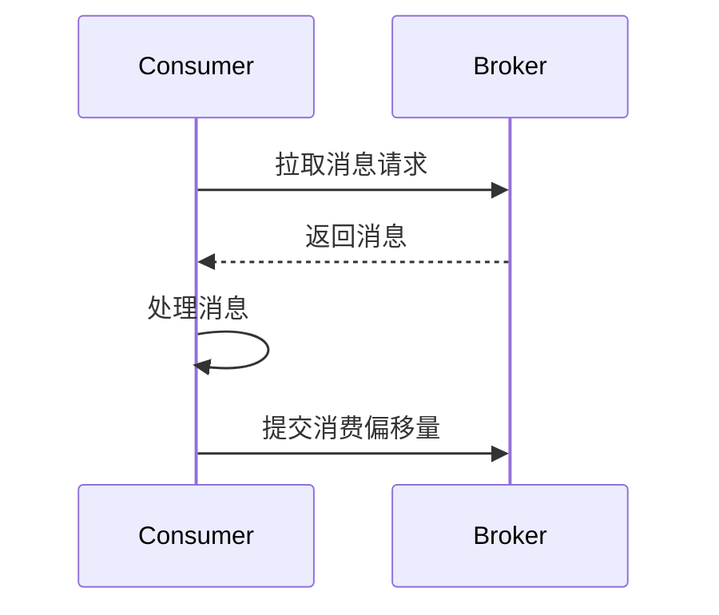

# RocketMQ 拉取模式

RocketMQ 是一个分布式消息中间件，支持多种消息消费模式。其中，**拉取模式（Pull Mode）** 是一种由消费者主动从消息队列中拉取消息的消费方式。与推送模式（Push Mode）不同，拉取模式将消息的获取控制权交给了消费者，适合需要精细控制消息消费的场景。

## 什么是拉取模式？

在拉取模式中，消费者主动向消息队列请求消息，而不是由消息队列主动推送消息给消费者。这种方式允许消费者根据自己的处理能力来决定何时拉取消息以及拉取多少消息，从而避免了消息堆积或消费者过载的问题。

### 拉取模式的核心特点
1. **消费者主动控制**：消费者决定何时拉取消息以及拉取的数量。
2. **灵活性高**：适合需要根据业务逻辑动态调整消费速率的场景。
3. **资源占用可控**：消费者可以根据自身负载情况调整拉取频率，避免资源浪费。

## 拉取模式的工作原理

在拉取模式下，消费者通过调用 `pull` 方法从消息队列中获取消息。RocketMQ 提供了 `DefaultMQPullConsumer` 类来实现拉取模式。以下是拉取模式的基本流程：

1. 消费者启动并连接到 RocketMQ 的 Broker。
2. 消费者通过 `pull` 方法从指定的消息队列中拉取消息。
3. 消费者处理拉取到的消息。
4. 消费者根据处理结果决定是否提交消费偏移量（offset）。



## 代码示例

以下是一个使用 `DefaultMQPullConsumer` 实现拉取模式的简单示例：

```java
import org.apache.rocketmq.client.consumer.DefaultMQPullConsumer;
import org.apache.rocketmq.client.consumer.PullResult;
import org.apache.rocketmq.common.message.MessageQueue;

public class PullConsumerExample {
    public static void main(String[] args) throws Exception {
        // 创建拉取模式的消费者
        DefaultMQPullConsumer consumer = new DefaultMQPullConsumer("PullConsumerGroup");
        consumer.setNamesrvAddr("localhost:9876");
        consumer.start();

        // 获取消息队列
        MessageQueue messageQueue = new MessageQueue("TestTopic", "BrokerA", 0);

        // 拉取消息
        long offset = 0; // 从偏移量0开始拉取
        PullResult pullResult = consumer.pull(messageQueue, "*", offset, 32);

        // 处理拉取到的消息
        switch (pullResult.getPullStatus()) {
            case FOUND:
                pullResult.getMsgFoundList().forEach(msg -> {
                    System.out.println("收到消息: " + new String(msg.getBody()));
                });
                break;
            case NO_NEW_MSG:
                System.out.println("没有新消息");
                break;
            case NO_MATCHED_MSG:
                System.out.println("没有匹配的消息");
                break;
            case OFFSET_ILLEGAL:
                System.out.println("偏移量非法");
                break;
            default:
                break;
        }

        // 提交消费偏移量
        consumer.updateConsumeOffset(messageQueue, pullResult.getNextBeginOffset());

        // 关闭消费者
        consumer.shutdown();
    }
}
```

### 代码说明
1. **DefaultMQPullConsumer**：用于创建拉取模式的消费者实例。
2. **pull 方法**：从指定的消息队列中拉取消息，参数包括消息队列、过滤表达式、起始偏移量和最大拉取数量。
3. **PullResult**：拉取结果对象，包含拉取状态和消息列表。
4. **updateConsumeOffset**：提交消费偏移量，确保下次拉取从正确的位置开始。

:::tip
在实际应用中，建议根据业务需求动态调整拉取频率和拉取数量，以避免频繁拉取导致性能问题。
:::

## 实际应用场景

拉取模式适用于以下场景：
1. **批量处理**：需要一次性拉取大量消息进行批量处理的场景。
2. **延迟消费**：消费者需要根据业务逻辑延迟处理消息的场景。
3. **资源受限环境**：在资源受限的环境中，消费者需要根据自身负载动态调整拉取频率。

例如，在日志处理系统中，消费者可以定时拉取日志消息并进行批量处理，从而提高处理效率。

## 总结

RocketMQ 的拉取模式为消费者提供了更高的灵活性和控制权，适合需要精细控制消息消费的场景。通过 `DefaultMQPullConsumer`，开发者可以轻松实现消息的拉取消费，并根据业务需求动态调整拉取策略。

:::note
拉取模式虽然灵活，但也需要开发者手动管理消费偏移量和拉取频率，因此在复杂场景中可能需要更多的开发工作量。
:::

## 附加资源与练习

1. **官方文档**：阅读 [RocketMQ 官方文档](https://rocketmq.apache.org/docs/) 了解更多关于拉取模式的细节。
2. **练习**：尝试修改上述代码，实现定时拉取消息的功能，并观察拉取频率对系统性能的影响。
3. **扩展阅读**：了解 RocketMQ 的推送模式（Push Mode），并与拉取模式进行对比分析。

通过以上内容，你应该已经掌握了 RocketMQ 拉取模式的基本概念和使用方法。继续深入学习 RocketMQ 的其他特性，提升你的消息中间件开发能力！