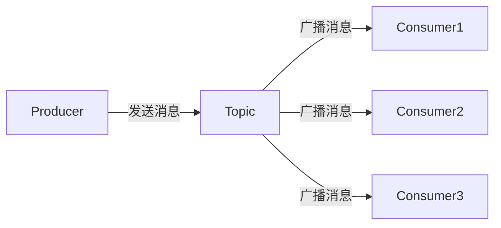

# RocketMQ 广播消费

RocketMQ 是一个分布式消息中间件，支持多种消息消费模式。其中，**广播消费**是一种特殊的消费模式，适用于需要将消息发送给所有消费者的场景。本文将详细介绍 RocketMQ 广播消费的概念、工作原理、实现方式以及实际应用场景。

## 什么是广播消费？

在 RocketMQ 中，广播消费是指一条消息被发送到所有订阅了该主题的消费者实例。与集群消费模式不同，集群消费模式下，一条消息只会被一个消费者实例消费，而广播消费模式下，所有消费者实例都会收到并处理同一条消息。

:::note
广播消费适用于需要将消息广播给所有消费者的场景，例如配置更新、日志分发等。
:::

## 广播消费的工作原理

在广播消费模式下，RocketMQ 会将消息发送到所有订阅了该主题的消费者实例。每个消费者实例都会独立处理消息，彼此之间不会相互影响。



如上图所示，生产者将消息发送到主题（Topic），然后主题将消息广播给所有订阅了该主题的消费者实例。

## 如何实现广播消费？

在 RocketMQ 中，实现广播消费非常简单。你只需要在消费者端设置消费模式为广播模式即可。

### 代码示例

以下是一个使用 Java 实现的 RocketMQ 广播消费的示例：

```java
import org.apache.rocketmq.client.consumer.DefaultMQPushConsumer;
import org.apache.rocketmq.client.consumer.listener.ConsumeConcurrentlyContext;
import org.apache.rocketmq.client.consumer.listener.ConsumeConcurrentlyStatus;
import org.apache.rocketmq.client.consumer.listener.MessageListenerConcurrently;
import org.apache.rocketmq.common.message.MessageExt;
import org.apache.rocketmq.common.protocol.heartbeat.MessageModel;

import java.util.List;

public class BroadcastConsumer {
    public static void main(String[] args) throws Exception {
        // 实例化消费者
        DefaultMQPushConsumer consumer = new DefaultMQPushConsumer("broadcast_consumer_group");

        // 设置NameServer地址
        consumer.setNamesrvAddr("localhost:9876");

        // 订阅主题
        consumer.subscribe("broadcast_topic", "*");

        // 设置消费模式为广播模式
        consumer.setMessageModel(MessageModel.BROADCASTING);

        // 注册消息监听器
        consumer.registerMessageListener(new MessageListenerConcurrently() {
            @Override
            public ConsumeConcurrentlyStatus consumeMessage(List<MessageExt> msgs, ConsumeConcurrentlyContext context) {
                for (MessageExt msg : msgs) {
                    System.out.println("Received message: " + new String(msg.getBody()));
                }
                return ConsumeConcurrentlyStatus.CONSUME_SUCCESS;
            }
        });

        // 启动消费者
        consumer.start();
        System.out.println("Broadcast Consumer Started.");
    }
}
```

### 代码解释

1. **DefaultMQPushConsumer**: 这是 RocketMQ 提供的默认消费者实现类。
2. **setNamesrvAddr**: 设置 NameServer 地址，NameServer 是 RocketMQ 的服务发现组件。
3. **subscribe**: 订阅指定的主题和标签（Tag），这里使用 `*` 表示订阅所有标签的消息。
4. **setMessageModel**: 设置消费模式为广播模式（`MessageModel.BROADCASTING`）。
5. **registerMessageListener**: 注册消息监听器，用于处理接收到的消息。
6. **start**: 启动消费者。

### 运行结果

当你运行上述代码时，所有订阅了 `broadcast_topic` 的消费者实例都会收到并处理同一条消息。

## 实际应用场景

广播消费在实际应用中有很多场景，以下是一些常见的例子：

1. **配置更新**: 当系统配置发生变化时，可以通过广播消费模式将新的配置推送到所有服务实例。
2. **日志分发**: 在分布式系统中，可以将日志消息广播给所有日志收集器，以便进行集中处理和分析。
3. **通知推送**: 在需要向所有用户推送通知的场景下，可以使用广播消费模式。

## 总结

RocketMQ 的广播消费模式是一种强大的消息分发机制，适用于需要将消息发送给所有消费者的场景。通过本文的介绍，你应该已经了解了广播消费的工作原理、实现方式以及实际应用场景。

:::tip
在实际项目中，选择广播消费还是集群消费取决于具体的业务需求。广播消费适用于需要消息广播的场景，而集群消费则适用于需要负载均衡的场景。
:::

## 附加资源

- [RocketMQ 官方文档](https://rocketmq.apache.org/docs/)
- [RocketMQ GitHub 仓库](https://github.com/apache/rocketmq)

## 练习

1. 尝试修改上述代码，使其订阅不同的主题和标签。
2. 在本地搭建一个 RocketMQ 环境，并运行广播消费的示例代码，观察消息的消费情况。
3. 思考并列举出更多适合使用广播消费的场景。

希望本文能帮助你更好地理解 RocketMQ 的广播消费模式，并在实际项目中灵活运用！