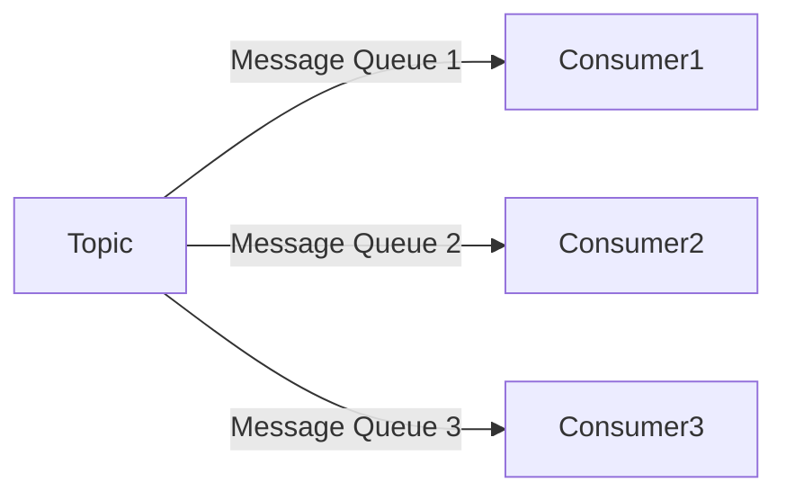
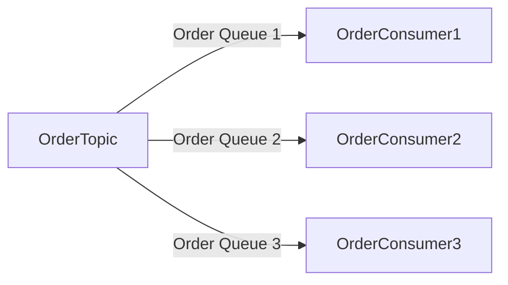
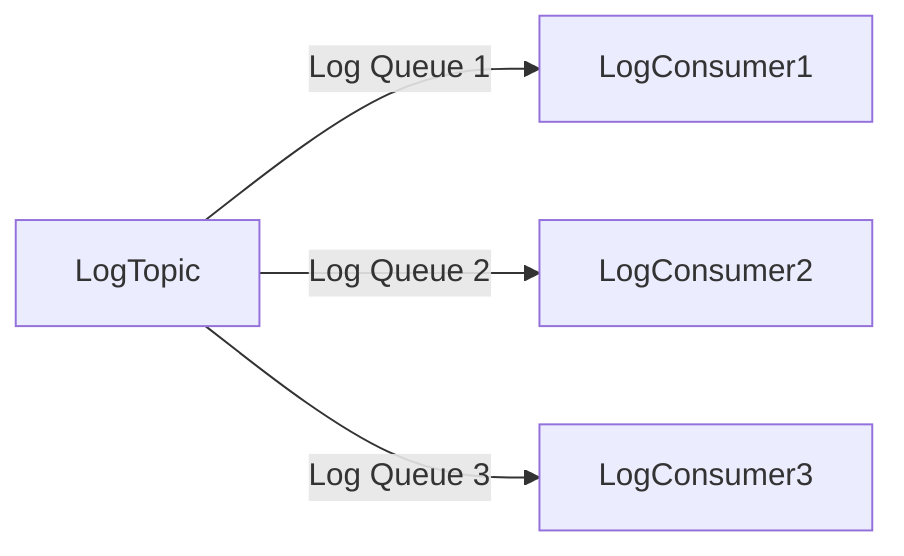

# RocketMQ 集群消费

RocketMQ 是一个分布式消息中间件，广泛应用于大规模分布式系统中。在 RocketMQ 中，消费者可以通过**集群消费**模式来消费消息。本文将详细介绍 RocketMQ 集群消费的概念、工作原理、配置方法以及实际应用场景。

## 什么是集群消费？

集群消费（Cluster Consumption）是 RocketMQ 中一种常见的消费模式。在这种模式下，多个消费者实例组成一个消费者组（Consumer Group），共同消费同一个主题（Topic）下的消息。RocketMQ 会确保每条消息只会被消费者组中的一个消费者实例消费，从而实现负载均衡和高可用性。

:::note
集群消费模式适用于需要高并发、高可用性的场景，例如订单处理、日志收集等。
:::

## 集群消费的工作原理

在集群消费模式下，RocketMQ 会将消息队列（Message Queue）分配给消费者组中的不同消费者实例。每个消费者实例负责消费分配给它的消息队列中的消息。RocketMQ 会动态调整消息队列的分配，以确保负载均衡。



如上图所示，一个主题（Topic）下有多个消息队列（Message Queue），每个消息队列被分配给消费者组中的一个消费者实例。

## 配置集群消费

在 RocketMQ 中，配置集群消费非常简单。以下是一个使用 Java 客户端配置集群消费的示例：

```java
import org.apache.rocketmq.client.consumer.DefaultMQPushConsumer;
import org.apache.rocketmq.client.consumer.listener.ConsumeConcurrentlyStatus;
import org.apache.rocketmq.client.consumer.listener.MessageListenerConcurrently;
import org.apache.rocketmq.common.message.MessageExt;

public class ClusterConsumer {
    public static void main(String[] args) throws Exception {
        // 创建消费者实例，指定消费者组名称
        DefaultMQPushConsumer consumer = new DefaultMQPushConsumer("MyConsumerGroup");

        // 指定NameServer地址
        consumer.setNamesrvAddr("localhost:9876");

        // 订阅主题，指定标签（Tag）为 "*"，表示消费所有消息
        consumer.subscribe("MyTopic", "*");

        // 注册消息监听器
        consumer.registerMessageListener((MessageListenerConcurrently) (msgs, context) -> {
            for (MessageExt msg : msgs) {
                System.out.printf("收到消息: %s%n", new String(msg.getBody()));
            }
            return ConsumeConcurrentlyStatus.CONSUME_SUCCESS;
        });

        // 启动消费者
        consumer.start();
        System.out.println("消费者已启动");
    }
}
```

### 代码解释

1. **DefaultMQPushConsumer**: 创建一个消费者实例，指定消费者组名称。
2. **setNamesrvAddr**: 设置 NameServer 地址，NameServer 是 RocketMQ 的服务发现组件。
3. **subscribe**: 订阅主题，并指定标签（Tag）。标签用于过滤消息，`"*"` 表示消费所有消息。
4. **registerMessageListener**: 注册消息监听器，处理接收到的消息。
5. **start**: 启动消费者。

:::tip
在实际生产环境中，建议将 NameServer 地址配置为集群模式，以提高系统的可用性。
:::

## 实际应用场景

### 订单处理系统

假设我们有一个订单处理系统，订单消息通过 RocketMQ 进行传递。为了提高系统的处理能力，我们可以使用集群消费模式，将订单消息分配给多个消费者实例进行处理。



在这个场景中，每个消费者实例负责处理一部分订单消息，从而实现高并发处理。

### 日志收集系统

在日志收集系统中，日志消息通过 RocketMQ 进行传递。使用集群消费模式，可以将日志消息分配给多个消费者实例进行存储或分析。



通过集群消费模式，日志收集系统可以高效地处理大量的日志消息。

## 总结

RocketMQ 的集群消费模式是一种高效、可靠的消息消费方式，适用于需要高并发、高可用性的场景。通过合理配置消费者组和消息队列，可以实现消息的负载均衡和高可用性。

在实际应用中，集群消费模式广泛应用于订单处理、日志收集等场景。通过本文的介绍，你应该已经掌握了 RocketMQ 集群消费的基本概念、配置方法以及实际应用场景。

## 附加资源与练习

- **练习**: 尝试在自己的 RocketMQ 环境中配置一个集群消费的消费者组，并观察消息的消费情况。
- **资源**: 参考 [RocketMQ 官方文档](https://rocketmq.apache.org/docs/) 了解更多关于集群消费的配置和优化技巧。

:::caution
在实际生产环境中，务必注意消费者的并发能力和消息的消费速度，避免消息堆积。
:::