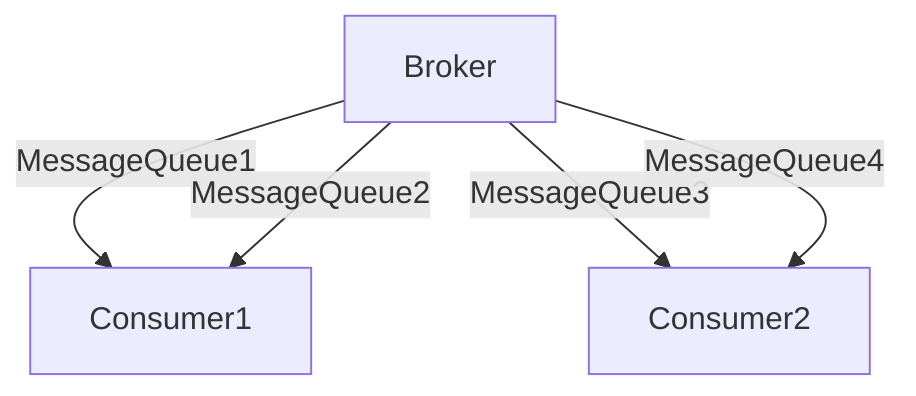

# RocketMQ 消费者负载均衡

在分布式消息队列系统中，负载均衡是一个至关重要的概念。RocketMQ作为一款高性能、高可用的消息中间件，其消费者负载均衡机制确保了消息的高效处理和系统的稳定性。本文将详细介绍RocketMQ消费者负载均衡的概念、实现方式以及实际应用场景。

## 什么是消费者负载均衡？

消费者负载均衡是指在多个消费者实例之间分配消息处理任务的过程。其目的是确保每个消费者实例都能公平地处理消息，避免某些消费者过载而其他消费者空闲的情况。RocketMQ通过其内置的负载均衡机制，能够动态地将消息队列分配给不同的消费者实例，从而实现高效的消息处理。

## RocketMQ 消费者负载均衡的工作原理

RocketMQ的消费者负载均衡机制主要依赖于以下几个关键组件：

1. **Broker**：负责存储消息并将消息分发给消费者。
2. **Consumer Group**：一组消费者实例，共同消费同一个主题的消息。
3. **MessageQueue**：消息队列，每个队列对应一个Broker上的一个分区。

### 负载均衡策略

RocketMQ提供了多种负载均衡策略，默认使用的是**平均分配策略**。该策略会将所有消息队列平均分配给消费者组中的每个消费者实例。例如，如果有4个消息队列和2个消费者实例，那么每个消费者实例将负责处理2个队列。



### 代码示例

以下是一个简单的RocketMQ消费者负载均衡的代码示例：

```java
import org.apache.rocketmq.client.consumer.DefaultMQPushConsumer;
import org.apache.rocketmq.client.consumer.listener.ConsumeConcurrentlyStatus;
import org.apache.rocketmq.client.consumer.listener.MessageListenerConcurrently;
import org.apache.rocketmq.common.message.MessageExt;

public class RocketMQConsumerExample {
    public static void main(String[] args) throws Exception {
        // 创建消费者实例，指定消费者组名称
        DefaultMQPushConsumer consumer = new DefaultMQPushConsumer("ConsumerGroup");

        // 设置NameServer地址
        consumer.setNamesrvAddr("localhost:9876");

        // 订阅主题
        consumer.subscribe("TestTopic", "*");

        // 注册消息监听器
        consumer.registerMessageListener((MessageListenerConcurrently) (msgs, context) -> {
            for (MessageExt msg : msgs) {
                System.out.println("Received message: " + new String(msg.getBody()));
            }
            return ConsumeConcurrentlyStatus.CONSUME_SUCCESS;
        });

        // 启动消费者
        consumer.start();
        System.out.println("Consumer started.");
    }
}
```

在这个示例中，`DefaultMQPushConsumer`会自动处理消息队列的负载均衡，确保每个消费者实例都能公平地处理消息。

## 实际应用场景

### 电商订单处理

假设有一个电商平台，每天需要处理大量的订单消息。为了提高处理效率，可以使用RocketMQ的消费者负载均衡机制，将订单消息分配给多个消费者实例进行处理。这样不仅可以提高系统的吞吐量，还能确保订单处理的及时性。

### 日志收集系统

在日志收集系统中，日志消息通常会被发送到RocketMQ中。通过使用消费者负载均衡，可以将日志消息分配给多个消费者实例进行处理，从而提高日志处理的效率，并确保系统的稳定性。

## 总结

RocketMQ的消费者负载均衡机制是确保消息高效处理的关键。通过合理的负载均衡策略，可以避免消费者实例的过载或空闲，从而提高系统的整体性能和稳定性。本文介绍了RocketMQ消费者负载均衡的工作原理、代码示例以及实际应用场景，希望能帮助初学者更好地理解和应用这一概念。

## 附加资源

- [RocketMQ官方文档](https://rocketmq.apache.org/docs/)
- [RocketMQ GitHub仓库](https://github.com/apache/rocketmq)
- [分布式消息队列系统设计](https://www.oreilly.com/library/view/designing-data-intensive-applications/9781491903063/)

## 练习

1. 尝试在本地环境中部署RocketMQ，并创建一个消费者组，观察负载均衡的效果。
2. 修改负载均衡策略，观察不同策略下消费者实例的消息处理情况。
3. 设计一个简单的电商订单处理系统，使用RocketMQ进行消息传递，并实现消费者负载均衡。
