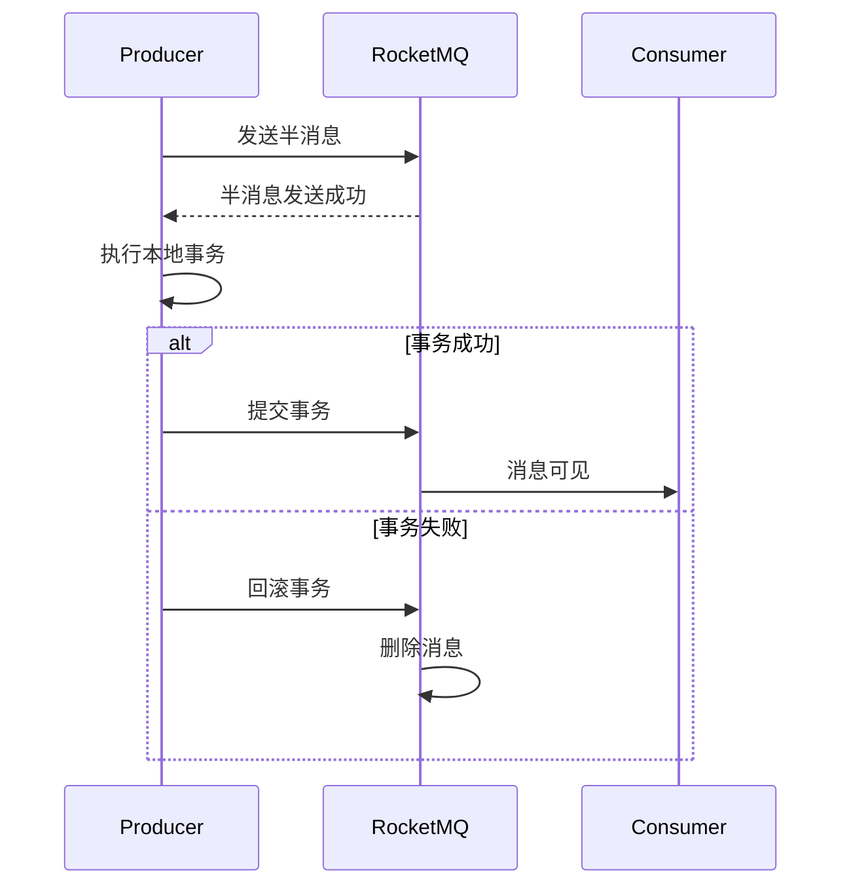

# RocketMQ 事务消息详解

## 介绍

RocketMQ 是一款高性能、高可用的分布式消息中间件，广泛应用于大规模分布式系统中。事务消息是 RocketMQ 提供的一种特殊消息类型，用于确保消息的发送与本地事务的执行能够保持一致性。通过事务消息，开发者可以在消息发送的同时执行本地事务，并在事务提交或回滚后，确保消息的最终一致性。

## 事务消息的工作原理

RocketMQ 事务消息的核心思想是“两阶段提交”（2PC）。具体流程如下：

1. **发送半消息**：生产者首先发送一条“半消息”到 RocketMQ 服务器。这条消息对消费者不可见，只有生产者可以确认其状态。
2. **执行本地事务**：生产者在发送半消息后，执行本地事务操作。
3. **提交或回滚**：根据本地事务的执行结果，生产者向 RocketMQ 服务器发送提交或回滚请求。如果提交，消息将对消费者可见；如果回滚，消息将被删除。
4. **消息回查**：如果生产者在规定时间内未发送提交或回滚请求，RocketMQ 服务器会主动回查生产者的本地事务状态，并根据回查结果决定消息的最终状态。



## 代码示例

以下是一个简单的 RocketMQ 事务消息发送与消费的代码示例。

### 生产者代码

```java
import org.apache.rocketmq.client.producer.LocalTransactionState;
import org.apache.rocketmq.client.producer.TransactionListener;
import org.apache.rocketmq.client.producer.TransactionMQProducer;
import org.apache.rocketmq.common.message.Message;
import org.apache.rocketmq.common.message.MessageExt;

public class TransactionProducer {
    public static void main(String[] args) throws Exception {
        TransactionMQProducer producer = new TransactionMQProducer("transaction_producer_group");
        producer.setNamesrvAddr("localhost:9876");
        producer.setTransactionListener(new TransactionListener() {
            @Override
            public LocalTransactionState executeLocalTransaction(Message msg, Object arg) {
                // 执行本地事务
                try {
                    // 模拟事务成功
                    return LocalTransactionState.COMMIT_MESSAGE;
                } catch (Exception e) {
                    // 模拟事务失败
                    return LocalTransactionState.ROLLBACK_MESSAGE;
                }
            }

            @Override
            public LocalTransactionState checkLocalTransaction(MessageExt msg) {
                // 事务回查逻辑
                return LocalTransactionState.COMMIT_MESSAGE;
            }
        });
        producer.start();

        Message msg = new Message("transaction_topic", "TagA", "Hello RocketMQ Transaction Message".getBytes());
        producer.sendMessageInTransaction(msg, null);

        producer.shutdown();
    }
}
```

### 消费者代码

```java
import org.apache.rocketmq.client.consumer.DefaultMQPushConsumer;
import org.apache.rocketmq.client.consumer.listener.ConsumeConcurrentlyContext;
import org.apache.rocketmq.client.consumer.listener.ConsumeConcurrentlyStatus;
import org.apache.rocketmq.client.consumer.listener.MessageListenerConcurrently;
import org.apache.rocketmq.common.message.MessageExt;

import java.util.List;

public class TransactionConsumer {
    public static void main(String[] args) throws Exception {
        DefaultMQPushConsumer consumer = new DefaultMQPushConsumer("transaction_consumer_group");
        consumer.setNamesrvAddr("localhost:9876");
        consumer.subscribe("transaction_topic", "*");

        consumer.registerMessageListener(new MessageListenerConcurrently() {
            @Override
            public ConsumeConcurrentlyStatus consumeMessage(List<MessageExt> msgs, ConsumeConcurrentlyContext context) {
                for (MessageExt msg : msgs) {
                    System.out.println("Received message: " + new String(msg.getBody()));
                }
                return ConsumeConcurrentlyStatus.CONSUME_SUCCESS;
            }
        });

        consumer.start();
        System.out.println("Consumer started.");
    }
}
```

## 实际应用场景

事务消息在以下场景中非常有用：

1. **订单系统**：在创建订单时，需要同时发送消息通知库存系统扣减库存。通过事务消息，可以确保订单创建成功后再发送消息，避免库存扣减失败导致订单创建失败。
2. **支付系统**：在支付成功后，需要发送消息通知其他系统进行后续处理。通过事务消息，可以确保支付成功后再发送消息，避免支付失败后消息被错误处理。

## 总结

RocketMQ 事务消息通过两阶段提交机制，确保了消息发送与本地事务的一致性。它适用于需要强一致性的场景，如订单系统、支付系统等。通过本文的介绍和代码示例，你应该能够理解并实现 RocketMQ 事务消息的发送与消费。

## 附加资源

- [RocketMQ 官方文档](https://rocketmq.apache.org/docs/)
- [RocketMQ 事务消息源码解析](https://github.com/apache/rocketmq)

## 练习

1. 修改生产者代码，模拟本地事务失败的情况，观察消息是否被回滚。
2. 在消费者代码中添加日志，记录每条消息的消费时间，并分析消息的消费顺序。
