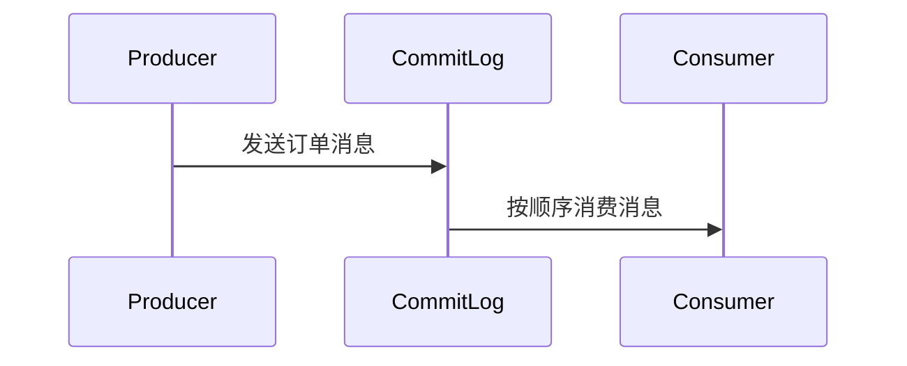
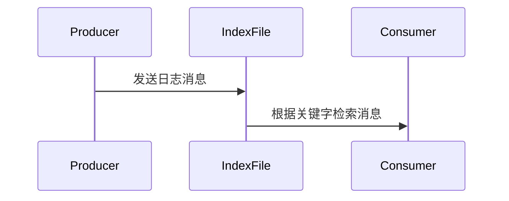

# RocketMQ 消息存储格式

RocketMQ 是一个分布式消息中间件，广泛应用于大规模分布式系统中。为了确保消息的高效存储和快速检索，RocketMQ 设计了一套独特的消息存储格式。本文将详细介绍 RocketMQ 消息存储格式的结构、存储方式以及实际应用场景。

## 什么是RocketMQ消息存储格式？

RocketMQ 的消息存储格式是指消息在磁盘上的存储方式。RocketMQ 将消息存储在 CommitLog 文件中，并通过索引文件（IndexFile）和消费队列（ConsumeQueue）来加速消息的检索。这种设计使得 RocketMQ 能够高效地处理海量消息，同时保证消息的可靠性和持久性。

### 核心组件

1. **CommitLog**：存储所有消息的原始数据，按顺序写入。
2. **ConsumeQueue**：存储消息的消费队列，用于快速定位消息。
3. **IndexFile**：存储消息的索引，用于快速查找消息。

## CommitLog 文件结构

CommitLog 是 RocketMQ 存储消息的核心文件。所有消息都按顺序写入 CommitLog 文件，确保写入的高效性。每条消息在 CommitLog 中的存储格式如下：

```plaintext
| 消息长度 (4字节) | 消息内容 (变长) | 消息属性 (变长) |
```

- **消息长度**：表示消息内容的总长度。
- **消息内容**：包含消息的主题、标签、键值对等信息。
- **消息属性**：包含消息的附加属性，如延迟时间、重试次数等。

:::note
CommitLog 文件的大小是固定的，默认情况下为 1GB。当文件写满后，RocketMQ 会创建一个新的 CommitLog 文件。
:::

## ConsumeQueue 文件结构

ConsumeQueue 是 RocketMQ 用于加速消息检索的索引文件。每个主题（Topic）对应一个 ConsumeQueue，存储消息在 CommitLog 中的偏移量。ConsumeQueue 的存储格式如下：

```plaintext
| CommitLog 偏移量 (8字节) | 消息大小 (4字节) | 消息标签哈希值 (8字节) |
```

- **CommitLog 偏移量**：表示消息在 CommitLog 文件中的起始位置。
- **消息大小**：表示消息的长度。
- **消息标签哈希值**：用于快速过滤消息。

:::tip
ConsumeQueue 文件的大小也是固定的，默认情况下为 30W 条记录。当文件写满后，RocketMQ 会创建一个新的 ConsumeQueue 文件。
:::

## IndexFile 文件结构

IndexFile 是 RocketMQ 用于加速消息查找的索引文件。它通过消息的键值对（Key）来快速定位消息。IndexFile 的存储格式如下：

```plaintext
| 键值哈希值 (4字节) | CommitLog 偏移量 (8字节) | 时间戳 (8字节) |
```

- **键值哈希值**：表示消息键的哈希值。
- **CommitLog 偏移量**：表示消息在 CommitLog 文件中的起始位置。
- **时间戳**：表示消息的存储时间。

:::caution
IndexFile 文件的大小是固定的，默认情况下为 400MB。当文件写满后，RocketMQ 会创建一个新的 IndexFile 文件。
:::

## 实际应用场景

### 场景1：消息顺序存储

在电商系统中，订单消息需要按照顺序处理。RocketMQ 的 CommitLog 文件按顺序存储消息，确保订单消息的顺序性。



### 场景2：消息快速检索

在日志系统中，需要根据日志的关键字快速检索日志。RocketMQ 的 IndexFile 文件通过键值对快速定位消息，提高检索效率。



## 总结

RocketMQ 的消息存储格式是其高效处理海量消息的关键。通过 CommitLog、ConsumeQueue 和 IndexFile 的协同工作，RocketMQ 能够确保消息的顺序性、可靠性和快速检索能力。理解这些存储格式对于深入掌握 RocketMQ 的工作原理至关重要。

## 附加资源

- [RocketMQ 官方文档](https://rocketmq.apache.org/docs/)
- [RocketMQ 源码解析](https://github.com/apache/rocketmq)

## 练习

1. 尝试在本地搭建 RocketMQ 环境，并观察 CommitLog 文件的生成过程。
2. 编写一个简单的生产者程序，发送消息到 RocketMQ，并使用消费者程序验证消息的顺序性。
3. 修改 RocketMQ 的配置文件，调整 CommitLog 和 ConsumeQueue 文件的大小，观察其对性能的影响。