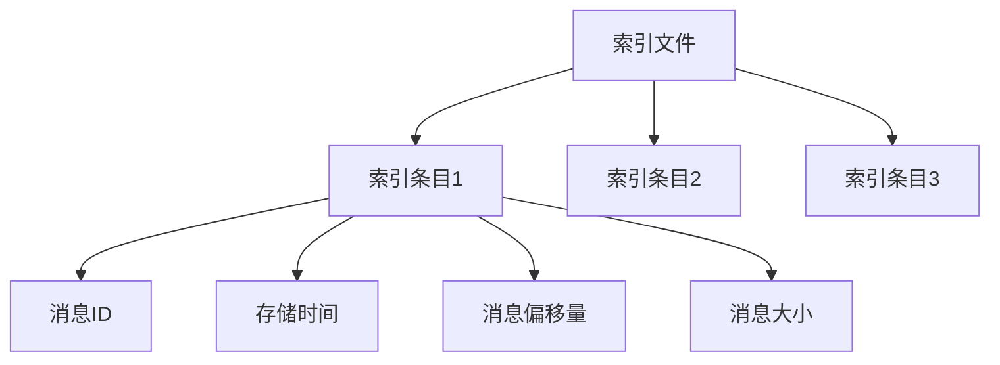

# RocketMQ 消息索引

RocketMQ是一个分布式消息中间件，广泛应用于大规模分布式系统中。消息索引是RocketMQ中一个重要的概念，它帮助系统快速定位和检索消息。本文将详细介绍RocketMQ消息索引的工作原理、使用场景以及如何在实际项目中应用。

## 什么是RocketMQ消息索引？

在RocketMQ中，消息索引是一种数据结构，用于快速查找和检索消息。每条消息在发送到RocketMQ时，都会被分配一个唯一的消息ID（Message ID），并且会被存储在一个索引文件中。索引文件包含了消息的偏移量、存储时间、消息ID等信息，通过这些信息，RocketMQ可以快速定位到具体的消息。

:::note
消息索引的主要作用是提高消息的检索效率，尤其是在需要根据消息ID或其他条件查找消息时。
:::

## 消息索引的工作原理

RocketMQ的消息索引是基于文件存储的，索引文件通常存储在Broker的磁盘上。每个索引文件包含多个索引条目，每个条目对应一条消息。索引条目的结构如下：

- **消息ID**：唯一标识一条消息。
- **存储时间**：消息的存储时间戳。
- **消息偏移量**：消息在CommitLog中的物理偏移量。
- **消息大小**：消息的大小。

当生产者发送消息时，Broker会将消息写入CommitLog，并生成相应的索引条目。消费者在消费消息时，可以通过消息ID或其他条件查询索引文件，快速定位到消息的存储位置。

### 索引文件的存储结构

RocketMQ的索引文件通常以`index`为后缀，存储在Broker的`store`目录下。索引文件的结构如下：



:::tip
索引文件的大小是有限的，当索引文件达到一定大小时，RocketMQ会创建新的索引文件。
:::

## 如何使用消息索引？

在实际应用中，消息索引主要用于以下场景：

1. **消息查询**：根据消息ID查询消息内容。
2. **消息回溯**：根据时间范围查询历史消息。
3. **消息重放**：重新消费某条消息。

### 示例：根据消息ID查询消息

以下是一个简单的Java代码示例，展示如何使用RocketMQ的API根据消息ID查询消息：

```java
import org.apache.rocketmq.client.consumer.DefaultMQPushConsumer;
import org.apache.rocketmq.client.consumer.MessageSelector;
import org.apache.rocketmq.client.consumer.listener.ConsumeConcurrentlyContext;
import org.apache.rocketmq.client.consumer.listener.ConsumeConcurrentlyStatus;
import org.apache.rocketmq.client.consumer.listener.MessageListenerConcurrently;
import org.apache.rocketmq.common.message.MessageExt;

public class MessageQueryExample {
    public static void main(String[] args) throws Exception {
        // 创建消费者实例
        DefaultMQPushConsumer consumer = new DefaultMQPushConsumer("example_group");
        consumer.setNamesrvAddr("localhost:9876");

        // 订阅主题
        consumer.subscribe("example_topic", "*");

        // 注册消息监听器
        consumer.registerMessageListener(new MessageListenerConcurrently() {
            @Override
            public ConsumeConcurrentlyStatus consumeMessage(List<MessageExt> msgs, ConsumeConcurrentlyContext context) {
                for (MessageExt msg : msgs) {
                    System.out.println("Received message: " + new String(msg.getBody()));
                }
                return ConsumeConcurrentlyStatus.CONSUME_SUCCESS;
            }
        });

        // 启动消费者
        consumer.start();
        System.out.println("Consumer started.");

        // 根据消息ID查询消息
        String messageId = "7F00000100002A9F0000000000000000";
        MessageExt message = consumer.viewMessage("example_topic", messageId);
        System.out.println("Queried message: " + new String(message.getBody()));
    }
}
```

:::caution
在实际生产环境中，消息ID的生成和存储需要特别注意，确保其唯一性和可追溯性。
:::

## 实际应用场景

### 场景1：消息回溯

在某些业务场景中，可能需要回溯历史消息。例如，当系统出现故障时，可以通过消息索引快速定位到故障发生时的消息，进行问题排查。

### 场景2：消息重放

在某些情况下，可能需要重新消费某条消息。例如，当消息处理失败时，可以通过消息索引找到该消息，并重新发送给消费者进行处理。

## 总结

RocketMQ的消息索引是一个强大的工具，它能够帮助系统快速定位和检索消息。通过理解消息索引的工作原理和使用方法，开发者可以更好地利用RocketMQ来处理大规模消息流。

## 附加资源与练习

- **官方文档**：阅读RocketMQ的官方文档，了解更多关于消息索引的详细信息。
- **练习**：尝试在自己的项目中实现消息查询功能，并根据消息ID查询消息内容。

:::warning
在使用消息索引时，务必注意索引文件的大小和存储位置，避免因索引文件过大而影响系统性能。
:::