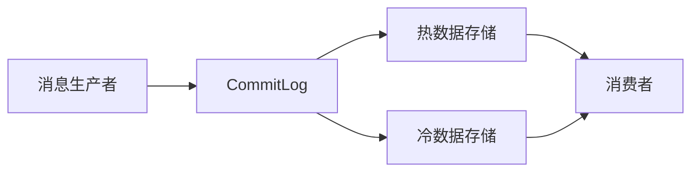

# RocketMQ 存储优化

RocketMQ 是一个分布式消息中间件，广泛应用于大规模分布式系统中。其存储系统是 RocketMQ 的核心组件之一，负责消息的持久化、检索和管理。为了确保 RocketMQ 在高并发、大数据量的场景下依然能够高效运行，存储优化显得尤为重要。

本文将介绍 RocketMQ 存储系统的基本原理，并深入探讨如何通过优化存储来提升 RocketMQ 的性能和可靠性。

## 1. RocketMQ 存储系统简介

RocketMQ 的存储系统主要由以下几个部分组成：

- **CommitLog**：存储所有消息的原始数据，按顺序写入。
- **ConsumeQueue**：存储消息的索引，用于快速检索消息。
- **IndexFile**：提供消息的索引服务，支持按关键字查询。

这些组件共同协作，确保消息的高效存储和检索。然而，随着消息量的增加，存储系统可能会成为性能瓶颈。因此，优化存储系统是提升 RocketMQ 性能的关键。

## 2. 存储优化的关键策略

### 2.1 消息存储的压缩

RocketMQ 支持对消息进行压缩存储，以减少磁盘空间的占用和网络传输的开销。常见的压缩算法包括 GZIP、ZIP 等。

```java
// 示例：在发送消息时启用压缩
DefaultMQProducer producer = new DefaultMQProducer("ProducerGroupName");
producer.setCompressMsgBodyOverHowmuch(1024); // 设置消息体超过1024字节时启用压缩
producer.start();
```

:::tip
压缩虽然可以减少存储空间，但会增加 CPU 的开销。因此，在高并发场景下，需要权衡压缩带来的收益和性能损耗。
:::

### 2.2 消息存储的分段

RocketMQ 的 CommitLog 文件默认大小为 1GB，当文件达到大小时，会自动创建新的文件。为了优化存储性能，可以通过调整 CommitLog 文件的大小和分段策略来减少文件碎片。

```java
// 示例：调整 CommitLog 文件大小
System.setProperty("rocketmq.broker.commitlog.size", "2GB"); // 设置 CommitLog 文件大小为 2GB
```

:::caution
过大的 CommitLog 文件可能会导致文件碎片化，影响磁盘 I/O 性能。因此，需要根据实际业务需求合理设置文件大小。
:::

### 2.3 消息存储的异步刷盘

RocketMQ 支持同步刷盘和异步刷盘两种模式。同步刷盘可以确保消息的可靠性，但会降低性能；异步刷盘则可以提升性能，但可能会丢失部分消息。

```java
// 示例：设置异步刷盘模式
BrokerConfig brokerConfig = new BrokerConfig();
brokerConfig.setFlushDiskType(FlushDiskType.ASYNC_FLUSH); // 设置异步刷盘
```

:::note
在高并发场景下，异步刷盘可以显著提升性能，但需要确保业务能够容忍一定的消息丢失风险。
:::

### 2.4 消息存储的冷热分离

RocketMQ 支持将冷数据和热数据分离存储，以提升存储系统的性能。冷数据是指访问频率较低的消息，而热数据是指访问频率较高的消息。



:::tip
通过冷热分离，可以将热数据存储在高速存储设备上，而将冷数据存储在低成本存储设备上，从而提升整体性能并降低成本。
:::

## 3. 实际案例：电商平台的订单消息存储优化

假设某电商平台每天产生数百万条订单消息，RocketMQ 作为消息中间件，负责处理这些消息。为了提升消息处理的性能，该平台采取了以下优化措施：

1. **消息压缩**：对订单消息进行压缩存储，减少磁盘空间占用。
2. **异步刷盘**：采用异步刷盘模式，提升消息写入性能。
3. **冷热分离**：将历史订单消息（冷数据）存储在低成本存储设备上，而将实时订单消息（热数据）存储在高速存储设备上。

通过以上优化措施，该电商平台成功提升了 RocketMQ 的性能，确保了订单消息的高效处理。

## 4. 总结

RocketMQ 的存储系统是其高性能和高可靠性的关键。通过消息压缩、存储分段、异步刷盘和冷热分离等优化策略，可以显著提升 RocketMQ 的存储性能。在实际应用中，需要根据业务需求和系统环境，合理选择和配置这些优化策略。

## 5. 附加资源与练习

- **附加资源**：
  - [RocketMQ 官方文档](https://rocketmq.apache.org/docs/)
  - [RocketMQ 存储系统深入解析](https://www.example.com/rocketmq-storage)

- **练习**：
  - 尝试在本地环境中配置 RocketMQ，并启用消息压缩和异步刷盘模式，观察性能变化。
  - 设计一个冷热分离的存储方案，并模拟高并发场景下的消息处理。

通过本文的学习，你应该对 RocketMQ 的存储优化有了初步的了解。希望你能在实际项目中应用这些知识，进一步提升系统的性能和可靠性。