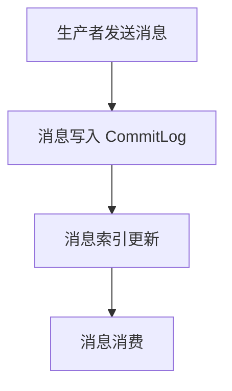

# RocketMQ CommitLog

## 介绍

RocketMQ 是一个分布式消息中间件，广泛应用于大规模分布式系统中。在 RocketMQ 的存储系统中，**CommitLog** 是其核心组件之一。CommitLog 是 RocketMQ 用于存储所有消息的物理文件，所有的消息都会按照顺序写入 CommitLog 文件中。这种设计使得 RocketMQ 能够高效地处理大量的消息写入和读取操作。

:::note
CommitLog 是 RocketMQ 存储系统的基石，理解它的工作原理对于掌握 RocketMQ 的整体架构至关重要。
:::

## CommitLog 的工作原理

### 消息写入流程

当生产者发送消息到 RocketMQ 时，消息首先会被写入 CommitLog 文件。CommitLog 文件是一个顺序写入的文件，所有的消息都会按照到达的顺序依次写入。这种顺序写入的方式极大地提高了写入性能。



### CommitLog 文件结构

CommitLog 文件由多个固定大小的文件组成，每个文件的大小通常为 1GB。当当前文件写满后，RocketMQ 会自动创建一个新的文件继续写入消息。

:::tip
CommitLog 文件的顺序写入特性使得 RocketMQ 能够在大规模消息处理场景中保持高性能。
:::

### 消息读取流程

当消费者需要消费消息时，RocketMQ 会根据消息的索引从 CommitLog 文件中读取消息内容。由于 CommitLog 文件是顺序写入的，读取操作也非常高效。

## 实际应用场景

### 高吞吐量消息处理

在电商平台的订单系统中，每天可能会产生数百万甚至上千万的订单消息。RocketMQ 的 CommitLog 设计能够确保这些消息能够高效地写入和读取，从而保证系统的稳定性和高性能。

### 日志收集与分析

在大数据场景中，RocketMQ 可以用于收集和分析日志数据。CommitLog 的顺序写入特性使得日志数据能够快速地被存储和检索，从而支持实时的日志分析。

## 代码示例

以下是一个简单的 RocketMQ 生产者示例，展示了如何发送消息到 RocketMQ：

```java
import org.apache.rocketmq.client.producer.DefaultMQProducer;
import org.apache.rocketmq.common.message.Message;

public class RocketMQProducer {
    public static void main(String[] args) throws Exception {
        // 实例化一个生产者
        DefaultMQProducer producer = new DefaultMQProducer("ProducerGroupName");
        // 设置 NameServer 地址
        producer.setNamesrvAddr("localhost:9876");
        // 启动生产者
        producer.start();

        // 创建消息实例，指定 Topic、Tag 和消息体
        Message msg = new Message("TopicTest", "TagA", "Hello RocketMQ".getBytes());
        // 发送消息
        producer.send(msg);

        // 关闭生产者
        producer.shutdown();
    }
}
```

:::caution
在实际生产环境中，请确保正确配置 NameServer 地址和生产者组名称。
:::

## 总结

RocketMQ 的 CommitLog 是其存储系统的核心组件，通过顺序写入的方式实现了高效的消息存储和读取。理解 CommitLog 的工作原理对于掌握 RocketMQ 的整体架构至关重要。通过本文的介绍和代码示例，你应该对 CommitLog 有了初步的了解。

## 附加资源与练习

- **官方文档**: 阅读 [RocketMQ 官方文档](https://rocketmq.apache.org/docs/) 以获取更多详细信息。
- **练习**: 尝试在自己的环境中部署 RocketMQ，并使用生产者发送消息，观察 CommitLog 文件的变化。

:::warning
在进行练习时，请确保在测试环境中操作，避免对生产环境造成影响。
:::