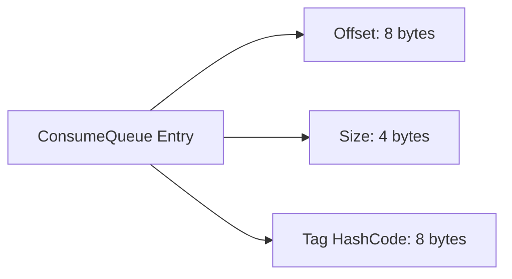

# RocketMQ ConsumeQueue

RocketMQ 是一个高性能、高吞吐量的分布式消息队列系统，广泛应用于大规模分布式系统中。在 RocketMQ 的存储系统中，**ConsumeQueue** 是一个关键组件，它负责管理消息的消费进度，确保消费者能够高效地获取消息。

## 什么是 ConsumeQueue？

ConsumeQueue 是 RocketMQ 中用于存储消息消费进度的数据结构。它本质上是一个逻辑队列，记录了每个消息队列（MessageQueue）中消息的偏移量（offset）和消息的大小。ConsumeQueue 的主要作用是帮助消费者快速定位消息，而不需要遍历整个 CommitLog（RocketMQ 的物理存储文件）。

:::note
ConsumeQueue 并不是直接存储消息内容，而是存储消息的元数据（如偏移量和大小），这些元数据指向 CommitLog 中的实际消息。
:::

## ConsumeQueue 的结构

ConsumeQueue 的结构非常简单，它由多个固定大小的条目（Entry）组成。每个条目包含以下信息：

- **消息偏移量（Offset）**：消息在 CommitLog 中的物理偏移量。
- **消息大小（Size）**：消息的大小，单位为字节。
- **消息标签哈希码（Tag HashCode）**：用于消息过滤的标签哈希码。

每个条目的大小固定为 20 字节（8 字节偏移量 + 4 字节大小 + 8 字节标签哈希码）。



## ConsumeQueue 的工作原理

当生产者发送消息到 RocketMQ 时，消息首先会被写入 CommitLog。然后，RocketMQ 会异步地将消息的元数据（偏移量、大小、标签哈希码）写入对应的 ConsumeQueue 中。

消费者在消费消息时，会从 ConsumeQueue 中获取消息的偏移量，然后根据偏移量从 CommitLog 中读取实际的消息内容。这种方式使得消费者能够快速定位消息，而不需要扫描整个 CommitLog。

:::tip
ConsumeQueue 的设计使得 RocketMQ 能够支持高并发的消息消费，同时保持较低的延迟。
:::

## 实际应用场景

假设你正在开发一个电商系统，需要处理大量的订单消息。每个订单消息都会被发送到 RocketMQ 中，然后由多个消费者进行处理。为了确保消费者能够高效地获取消息，RocketMQ 使用 ConsumeQueue 来管理每个消息队列的消费进度。

```java
// 示例：消费者从 ConsumeQueue 中获取消息
DefaultMQPushConsumer consumer = new DefaultMQPushConsumer("example_group");
consumer.subscribe("OrderTopic", "*");
consumer.registerMessageListener((MessageListenerConcurrently) (msgs, context) -> {
    for (MessageExt msg : msgs) {
        System.out.println("Received message: " + new String(msg.getBody()));
    }
    return ConsumeConcurrentlyStatus.CONSUME_SUCCESS;
});
consumer.start();
```

在上面的代码中，消费者订阅了 `OrderTopic`，并从 ConsumeQueue 中获取消息的偏移量，然后从 CommitLog 中读取实际的消息内容。

## 总结

ConsumeQueue 是 RocketMQ 存储系统中的核心组件之一，它通过存储消息的元数据（偏移量、大小、标签哈希码）来帮助消费者快速定位消息。这种设计使得 RocketMQ 能够支持高并发的消息消费，同时保持较低的延迟。

:::caution
在实际使用中，确保 ConsumeQueue 的大小和 CommitLog 的大小保持合理的比例，以避免存储空间的浪费或性能问题。
:::

## 附加资源

- [RocketMQ 官方文档](https://rocketmq.apache.org/docs/)
- [RocketMQ 源码解析](https://github.com/apache/rocketmq)

## 练习

1. 尝试在本地搭建一个 RocketMQ 环境，并创建一个简单的生产者和消费者。
2. 修改消费者的代码，使其能够过滤特定标签的消息。
3. 研究 RocketMQ 的 CommitLog 和 ConsumeQueue 的存储结构，并尝试手动解析这些文件。

通过以上练习，你将更深入地理解 RocketMQ 的存储系统以及 ConsumeQueue 的工作原理。