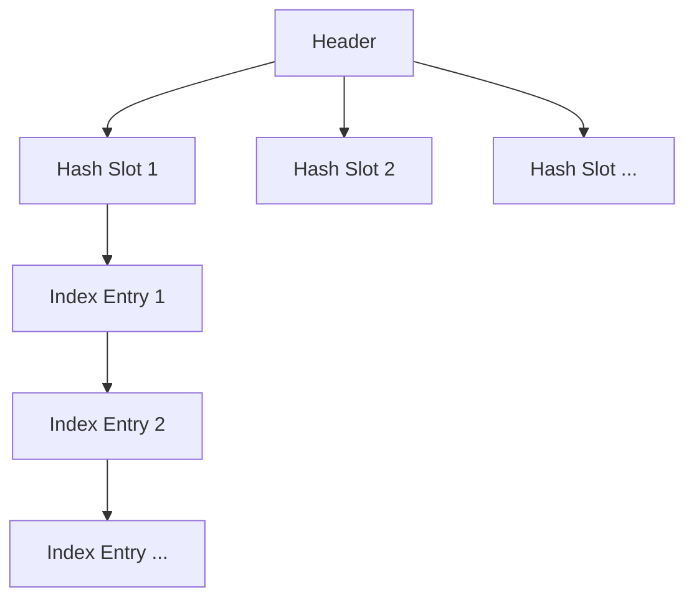

# RocketMQ IndexFile

RocketMQ 是一个分布式消息中间件，广泛应用于高吞吐量、高并发的场景。在 RocketMQ 中，`IndexFile` 是一个关键组件，用于存储消息的索引信息，以便快速检索消息。本文将详细介绍 `IndexFile` 的概念、结构及其在 RocketMQ 中的作用。

## 什么是 IndexFile？

`IndexFile` 是 RocketMQ 中用于存储消息索引的文件。它通过将消息的 `key` 与消息在 `CommitLog` 中的物理偏移量（`offset`）进行映射，从而加速消息的检索过程。`IndexFile` 的主要作用是提供一种高效的方式来查找消息，尤其是在需要根据消息的 `key` 进行查询时。

### IndexFile 的结构

`IndexFile` 的结构可以分为以下几个部分：

1. **Header**: 存储文件的元信息，如文件大小、索引数量等。
2. **Hash Slot**: 用于存储哈希槽，每个槽指向一个索引链表的头部。
3. **Index Entry**: 存储具体的索引信息，包括消息的 `key`、`CommitLog` 的偏移量、消息存储时间等。



### IndexFile 的工作原理

当消息被写入 `CommitLog` 时，RocketMQ 会同时将消息的 `key` 和 `CommitLog` 的偏移量写入 `IndexFile`。具体步骤如下：

1. **计算哈希值**: 根据消息的 `key` 计算哈希值，确定该消息应该存储在哪个哈希槽中。
2. **写入索引**: 将消息的 `key`、`CommitLog` 的偏移量等信息写入 `IndexFile` 的 `Index Entry` 中。
3. **更新哈希槽**: 更新哈希槽，使其指向最新的 `Index Entry`。

当需要根据 `key` 查找消息时，RocketMQ 会通过以下步骤进行检索：

1. **计算哈希值**: 根据 `key` 计算哈希值，确定该消息存储在哪个哈希槽中。
2. **遍历索引链表**: 从哈希槽指向的 `Index Entry` 开始，遍历链表，查找匹配的 `key`。
3. **获取消息**: 根据 `Index Entry` 中的 `CommitLog` 偏移量，从 `CommitLog` 中读取消息内容。

## 实际应用场景

假设我们有一个电商系统，用户下单后，系统会生成一个订单号（`orderId`），并将订单消息发送到 RocketMQ。为了后续能够快速查询某个订单的状态，我们可以将 `orderId` 作为消息的 `key`，并将其索引存储在 `IndexFile` 中。

```java
// 发送消息时指定 key
Message message = new Message("OrderTopic", "orderId-12345", "Order created".getBytes());
SendResult sendResult = producer.send(message);

// 根据 key 查询消息
QueryResult queryResult = mQAdminExt.queryMessage("OrderTopic", "orderId-12345", 10, 0, System.currentTimeMillis());
```

在这个场景中，`IndexFile` 的作用是帮助我们快速定位到 `orderId-12345` 对应的消息，而不需要遍历整个 `CommitLog`。

## 总结

`IndexFile` 是 RocketMQ 中用于加速消息检索的重要组件。它通过将消息的 `key` 与 `CommitLog` 的偏移量进行映射，提供了一种高效的消息查找方式。理解 `IndexFile` 的结构和工作原理，有助于我们更好地使用 RocketMQ 进行消息的存储和检索。

## 附加资源

- [RocketMQ 官方文档](https://rocketmq.apache.org/docs/)
- [RocketMQ 源码解析](https://github.com/apache/rocketmq)

## 练习

1. 尝试在本地部署 RocketMQ，并发送一些带有 `key` 的消息。
2. 使用 RocketMQ 提供的工具查询消息，观察 `IndexFile` 的作用。
3. 阅读 RocketMQ 源码，深入理解 `IndexFile` 的实现细节。
