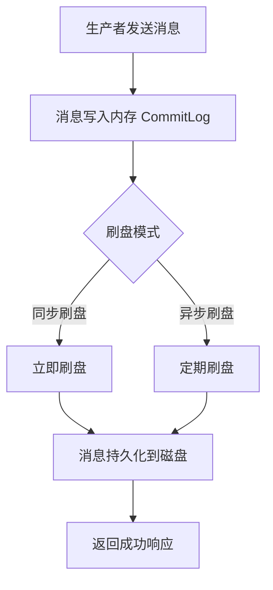

# RocketMQ 刷盘机制

RocketMQ 是一个分布式消息中间件，广泛应用于大规模分布式系统中。为了保证消息的可靠性和持久化，RocketMQ 引入了**刷盘机制**。本文将详细介绍 RocketMQ 的刷盘机制，帮助初学者理解其工作原理和实际应用。

## 什么是刷盘机制？

刷盘机制是指将内存中的数据（如消息）持久化到磁盘的过程。在 RocketMQ 中，消息首先被写入内存（即 CommitLog），然后通过刷盘机制将消息从内存写入磁盘，以确保即使系统崩溃或断电，消息也不会丢失。

RocketMQ 提供了两种刷盘方式：
1. **同步刷盘（SYNC_FLUSH）**
2. **异步刷盘（ASYNC_FLUSH）**

:::note
刷盘机制是 RocketMQ 保证消息可靠性的核心机制之一。
:::

---

## 同步刷盘 vs 异步刷盘

### 1. 同步刷盘（SYNC_FLUSH）

在同步刷盘模式下，消息写入内存后，RocketMQ 会立即将消息刷入磁盘，并等待磁盘写入完成后再返回成功响应。这种方式确保了消息的强一致性，但会降低系统的吞吐量。

**适用场景**：对消息可靠性要求极高的场景，如金融交易系统。

```java
// 示例：设置同步刷盘模式
DefaultMQProducer producer = new DefaultMQProducer("SyncFlushProducer");
producer.setFlushDiskType(FlushDiskType.SYNC_FLUSH);
```

### 2. 异步刷盘（ASYNC_FLUSH）

在异步刷盘模式下，消息写入内存后，RocketMQ 不会立即将消息刷入磁盘，而是通过后台线程定期批量刷盘。这种方式提高了系统的吞吐量，但在极端情况下（如系统崩溃）可能会导致少量消息丢失。

**适用场景**：对吞吐量要求较高，且允许少量消息丢失的场景，如日志收集系统。

```java
// 示例：设置异步刷盘模式
DefaultMQProducer producer = new DefaultMQProducer("AsyncFlushProducer");
producer.setFlushDiskType(FlushDiskType.ASYNC_FLUSH);
```

:::tip
异步刷盘的性能优于同步刷盘，但需要根据业务需求权衡可靠性和性能。
:::

---

## 刷盘机制的工作原理

RocketMQ 的刷盘机制依赖于 CommitLog 文件。以下是刷盘机制的工作流程：

1. **消息写入内存**：生产者发送的消息首先被写入内存中的 CommitLog。
2. **刷盘触发**：
   - 同步刷盘：每次写入内存后立即触发刷盘。
   - 异步刷盘：由后台线程定期触发刷盘。
3. **消息持久化**：将内存中的消息写入磁盘文件。
4. **返回响应**：刷盘完成后，返回成功响应给生产者。



---

## 实际应用场景

### 场景 1：金融交易系统

在金融交易系统中，每一笔交易消息都至关重要，不能丢失。因此，通常会选择**同步刷盘**模式，以确保消息的强一致性。

```java
// 金融交易系统配置同步刷盘
DefaultMQProducer producer = new DefaultMQProducer("FinancialProducer");
producer.setFlushDiskType(FlushDiskType.SYNC_FLUSH);
```

### 场景 2：日志收集系统

在日志收集系统中，日志消息的实时性要求较高，但允许少量消息丢失。因此，通常会选择**异步刷盘**模式，以提高系统的吞吐量。

```java
// 日志收集系统配置异步刷盘
DefaultMQProducer producer = new DefaultMQProducer("LogProducer");
producer.setFlushDiskType(FlushDiskType.ASYNC_FLUSH);
```

---

## 总结

RocketMQ 的刷盘机制是保证消息可靠性的重要手段。通过同步刷盘和异步刷盘两种模式，RocketMQ 能够满足不同场景下的需求：
- **同步刷盘**：适用于对消息可靠性要求极高的场景。
- **异步刷盘**：适用于对吞吐量要求较高的场景。

在实际应用中，需要根据业务需求选择合适的刷盘模式，以平衡性能和可靠性。

---

## 附加资源与练习

### 资源推荐
- [RocketMQ 官方文档](https://rocketmq.apache.org/docs/)
- 《RocketMQ 技术内幕》：深入解析 RocketMQ 的设计与实现。

### 练习
1. 尝试在本地部署 RocketMQ，并分别测试同步刷盘和异步刷盘的性能差异。
2. 编写一个生产者程序，模拟消息发送，并观察不同刷盘模式下的消息持久化效果。

:::caution
在测试过程中，请注意系统资源的消耗，避免因频繁刷盘导致性能问题。
:::