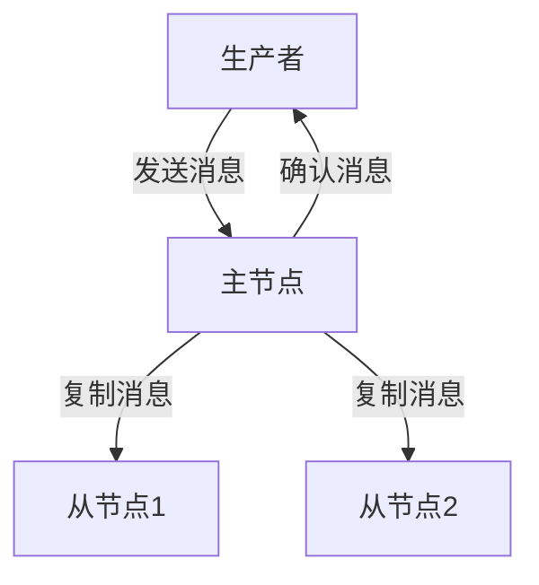

# RocketMQ 存储复制

RocketMQ 是一个分布式消息中间件，广泛应用于大规模分布式系统中。为了确保消息的高可用性和数据的安全性，RocketMQ 提供了存储复制机制。本文将详细介绍 RocketMQ 存储复制的概念、工作原理以及实际应用场景。

## 什么是存储复制？

存储复制是指将数据从一个存储节点复制到另一个或多个存储节点的过程。在 RocketMQ 中，存储复制主要用于确保消息的可靠性和高可用性。通过复制，即使某个存储节点发生故障，消息仍然可以从其他节点获取，从而避免数据丢失。

## RocketMQ 存储复制的工作原理

RocketMQ 的存储复制机制主要依赖于 **主从复制** 模型。在这种模型中，有一个主节点（Master）和多个从节点（Slave）。主节点负责处理所有的写操作，而从节点则通过复制主节点的数据来提供读操作。

### 主从复制流程

1. **写操作**：当生产者发送消息时，消息首先被写入主节点。
2. **复制操作**：主节点将消息复制到一个或多个从节点。
3. **确认操作**：一旦消息被成功复制到从节点，主节点会向生产者发送确认消息。



### 代码示例

以下是一个简单的 RocketMQ 生产者示例，展示了如何发送消息：

```java
import org.apache.rocketmq.client.producer.DefaultMQProducer;
import org.apache.rocketmq.common.message.Message;

public class ProducerExample {
    public static void main(String[] args) throws Exception {
        // 实例化一个生产者
        DefaultMQProducer producer = new DefaultMQProducer("ProducerGroupName");
        // 设置NameServer地址
        producer.setNamesrvAddr("localhost:9876");
        // 启动生产者
        producer.start();

        // 创建消息实例，指定Topic、Tag和消息体
        Message msg = new Message("TopicTest", "TagA", "Hello RocketMQ".getBytes());
        // 发送消息
        producer.send(msg);

        // 关闭生产者
        producer.shutdown();
    }
}
```

在这个示例中，消息被发送到主节点，主节点随后会将消息复制到从节点。

## 实际应用场景

### 高可用性

在一个分布式系统中，单个节点的故障是不可避免的。通过存储复制，RocketMQ 可以确保即使主节点发生故障，从节点仍然可以提供消息服务，从而保证系统的高可用性。

### 数据备份

存储复制还可以用于数据备份。通过将消息复制到多个从节点，即使某个节点发生数据丢失，仍然可以从其他节点恢复数据。

## 总结

RocketMQ 的存储复制机制是确保消息高可用性和数据安全性的重要手段。通过主从复制模型，RocketMQ 能够在节点故障时仍然提供可靠的消息服务。理解并合理利用存储复制机制，对于构建高可用的分布式系统至关重要。

## 附加资源

- [RocketMQ 官方文档](https://rocketmq.apache.org/docs/)
- [分布式系统设计模式](https://en.wikipedia.org/wiki/Distributed_computing)

## 练习

1. 尝试在本地搭建一个 RocketMQ 集群，并配置主从复制。
2. 编写一个消费者程序，从从节点读取消息，并验证消息的可靠性。

:::tip
在配置 RocketMQ 集群时，确保主节点和从节点之间的网络连接稳定，以避免复制延迟。
:::