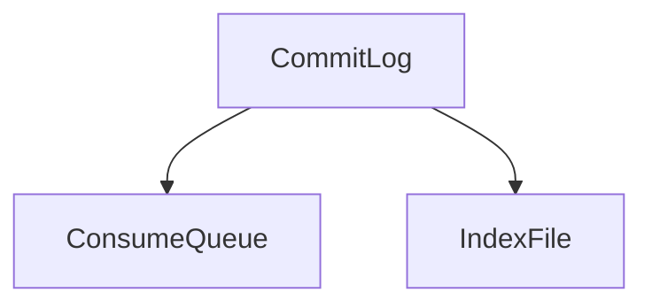

# RocketMQ 文件恢复

RocketMQ 是一个分布式消息中间件，广泛应用于高吞吐量、高可用性的消息传递场景。在 RocketMQ 中，消息的存储和恢复是确保系统可靠性的关键部分。本文将详细介绍 RocketMQ 文件恢复的概念、工作原理以及如何在实际场景中应用。

## 什么是RocketMQ文件恢复？

RocketMQ 文件恢复是指在消息存储文件（如 CommitLog、ConsumeQueue 等）损坏或丢失的情况下，通过备份或其他手段恢复这些文件的过程。文件恢复的目的是确保消息的完整性和系统的可用性。

## RocketMQ 文件存储结构

在深入讨论文件恢复之前，我们需要了解 RocketMQ 的文件存储结构。RocketMQ 的消息存储主要分为以下几个部分：

1. **CommitLog**：存储所有消息的原始数据。
2. **ConsumeQueue**：存储消息的索引，用于快速定位消息。
3. **IndexFile**：存储消息的索引，用于支持按关键字查询。



## 文件恢复的工作原理

当 RocketMQ 检测到文件损坏或丢失时，它会尝试从备份中恢复文件。以下是文件恢复的基本步骤：

1. **检测文件损坏**：RocketMQ 会定期检查文件的完整性，如果发现文件损坏或丢失，会触发恢复流程。
2. **查找备份**：RocketMQ 会查找最近的备份文件，通常备份文件存储在另一个磁盘或远程存储中。
3. **恢复文件**：将备份文件复制到原始位置，替换损坏的文件。
4. **重建索引**：如果 ConsumeQueue 或 IndexFile 损坏，RocketMQ 会重新构建这些索引文件。

:::note
文件恢复过程中，RocketMQ 会暂停消息的写入操作，以确保数据的一致性。
:::

## 实际应用场景

假设你正在运行一个电商平台，使用 RocketMQ 处理订单消息。某天，由于磁盘故障，部分 CommitLog 文件损坏。此时，RocketMQ 的文件恢复机制可以确保订单消息不会丢失，系统可以继续正常运行。

### 代码示例

以下是一个简单的代码示例，展示如何在 RocketMQ 中手动触发文件恢复：

```java
public class FileRecoveryExample {
    public static void main(String[] args) {
        // 假设我们检测到文件损坏
        boolean isFileCorrupted = true;

        if (isFileCorrupted) {
            // 触发文件恢复
            MessageStore messageStore = new DefaultMessageStore();
            messageStore.recover();
            System.out.println("文件恢复完成");
        }
    }
}
```

**输出：**
```
文件恢复完成
```

## 总结

RocketMQ 文件恢复是确保消息系统可靠性的重要机制。通过定期备份和自动恢复流程，RocketMQ 能够在文件损坏或丢失的情况下，快速恢复数据，确保系统的持续运行。

## 附加资源

- [RocketMQ 官方文档](https://rocketmq.apache.org/docs/)
- [RocketMQ 源码解析](https://github.com/apache/rocketmq)

## 练习

1. 尝试在本地环境中模拟文件损坏，并观察 RocketMQ 的文件恢复过程。
2. 阅读 RocketMQ 源码，了解文件恢复的具体实现细节。

:::tip
在实际生产环境中，建议定期备份 RocketMQ 的存储文件，并监控系统的健康状况，以便及时发现和处理文件损坏问题。
:::