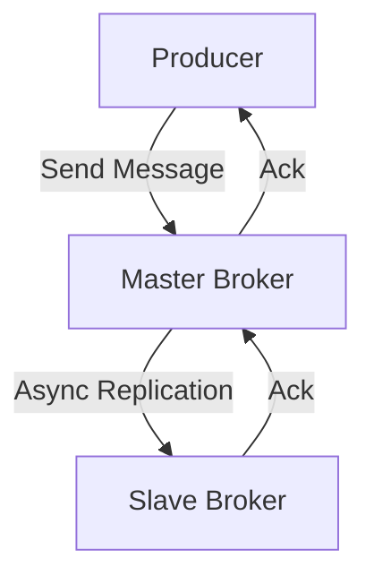

# RocketMQ 主从架构

RocketMQ 是一个分布式消息中间件，广泛应用于大规模分布式系统中。为了确保高可用性和数据可靠性，RocketMQ 采用了主从架构（Master-Slave Architecture）。本文将详细介绍 RocketMQ 主从架构的工作原理、配置方式以及实际应用场景。

## 什么是主从架构？

主从架构是一种常见的分布式系统设计模式，其中一个节点（主节点）负责处理主要的读写请求，而其他节点（从节点）则负责备份数据和处理读请求。在主从架构中，主节点和从节点之间通过数据同步机制保持数据一致性。

在 RocketMQ 中，主从架构主要用于 Broker 节点的部署。Broker 是 RocketMQ 的核心组件，负责消息的存储和转发。通过主从架构，RocketMQ 可以实现消息的高可用性和数据冗余。

## RocketMQ 主从架构的工作原理

在 RocketMQ 中，每个 Broker 组（Broker Group）由一个主节点（Master）和多个从节点（Slave）组成。主节点负责处理所有的写请求（即消息的生产），而从节点则负责备份主节点的数据，并在主节点不可用时接管服务。

### 数据同步机制

主节点和从节点之间通过异步复制的方式进行数据同步。当主节点接收到消息后，会将消息写入本地存储，并异步地将消息复制到从节点。从节点接收到消息后，也会将消息写入本地存储，从而保证数据的冗余。



### 故障切换

当主节点发生故障时，RocketMQ 会自动将从节点提升为新的主节点，从而保证服务的连续性。这种故障切换机制确保了系统的高可用性。

## 配置 RocketMQ 主从架构

在 RocketMQ 中，主从架构的配置主要通过 `broker.conf` 文件进行。以下是一个典型的主从配置示例：

```ini
# Master Broker 配置
brokerClusterName=DefaultCluster
brokerName=broker-a
brokerId=0
brokerRole=SYNC_MASTER
flushDiskType=ASYNC_FLUSH

# Slave Broker 配置
brokerClusterName=DefaultCluster
brokerName=broker-a
brokerId=1
brokerRole=SLAVE
flushDiskType=ASYNC_FLUSH
```

- `brokerClusterName`：Broker 集群的名称，主从节点必须属于同一个集群。
- `brokerName`：Broker 的名称，主从节点必须使用相同的名称。
- `brokerId`：Broker 的 ID，主节点的 ID 为 0，从节点的 ID 从 1 开始递增。
- `brokerRole`：Broker 的角色，主节点为 `SYNC_MASTER`，从节点为 `SLAVE`。
- `flushDiskType`：磁盘刷盘策略，`ASYNC_FLUSH` 表示异步刷盘。

## 实际应用场景

### 场景 1：消息的高可用性

在一个电商系统中，订单消息的可靠性至关重要。通过 RocketMQ 的主从架构，即使主节点发生故障，从节点也可以立即接管服务，确保订单消息不会丢失。

### 场景 2：数据冗余

在一个金融系统中，交易数据的完整性至关重要。通过 RocketMQ 的主从架构，交易数据可以在主节点和从节点之间进行同步，从而保证数据的冗余和可靠性。

## 总结

RocketMQ 的主从架构通过主节点和从节点的协同工作，实现了消息的高可用性和数据冗余。通过合理的配置和故障切换机制，RocketMQ 可以在分布式系统中提供稳定可靠的消息服务。

## 附加资源

- [RocketMQ 官方文档](https://rocketmq.apache.org/docs/)
- [RocketMQ 源码解析](https://github.com/apache/rocketmq)

## 练习

1. 尝试在本地部署一个 RocketMQ 主从集群，并测试主节点故障时的自动切换功能。
2. 修改 `broker.conf` 文件中的 `flushDiskType` 参数，观察不同刷盘策略对性能的影响。
