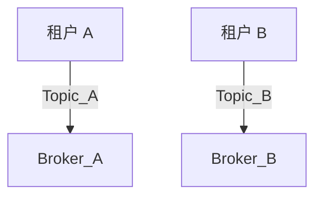

# RocketMQ 资源隔离

## 介绍

在分布式消息队列系统中，资源隔离是一个重要的概念，尤其是在多租户环境中。RocketMQ 提供了资源隔离机制，允许不同的业务或租户共享同一个 RocketMQ 集群，同时确保彼此之间的资源（如 Topic、Consumer Group 等）不会相互干扰。通过资源隔离，可以提高系统的稳定性和安全性，避免因某个租户的资源使用不当而影响其他租户。

本文将详细介绍 RocketMQ 中的资源隔离机制，并通过实际案例展示如何在实际场景中应用这一概念。

## 资源隔离的基本概念

在 RocketMQ 中，资源隔离主要通过以下几种方式实现：

1. **Topic 隔离**：每个租户或业务可以使用独立的 Topic，确保消息不会混淆。
2. **Consumer Group 隔离**：不同的消费者组可以独立消费消息，避免消费者之间的资源竞争。
3. **Broker 隔离**：通过配置不同的 Broker 组，将不同租户的消息存储在不同的 Broker 上，实现物理隔离。

### Topic 隔离

Topic 是 RocketMQ 中消息的逻辑分类。通过为每个租户或业务分配独立的 Topic，可以确保消息的隔离性。例如，租户 A 使用 `Topic_A`，租户 B 使用 `Topic_B`，这样即使两个租户共享同一个 RocketMQ 集群，他们的消息也不会相互干扰。

```java
// 创建租户 A 的 Topic
DefaultMQProducer producerA = new DefaultMQProducer("ProducerGroup_A");
producerA.setNamesrvAddr("127.0.0.1:9876");
producerA.start();
producerA.createTopic("Topic_A");

// 创建租户 B 的 Topic
DefaultMQProducer producerB = new DefaultMQProducer("ProducerGroup_B");
producerB.setNamesrvAddr("127.0.0.1:9876");
producerB.start();
producerB.createTopic("Topic_B");
```

### Consumer Group 隔离

Consumer Group 是 RocketMQ 中消费者的逻辑分组。通过为每个租户或业务分配独立的 Consumer Group，可以确保消费者之间的资源隔离。例如，租户 A 使用 `ConsumerGroup_A`，租户 B 使用 `ConsumerGroup_B`，这样即使两个租户消费同一个 Topic，他们的消费进度也不会相互影响。

```java
// 租户 A 的消费者
DefaultMQPushConsumer consumerA = new DefaultMQPushConsumer("ConsumerGroup_A");
consumerA.setNamesrvAddr("127.0.0.1:9876");
consumerA.subscribe("Topic_A", "*");
consumerA.registerMessageListener((MessageListenerConcurrently) (msgs, context) -> {
    // 处理消息
    return ConsumeConcurrentlyStatus.CONSUME_SUCCESS;
});
consumerA.start();

// 租户 B 的消费者
DefaultMQPushConsumer consumerB = new DefaultMQPushConsumer("ConsumerGroup_B");
consumerB.setNamesrvAddr("127.0.0.1:9876");
consumerB.subscribe("Topic_B", "*");
consumerB.registerMessageListener((MessageListenerConcurrently) (msgs, context) -> {
    // 处理消息
    return ConsumeConcurrentlyStatus.CONSUME_SUCCESS;
});
consumerB.start();
```

### Broker 隔离

Broker 是 RocketMQ 中存储和转发消息的核心组件。通过将不同租户的消息存储在不同的 Broker 上，可以实现物理层面的资源隔离。例如，租户 A 的消息存储在 `Broker_A`，租户 B 的消息存储在 `Broker_B`，这样即使某个 Broker 出现故障，也不会影响其他租户的消息处理。



## 实际案例

假设我们有一个电商平台，平台上有多个商家，每个商家都有自己的订单处理系统。为了确保不同商家的订单消息不会相互干扰，我们可以使用 RocketMQ 的资源隔离机制。

1. **Topic 隔离**：为每个商家分配独立的 Topic，例如 `Topic_Shop_A` 和 `Topic_Shop_B`。
2. **Consumer Group 隔离**：每个商家的订单处理系统使用独立的 Consumer Group，例如 `ConsumerGroup_Shop_A` 和 `ConsumerGroup_Shop_B`。
3. **Broker 隔离**：将不同商家的消息存储在不同的 Broker 上，确保物理隔离。

通过这种方式，即使某个商家的订单量激增，也不会影响其他商家的订单处理。

## 总结

RocketMQ 的资源隔离机制为多租户环境下的消息队列管理提供了强大的支持。通过 Topic 隔离、Consumer Group 隔离和 Broker 隔离，可以确保不同租户或业务之间的资源不会相互干扰，从而提高系统的稳定性和安全性。

在实际应用中，资源隔离不仅适用于多租户场景，还可以用于不同业务线之间的消息隔离。通过合理配置 RocketMQ 的资源隔离机制，可以有效避免资源竞争和消息混乱的问题。

## 附加资源

- [RocketMQ 官方文档](https://rocketmq.apache.org/docs/)
- [RocketMQ 多租户配置指南](https://rocketmq.apache.org/docs/multi-tenant/)
- [RocketMQ 实战案例](https://rocketmq.apache.org/docs/case-studies/)

## 练习

1. 创建一个 RocketMQ 集群，并配置两个独立的 Topic 和 Consumer Group，模拟多租户环境。
2. 尝试将不同租户的消息存储在不同的 Broker 上，观察消息的隔离效果。
3. 在某个租户的 Topic 中发送大量消息，观察是否会影响其他租户的消息处理。