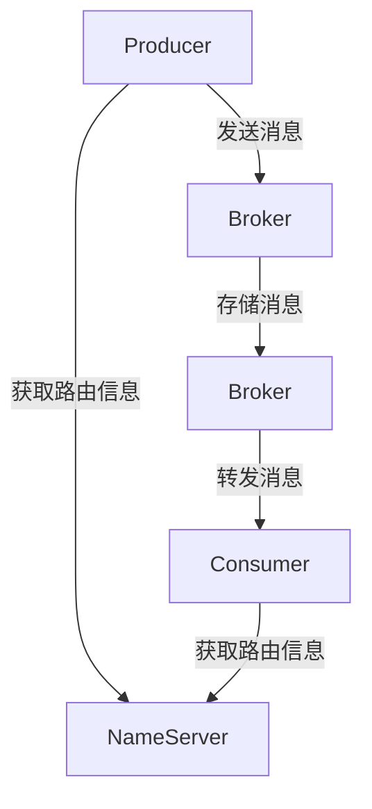

# RocketMQ 集群运维

RocketMQ 是一款高性能、高可用的分布式消息中间件，广泛应用于大规模分布式系统中。为了确保 RocketMQ 集群的稳定运行，集群运维是至关重要的一环。本文将详细介绍 RocketMQ 集群运维的基本概念、操作步骤以及实际应用场景，帮助初学者掌握 RocketMQ 集群的管理与维护。

## 什么是RocketMQ集群运维？

RocketMQ 集群运维是指对 RocketMQ 集群进行监控、维护、优化和故障处理的一系列操作。通过有效的运维管理，可以确保 RocketMQ 集群的高可用性、高性能以及数据的一致性。

## RocketMQ 集群架构

在深入了解运维之前，我们先来看一下 RocketMQ 集群的基本架构。RocketMQ 集群主要由以下几个组件组成：

- **NameServer**：负责管理 Broker 的路由信息，客户端通过 NameServer 获取 Broker 的地址。
- **Broker**：负责消息的存储和转发，是 RocketMQ 的核心组件。
- **Producer**：消息生产者，负责发送消息到 Broker。
- **Consumer**：消息消费者，负责从 Broker 订阅并消费消息。



## RocketMQ 集群运维的关键步骤

### 1. 集群部署

在部署 RocketMQ 集群时，需要确保 NameServer 和 Broker 的高可用性。通常，我们会部署多个 NameServer 和 Broker 实例，以实现负载均衡和故障转移。

#### 部署NameServer

NameServer 的部署相对简单，只需启动多个 NameServer 实例即可。例如：

```bash
nohup sh bin/mqnamesrv &
```

#### 部署Broker

Broker 的部署需要配置 `broker.conf` 文件，指定 NameServer 的地址、Broker 的角色（Master/Slave）等。例如：

```bash
nohup sh bin/mqbroker -c conf/broker.conf &
```

### 2. 集群监控

集群监控是运维工作的核心部分。通过监控，可以实时了解集群的运行状态，及时发现并解决问题。

#### 监控指标

- **Broker 状态**：包括 Broker 的 CPU、内存、磁盘使用情况等。
- **消息堆积**：监控消息的堆积情况，防止消息积压导致系统性能下降。
- **消息延迟**：监控消息的延迟情况，确保消息的及时处理。

#### 监控工具

可以使用 RocketMQ 自带的监控工具 `mqadmin`，或者集成第三方监控工具如 Prometheus、Grafana 等。

### 3. 集群优化

为了提高 RocketMQ 集群的性能，可以进行以下优化：

- **调整 Broker 参数**：例如调整消息存储路径、消息存储大小等。
- **优化网络配置**：确保 Broker 和 NameServer 之间的网络延迟较低。
- **负载均衡**：通过调整 Producer 和 Consumer 的负载均衡策略，避免单点瓶颈。

### 4. 故障处理

在 RocketMQ 集群运行过程中，可能会遇到各种故障，例如 Broker 宕机、网络故障等。以下是常见的故障处理步骤：

- **Broker 宕机**：如果某个 Broker 宕机，可以通过手动切换或自动切换的方式，将消息路由到其他 Broker。
- **网络故障**：如果 NameServer 和 Broker 之间的网络出现故障，可以通过调整网络配置或重启服务来恢复。

## 实际案例

假设我们有一个电商系统，使用 RocketMQ 来处理订单消息。为了确保订单消息的可靠性和及时性，我们需要对 RocketMQ 集群进行运维管理。

### 场景描述

- **Producer**：订单系统生成订单消息并发送到 RocketMQ。
- **Consumer**：库存系统从 RocketMQ 订阅订单消息，并更新库存。

### 运维操作

1. **部署集群**：部署多个 NameServer 和 Broker 实例，确保高可用性。
2. **监控集群**：使用 Prometheus 和 Grafana 监控 Broker 的状态、消息堆积和延迟情况。
3. **优化集群**：调整 Broker 的存储路径和大小，优化网络配置。
4. **故障处理**：当某个 Broker 宕机时，手动切换到备用 Broker，确保订单消息的可靠传输。

## 总结

RocketMQ 集群运维是确保 RocketMQ 集群稳定运行的关键。通过合理的部署、监控、优化和故障处理，可以确保 RocketMQ 集群的高可用性和高性能。希望本文能够帮助初学者掌握 RocketMQ 集群运维的基本知识和操作步骤。

## 附加资源

- [RocketMQ 官方文档](https://rocketmq.apache.org/docs/)
- [RocketMQ 监控与优化指南](https://rocketmq.apache.org/docs/monitoring-guide/)
- [RocketMQ 故障处理手册](https://rocketmq.apache.org/docs/troubleshooting-guide/)

## 练习

1. 尝试部署一个简单的 RocketMQ 集群，包括 NameServer 和 Broker。
2. 使用 `mqadmin` 工具监控集群状态，并记录监控指标。
3. 模拟 Broker 宕机场景，练习手动切换操作。

:::tip
在练习过程中，如果遇到问题，可以参考 RocketMQ 官方文档或社区论坛获取帮助。
:::