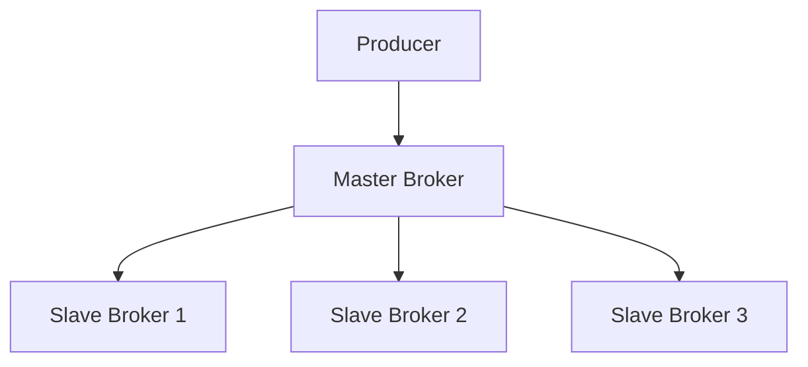

# RocketMQ 多副本机制

RocketMQ 是一个分布式消息中间件，广泛应用于大规模分布式系统中。为了保证数据的高可用性和一致性，RocketMQ 引入了多副本机制（Replication Mechanism）。本文将详细介绍 RocketMQ 的多副本机制，帮助初学者理解其工作原理和实际应用。

## 什么是多副本机制？

多副本机制是指在分布式系统中，将同一份数据存储在多个节点上，以确保在某个节点发生故障时，数据仍然可以从其他节点访问。RocketMQ 通过多副本机制实现了消息的高可用性和数据一致性。

在 RocketMQ 中，每个主题（Topic）的消息会被复制到多个 Broker 节点上。这些副本分为主副本（Master）和从副本（Slave）。主副本负责处理读写请求，而从副本则用于备份数据，并在主副本发生故障时接管服务。

## 多副本机制的工作原理

### 1. 主从架构

RocketMQ 的多副本机制基于主从架构。每个主题的消息会被复制到多个 Broker 节点上，其中一个节点作为主副本，其他节点作为从副本。



### 2. 数据同步

主副本负责接收生产者发送的消息，并将消息同步到从副本。RocketMQ 使用异步复制的方式将消息从主副本复制到从副本，以提高性能。

:::note
异步复制意味着主副本在接收到消息后，会立即返回确认给生产者，而不需要等待从副本完成同步。这种方式虽然提高了性能，但在主副本发生故障时，可能会导致部分数据丢失。
:::

### 3. 故障切换

当主副本发生故障时，RocketMQ 会自动从从副本中选举一个新的主副本，继续提供服务。这个过程称为故障切换（Failover）。

:::tip
故障切换是 RocketMQ 实现高可用性的关键机制。通过自动切换主副本，RocketMQ 可以在主副本发生故障时，快速恢复服务，减少对系统的影响。
:::

## 实际应用场景

### 场景 1：消息的高可用性

在一个电商系统中，订单消息是非常重要的数据。如果订单消息丢失，可能会导致用户下单失败或订单状态不一致。通过 RocketMQ 的多副本机制，订单消息会被复制到多个 Broker 节点上，即使某个节点发生故障，订单消息仍然可以从其他节点获取，确保订单系统的正常运行。

### 场景 2：数据一致性

在金融系统中，交易消息的准确性至关重要。RocketMQ 的多副本机制可以确保交易消息在多个节点上保持一致。即使主副本发生故障，从副本仍然可以提供一致的数据，避免交易数据出现不一致的情况。

## 代码示例

以下是一个简单的 RocketMQ 生产者示例，展示了如何发送消息到 RocketMQ 集群。

```java
import org.apache.rocketmq.client.producer.DefaultMQProducer;
import org.apache.rocketmq.common.message.Message;

public class RocketMQProducer {
    public static void main(String[] args) throws Exception {
        // 创建生产者实例
        DefaultMQProducer producer = new DefaultMQProducer("ProducerGroupName");
        // 设置 NameServer 地址
        producer.setNamesrvAddr("localhost:9876");
        // 启动生产者
        producer.start();

        // 创建消息
        Message msg = new Message("TopicTest", "TagA", "Hello RocketMQ".getBytes());
        // 发送消息
        producer.send(msg);

        // 关闭生产者
        producer.shutdown();
    }
}
```

:::caution
在实际生产环境中，建议配置多个 NameServer 地址，以提高系统的可用性。
:::

## 总结

RocketMQ 的多副本机制通过数据复制和故障切换，实现了消息的高可用性和数据一致性。主从架构和异步复制是 RocketMQ 多副本机制的核心，它们确保了系统在发生故障时能够快速恢复，并保持数据的完整性。

通过本文的介绍，你应该对 RocketMQ 的多副本机制有了初步的了解。在实际应用中，合理配置多副本机制可以显著提高系统的可靠性和稳定性。

## 附加资源

- [RocketMQ 官方文档](https://rocketmq.apache.org/docs/)
- [RocketMQ 源码解析](https://github.com/apache/rocketmq)
- [分布式系统设计模式](https://en.wikipedia.org/wiki/Distributed_computing)

## 练习

1. 尝试在本地搭建一个 RocketMQ 集群，并配置多副本机制。
2. 编写一个消费者程序，从 RocketMQ 集群中消费消息，并观察主副本故障时的行为。
3. 研究 RocketMQ 的同步复制模式，并与异步复制模式进行对比。
