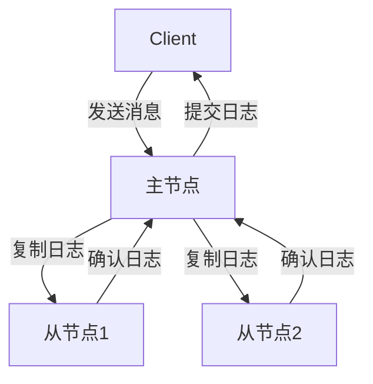

# RocketMQ DLedger 模式

RocketMQ 是一个分布式消息中间件，广泛应用于高并发、高吞吐量的场景。为了确保消息的高可用性和数据一致性，RocketMQ 引入了 **DLedger 模式**。DLedger 是一种基于 Raft 协议的分布式日志复制机制，能够有效解决 RocketMQ 集群中的主从切换和数据一致性问题。

本文将详细介绍 DLedger 模式的工作原理、配置方法以及实际应用场景，帮助你更好地理解和使用 RocketMQ 的高可用特性。

---

## 什么是 DLedger 模式？

DLedger 是 RocketMQ 提供的一种高可用集群管理机制，基于 Raft 协议实现。它的核心功能是确保消息的可靠存储和主从节点的自动切换。在传统的 RocketMQ 集群中，主从切换需要人工干预，而 DLedger 模式通过 Raft 协议实现了自动化的主从选举和数据同步。

:::note
Raft 协议是一种分布式一致性算法，用于管理复制日志的一致性。它通过选举机制和日志复制来确保集群的高可用性。
:::

DLedger 模式的主要特点包括：
1. **自动主从切换**：当主节点故障时，DLedger 会自动选举新的主节点。
2. **数据一致性**：通过 Raft 协议确保消息的强一致性。
3. **高可用性**：支持多副本存储，避免单点故障。

---

## DLedger 模式的工作原理

DLedger 模式的核心是基于 Raft 协议的日志复制和选举机制。以下是其工作流程：

1. **日志复制**：
   - 客户端发送消息到主节点。
   - 主节点将消息写入本地日志，并将日志复制到从节点。
   - 当大多数节点（超过半数）确认接收日志后，主节点提交日志并通知客户端。

2. **主从选举**：
   - 如果主节点故障，从节点会发起选举。
   - 通过 Raft 协议选举出新的主节点。
   - 新主节点接管消息处理，并继续日志复制。

以下是一个简单的示意图：



---

## 配置 DLedger 模式

要在 RocketMQ 中启用 DLedger 模式，需要在配置文件中进行以下设置：

1. 修改 `broker.conf` 文件，添加以下配置：

```ini
# 启用 DLedger 模式
enableDLegerCommitLog=true
# 设置 DLedger 组名称
dLegerGroup=my-dledger-group
# 设置 DLedger 节点列表
dLegerPeers=n0-127.0.0.1:40911;n1-127.0.0.1:40912;n2-127.0.0.1:40913
# 设置当前节点的 ID
dLegerSelfId=n0
```

2. 启动 RocketMQ 集群时，确保每个节点的配置正确。

:::caution
确保 `dLegerPeers` 中的节点 ID 和 `dLegerSelfId` 一致，否则集群无法正常启动。
:::

---

## 实际应用场景

DLedger 模式适用于以下场景：
1. **金融交易系统**：需要确保消息的强一致性和高可用性。
2. **电商订单系统**：在高并发场景下，避免因主节点故障导致的消息丢失。
3. **日志收集系统**：确保日志数据的可靠存储和快速恢复。

例如，在一个电商订单系统中，订单消息需要实时处理并存储。如果主节点故障，DLedger 模式可以自动切换到新的主节点，确保订单消息不丢失。

---

## 总结

DLedger 模式是 RocketMQ 提供的一种高可用集群管理机制，基于 Raft 协议实现自动主从切换和数据一致性。通过配置 DLedger 模式，可以有效提升 RocketMQ 集群的可靠性和稳定性。

:::tip
如果你想进一步学习 RocketMQ 的高可用机制，可以参考以下资源：
- [RocketMQ 官方文档](https://rocketmq.apache.org/docs/)
- Raft 协议论文：[In Search of an Understandable Consensus Algorithm](https://raft.github.io/raft.pdf)
:::

---

## 练习

1. 尝试在本地搭建一个 RocketMQ 集群，并启用 DLedger 模式。
2. 模拟主节点故障，观察 DLedger 模式如何自动切换主节点。
3. 修改 `broker.conf` 文件，测试不同配置对集群的影响。

通过以上练习，你将更深入地理解 DLedger 模式的工作原理和应用场景。