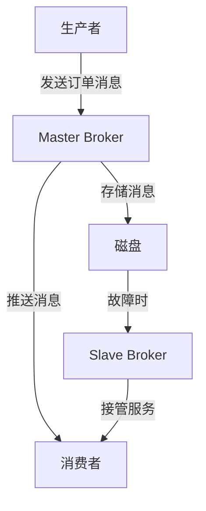

# RocketMQ Broker管理

RocketMQ 是一个分布式消息中间件，广泛应用于大规模分布式系统中。Broker 是 RocketMQ 的核心组件之一，负责消息的存储和转发。本文将详细介绍如何管理和配置 RocketMQ Broker，帮助初学者理解其工作原理和实际应用。

## 什么是 RocketMQ Broker？

Broker 是 RocketMQ 的消息存储和转发服务器。它负责接收生产者发送的消息，并将其存储到磁盘中。同时，Broker 也负责将消息推送给消费者。Broker 是 RocketMQ 集群中的关键组件，其性能和稳定性直接影响整个消息系统的表现。

## Broker 的基本配置

在 RocketMQ 中，Broker 的配置主要通过 `broker.conf` 文件进行。以下是一些常见的配置项：

- `brokerClusterName`: Broker 所属的集群名称。
- `brokerName`: Broker 的名称，同一集群中的 Broker 名称必须唯一。
- `brokerId`: Broker 的 ID，0 表示 Master，大于 0 表示 Slave。
- `listenPort`: Broker 监听的端口号。
- `storePathRootDir`: 消息存储的根目录。

以下是一个简单的 `broker.conf` 配置示例：

```properties
brokerClusterName=DefaultCluster
brokerName=broker-a
brokerId=0
listenPort=10911
storePathRootDir=/home/rocketmq/store
```

## Broker 的启动与停止

启动 Broker 时，可以使用 RocketMQ 提供的脚本 `mqbroker`。以下是一个启动 Broker 的示例命令：

```bash
nohup sh mqbroker -c /path/to/broker.conf &
```

停止 Broker 时，可以使用以下命令：

```bash
sh mqshutdown broker
```

## Broker 集群管理

在 RocketMQ 中，Broker 通常以集群的形式部署，以提高系统的可用性和扩展性。Broker 集群通常由一个 Master 和多个 Slave 组成。Master 负责处理所有的读写请求，而 Slave 则作为备份，当 Master 出现故障时，Slave 可以接管服务。

以下是一个简单的 Broker 集群配置示例：

```properties
# Master Broker
brokerClusterName=DefaultCluster
brokerName=broker-a
brokerId=0
listenPort=10911
storePathRootDir=/home/rocketmq/store

# Slave Broker
brokerClusterName=DefaultCluster
brokerName=broker-a
brokerId=1
listenPort=10912
storePathRootDir=/home/rocketmq/store-slave
```

:::note
在配置 Broker 集群时，确保 Master 和 Slave 的 `brokerName` 相同，但 `brokerId` 不同。
:::

## 实际应用场景

假设我们有一个电商系统，需要处理大量的订单消息。为了提高系统的可靠性，我们可以部署一个 RocketMQ Broker 集群。Master Broker 负责处理所有的订单消息，而 Slave Broker 作为备份，当 Master 出现故障时，Slave 可以接管服务，确保订单消息不会丢失。

以下是一个简单的订单消息处理流程：



## 总结

RocketMQ Broker 是 RocketMQ 消息系统的核心组件，负责消息的存储和转发。通过合理的配置和管理，可以确保 Broker 的高性能和稳定性。本文介绍了 Broker 的基本概念、配置选项、集群管理以及实际应用场景，希望对初学者有所帮助。

## 附加资源与练习

- [RocketMQ 官方文档](https://rocketmq.apache.org/docs/)
- 练习：尝试在自己的环境中部署一个 RocketMQ Broker 集群，并测试其高可用性。

:::tip
在实际生产环境中，建议定期监控 Broker 的性能和状态，及时发现并解决问题。
:::