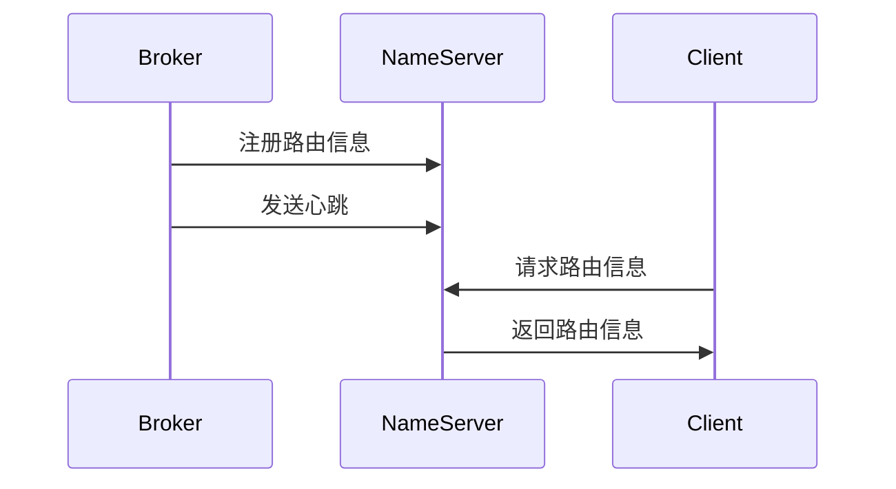

# RocketMQ NameServer 管理

## 介绍

在 RocketMQ 中，NameServer 是一个轻量级的服务，负责管理 Broker 的路由信息。它不存储消息数据，而是充当 Broker 和客户端之间的桥梁，帮助客户端找到正确的 Broker 进行消息的发送和接收。NameServer 的设计目标是简单、高效，并且能够快速响应路由信息的变化。

:::note
NameServer 是 RocketMQ 集群的核心组件之一，负责维护 Broker 的路由表，确保消息的准确传递。
:::

## NameServer 的作用

NameServer 的主要功能包括：

1. **路由管理**：NameServer 维护 Broker 的路由信息，包括 Broker 的地址、Topic 的分布等。
2. **服务发现**：客户端通过 NameServer 获取 Broker 的地址，从而能够正确地发送和接收消息。
3. **高可用性**：NameServer 本身是无状态的，可以通过部署多个实例来提高系统的可用性。

## NameServer 的配置

在 RocketMQ 中，NameServer 的配置相对简单。以下是一个典型的 NameServer 配置文件示例：

```properties
# NameServer 配置文件示例
listenPort=9876
serverWorkerThreads=8
serverCallbackExecutorThreads=0
serverSelectorThreads=3
serverOnewaySemaphoreValue=256
serverAsyncSemaphoreValue=64
```

:::tip
在实际生产环境中，建议至少部署两个 NameServer 实例，以确保高可用性。
:::

## NameServer 的启动

启动 NameServer 非常简单，只需执行以下命令：

```bash
nohup sh bin/mqnamesrv &
```

启动后，NameServer 会监听指定的端口（默认是 9876），并开始接收 Broker 和客户端的请求。

## NameServer 与 Broker 的交互

NameServer 与 Broker 之间的交互是 RocketMQ 集群正常运行的关键。Broker 启动时会向 NameServer 注册自己的路由信息，并定期发送心跳以保持连接。NameServer 会将这些信息存储在内存中，并在客户端请求时返回相应的路由信息。



## 实际案例

假设我们有一个 RocketMQ 集群，包含两个 Broker 和一个 NameServer。客户端需要向某个 Topic 发送消息，以下是消息发送的流程：

1. 客户端向 NameServer 请求该 Topic 的路由信息。
2. NameServer 返回该 Topic 对应的 Broker 地址。
3. 客户端根据返回的 Broker 地址，将消息发送到相应的 Broker。

```java
// 客户端代码示例
DefaultMQProducer producer = new DefaultMQProducer("ProducerGroupName");
producer.setNamesrvAddr("127.0.0.1:9876");
producer.start();

Message msg = new Message("TopicTest", "TagA", "Hello RocketMQ".getBytes());
SendResult sendResult = producer.send(msg);
System.out.println(sendResult);

producer.shutdown();
```

:::caution
在实际生产环境中，NameServer 的地址应该配置为多个，以提高系统的容错能力。
:::

## 总结

NameServer 是 RocketMQ 集群中不可或缺的组件，它负责管理 Broker 的路由信息，确保消息的准确传递。通过本文的介绍，你应该已经了解了 NameServer 的作用、配置和管理方法。在实际应用中，合理配置和管理 NameServer 是保证 RocketMQ 集群稳定运行的关键。

## 附加资源

- [RocketMQ 官方文档](https://rocketmq.apache.org/docs/)
- [RocketMQ GitHub 仓库](https://github.com/apache/rocketmq)

## 练习

1. 尝试在本地启动一个 NameServer，并配置一个 Broker 进行注册。
2. 编写一个简单的客户端程序，通过 NameServer 获取 Broker 的路由信息，并发送一条消息。
3. 思考如何在高可用性场景下部署多个 NameServer，并验证其效果。
