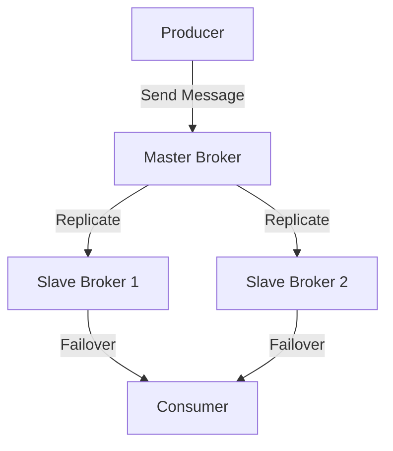
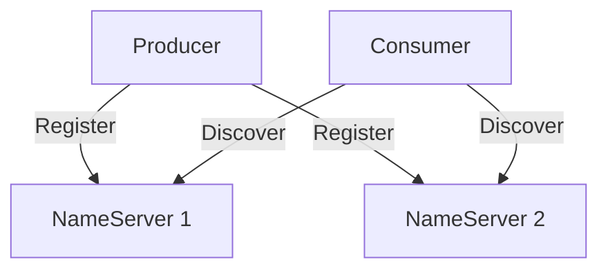

# RocketMQ 故障转移

## 介绍

在分布式系统中，故障转移（Failover）是一种确保系统高可用性的关键机制。RocketMQ作为一款高性能、高可用的分布式消息队列系统，其故障转移机制尤为重要。本文将详细介绍RocketMQ中的故障转移机制，帮助初学者理解如何通过故障转移来保证系统的稳定运行。

## 什么是故障转移？

故障转移是指在系统发生故障时，自动将任务或服务转移到备用节点上，以确保系统的连续性和可用性。在RocketMQ中，故障转移主要涉及Broker（消息存储和转发节点）和NameServer（服务发现和路由管理节点）的高可用性。

## RocketMQ 中的故障转移机制

### 1. Broker故障转移

Broker是RocketMQ中负责存储和转发消息的核心组件。为了确保Broker的高可用性，RocketMQ采用了主从复制机制。每个Broker集群由一个主节点（Master）和多个从节点（Slave）组成。当主节点发生故障时，从节点会自动接管主节点的工作，确保消息的持续处理。

#### 主从复制机制



在上图中，Producer将消息发送到Master Broker，Master Broker会将消息复制到多个Slave Broker。当Master Broker发生故障时，Consumer会自动从Slave Broker获取消息，确保消息的持续消费。

### 2. NameServer故障转移

NameServer是RocketMQ中的服务发现和路由管理组件。为了确保NameServer的高可用性，RocketMQ支持多NameServer部署。当某个NameServer发生故障时，客户端会自动切换到其他可用的NameServer，确保服务的连续性。

#### 多NameServer部署



在上图中，Producer和Consumer都会向多个NameServer注册和发现服务。当某个NameServer发生故障时，客户端会自动切换到其他NameServer，确保服务的连续性。

## 实际案例

假设我们有一个电商系统，使用RocketMQ来处理订单消息。为了确保订单消息的高可用性，我们部署了一个包含一个Master Broker和两个Slave Broker的RocketMQ集群。

### 场景描述

1. **正常情况**：Producer将订单消息发送到Master Broker，Master Broker将消息复制到两个Slave Broker。Consumer从Master Broker获取消息并处理订单。
2. **故障情况**：Master Broker发生故障，Consumer自动从Slave Broker获取消息，确保订单的持续处理。

### 代码示例

以下是一个简单的Producer和Consumer代码示例，展示如何在RocketMQ中发送和消费消息。

#### Producer

```java
DefaultMQProducer producer = new DefaultMQProducer("ProducerGroup");
producer.setNamesrvAddr("127.0.0.1:9876");
producer.start();

Message msg = new Message("OrderTopic", "OrderTag", "OrderID12345", "OrderContent".getBytes());
SendResult sendResult = producer.send(msg);
System.out.println("Message sent: " + sendResult);

producer.shutdown();
```

#### Consumer

```java
DefaultMQPushConsumer consumer = new DefaultMQPushConsumer("ConsumerGroup");
consumer.setNamesrvAddr("127.0.0.1:9876");
consumer.subscribe("OrderTopic", "*");

consumer.registerMessageListener((MessageListenerConcurrently) (msgs, context) -> {
    for (MessageExt msg : msgs) {
        System.out.println("Received message: " + new String(msg.getBody()));
    }
    return ConsumeConcurrentlyStatus.CONSUME_SUCCESS;
});

consumer.start();
```

## 总结

RocketMQ的故障转移机制通过主从复制和多NameServer部署，确保了系统的高可用性和可靠性。在实际应用中，合理配置Broker和NameServer的故障转移策略，可以有效避免单点故障，确保消息的持续处理和服务的连续性。

## 附加资源

- [RocketMQ官方文档](https://rocketmq.apache.org/docs/)
- [RocketMQ GitHub仓库](https://github.com/apache/rocketmq)

## 练习

1. 尝试在一个RocketMQ集群中模拟Master Broker的故障，观察Consumer是否能够自动切换到Slave Broker。
2. 部署多个NameServer，模拟其中一个NameServer的故障，观察客户端是否能够自动切换到其他NameServer。
