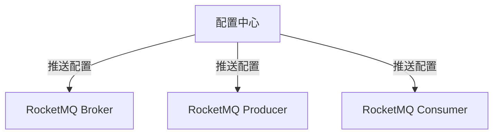

# RocketMQ 动态配置

## 介绍

RocketMQ 是一个分布式消息中间件，广泛应用于大规模分布式系统中。在实际生产环境中，系统的配置参数可能需要根据业务需求或运行环境的变化进行调整。传统的方式是通过修改配置文件并重启服务来实现，但这种方式不仅效率低下，还可能影响系统的可用性。为了解决这个问题，RocketMQ 提供了**动态配置**功能，允许在不重启服务的情况下动态调整配置参数。

动态配置的核心思想是将配置信息存储在外部存储（如Zookeeper、Nacos等）中，RocketMQ 客户端和服务器可以实时监听这些配置的变化，并在配置发生变化时自动更新本地配置。这种方式不仅提高了系统的灵活性，还大大减少了因配置变更导致的系统停机时间。

## 动态配置的工作原理

RocketMQ 的动态配置功能依赖于**配置中心**。配置中心是一个集中管理配置信息的服务，RocketMQ 的客户端和服务器会定期从配置中心拉取最新的配置信息。当配置发生变化时，配置中心会通知 RocketMQ 的各个组件，使其能够及时更新本地配置。



如上图所示，配置中心负责管理所有的配置信息，并将这些信息推送给 RocketMQ 的各个组件。当配置发生变化时，配置中心会立即通知这些组件，使其能够及时更新配置。

## 动态配置的使用场景

动态配置在以下场景中非常有用：

1. **调整消息发送和消费的并发度**：在高并发场景下，可能需要动态调整 Producer 和 Consumer 的并发度，以应对突发的流量变化。
2. **修改消息存储策略**：根据业务需求，可能需要动态调整消息的存储策略，例如修改消息的存储路径、存储格式等。
3. **调整日志级别**：在生产环境中，可能需要动态调整日志级别，以便更好地监控系统的运行状态。
4. **修改超时时间**：根据网络状况的变化，可能需要动态调整消息发送和消费的超时时间。

## 动态配置的实现

RocketMQ 的动态配置功能可以通过以下步骤实现：

### 1. 配置中心的设置

首先，需要选择一个合适的配置中心，例如 Zookeeper、Nacos 等。以 Nacos 为例，首先需要在 Nacos 中创建一个配置项，例如：

```plaintext
Data ID: rocketmq-config
Group: DEFAULT_GROUP
Content:
{
  "sendMsgTimeout": 3000,
  "consumeThreadMin": 20,
  "consumeThreadMax": 64
}
```

### 2. RocketMQ 客户端和服务器配置

在 RocketMQ 的客户端和服务器中，需要配置 Nacos 的地址，并指定要监听的配置项。例如，在 `broker.conf` 中配置：

```plaintext
namesrvAddr=127.0.0.1:9876
configStorePath=nacos://127.0.0.1:8848/rocketmq-config
```

### 3. 动态配置的监听

RocketMQ 的客户端和服务器会自动监听配置中心的变化。当配置发生变化时，RocketMQ 会自动更新本地配置。例如，当 `sendMsgTimeout` 从 3000 修改为 5000 时，RocketMQ 会自动将消息发送的超时时间调整为 5000 毫秒。

### 4. 验证配置更新

可以通过日志或监控工具来验证配置是否已经更新。例如，在 RocketMQ 的日志中可以看到类似以下的输出：

```plaintext
[INFO] [ConfigManager] Dynamic config updated: sendMsgTimeout=5000
```

## 实际案例

假设我们有一个电商系统，使用 RocketMQ 来处理订单消息。在双十一大促期间，订单量激增，系统需要动态调整消息发送和消费的并发度，以应对突发的流量。

1. **初始配置**：在 Nacos 中配置 `consumeThreadMin=20` 和 `consumeThreadMax=64`。
2. **流量激增**：双十一期间，订单量激增，系统需要提高消费并发度。
3. **动态调整**：在 Nacos 中将 `consumeThreadMin` 调整为 50，`consumeThreadMax` 调整为 128。
4. **配置生效**：RocketMQ 自动更新配置，消费并发度提高，系统能够更好地处理订单消息。

## 总结

RocketMQ 的动态配置功能为系统提供了极大的灵活性，允许在不重启服务的情况下动态调整配置参数。通过配置中心，RocketMQ 的客户端和服务器可以实时监听配置的变化，并在配置发生变化时自动更新本地配置。这种方式不仅提高了系统的可维护性，还大大减少了因配置变更导致的系统停机时间。

在实际应用中，动态配置可以用于调整消息发送和消费的并发度、修改消息存储策略、调整日志级别等场景。通过合理使用动态配置，可以显著提升系统的稳定性和性能。

## 附加资源

- [RocketMQ 官方文档](https://rocketmq.apache.org/docs/)
- [Nacos 官方文档](https://nacos.io/zh-cn/docs/what-is-nacos.html)
- [Zookeeper 官方文档](https://zookeeper.apache.org/doc/current/)

## 练习

1. 尝试在本地搭建一个 RocketMQ 环境，并使用 Nacos 作为配置中心，实现动态配置功能。
2. 修改 Nacos 中的配置项，观察 RocketMQ 的日志，验证配置是否自动更新。
3. 思考在实际项目中，哪些场景下可以使用动态配置功能，并尝试实现这些场景。