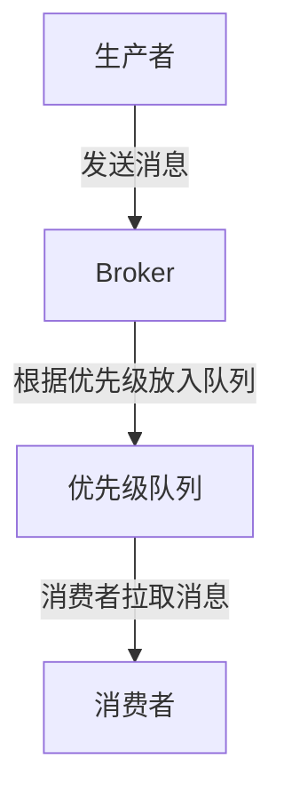

# RocketMQ 消息优先级

在分布式消息系统中，消息的优先级是一个非常重要的特性。RocketMQ作为一款高性能、高可用的消息中间件，提供了消息优先级的功能，允许开发者根据业务需求对消息进行优先级划分，从而确保高优先级的消息能够被优先处理。

## 什么是消息优先级？

消息优先级是指消息在队列中的处理顺序。在RocketMQ中，消息的优先级通过消息的`priority`属性来定义。优先级越高的消息，越早被消费者处理。RocketMQ支持0到9共10个优先级级别，其中0为最低优先级，9为最高优先级。

:::note
RocketMQ的消息优先级是基于队列的，而不是基于主题的。这意味着优先级仅在同一个队列中有效，不同队列之间的消息优先级无法直接比较。
:::

## 如何设置消息优先级？

在RocketMQ中，消息的优先级可以通过设置消息的`priority`属性来实现。以下是一个简单的Java代码示例，展示了如何发送带有优先级的消息：

```java
import org.apache.rocketmq.client.producer.DefaultMQProducer;
import org.apache.rocketmq.common.message.Message;

public class PriorityMessageProducer {
    public static void main(String[] args) throws Exception {
        // 实例化一个生产者
        DefaultMQProducer producer = new DefaultMQProducer("priority_producer_group");
        // 设置NameServer地址
        producer.setNamesrvAddr("localhost:9876");
        // 启动生产者
        producer.start();

        // 创建消息，指定Topic和Tag
        Message msg = new Message("PriorityTopic", "TagA", "Hello RocketMQ".getBytes());
        // 设置消息优先级
        msg.setPriority(5); // 优先级为5
        // 发送消息
        producer.send(msg);

        // 关闭生产者
        producer.shutdown();
    }
}
```

在这个示例中，我们创建了一个优先级为5的消息，并将其发送到名为`PriorityTopic`的主题中。

## 消息优先级的处理机制

RocketMQ的消息优先级处理机制是基于队列的。当消息被发送到Broker时，Broker会根据消息的优先级将其放入相应的队列中。消费者在消费消息时，会优先从高优先级的队列中拉取消息。



:::tip
在实际应用中，建议将优先级较高的消息放入单独的队列中，以避免低优先级消息阻塞高优先级消息的处理。
:::

## 实际应用场景

### 电商订单处理

在电商系统中，订单的处理通常有不同的优先级。例如，VIP用户的订单可能需要优先处理，而普通用户的订单则可以稍后处理。通过使用RocketMQ的消息优先级功能，可以确保VIP用户的订单被优先处理，从而提升用户体验。

```java
// VIP用户订单消息
Message vipOrderMsg = new Message("OrderTopic", "VIP", "VIP Order".getBytes());
vipOrderMsg.setPriority(9); // 最高优先级

// 普通用户订单消息
Message normalOrderMsg = new Message("OrderTopic", "Normal", "Normal Order".getBytes());
normalOrderMsg.setPriority(1); // 较低优先级
```

### 实时告警系统

在实时告警系统中，不同级别的告警消息需要不同的处理优先级。例如，严重级别的告警需要立即处理，而普通级别的告警可以稍后处理。通过设置消息优先级，可以确保严重级别的告警被优先处理。

```java
// 严重级别告警消息
Message criticalAlertMsg = new Message("AlertTopic", "Critical", "Critical Alert".getBytes());
criticalAlertMsg.setPriority(9); // 最高优先级

// 普通级别告警消息
Message normalAlertMsg = new Message("AlertTopic", "Normal", "Normal Alert".getBytes());
normalAlertMsg.setPriority(3); // 较低优先级
```

## 总结

RocketMQ的消息优先级功能为开发者提供了一种灵活的方式来控制消息的处理顺序。通过合理设置消息的优先级，可以确保高优先级的消息被优先处理，从而满足不同业务场景的需求。

在实际应用中，建议根据业务需求合理划分消息的优先级，并注意优先级队列的管理，以避免低优先级消息阻塞高优先级消息的处理。

## 附加资源与练习

- **练习1**：尝试在本地搭建一个RocketMQ环境，并发送不同优先级的消息，观察消费者的处理顺序。
- **练习2**：设计一个电商订单处理系统，使用RocketMQ的消息优先级功能实现VIP订单的优先处理。

通过以上练习，你将更深入地理解RocketMQ的消息优先级机制，并能够在实际项目中灵活应用。