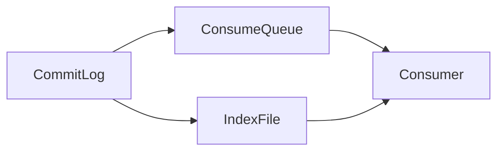

# RocketMQ 消息存储策略

RocketMQ 是一款高性能、高可用的分布式消息中间件，广泛应用于大规模分布式系统中。消息存储策略是 RocketMQ 的核心机制之一，它决定了消息如何被持久化、存储和检索。本文将详细介绍 RocketMQ 的消息存储策略，帮助初学者理解其工作原理和实际应用。

## 1. 消息存储概述

在 RocketMQ 中，消息存储是消息传递的核心环节。消息存储策略的设计直接影响到消息的可靠性、性能和扩展性。RocketMQ 的消息存储策略主要包括以下几个方面：

- **消息持久化**：确保消息在发送后不会丢失。
- **消息索引**：快速检索消息。
- **消息清理**：定期清理过期或无用的消息。

## 2. 消息存储机制

### 2.1 消息持久化

RocketMQ 使用 CommitLog 文件来持久化消息。所有消息都会按照顺序写入 CommitLog 文件，确保消息的可靠存储。CommitLog 文件是 RocketMQ 的核心存储文件，它记录了所有消息的原始数据。


### 2.2 消息索引

为了快速检索消息，RocketMQ 使用 ConsumeQueue 和 IndexFile 两种索引文件。

- **ConsumeQueue**：每个主题（Topic）和队列（Queue）都有一个对应的 ConsumeQueue 文件，记录了消息在 CommitLog 中的偏移量。
- **IndexFile**：用于支持按消息 Key 或时间范围查询消息。



### 2.3 消息清理

RocketMQ 会定期清理过期的消息和无用的索引文件，以释放存储空间。清理策略包括：

- **时间清理**：删除超过指定时间的消息。
- **空间清理**：当存储空间不足时，删除最早的消息。

## 3. 实际案例

### 3.1 电商订单系统

在电商系统中，订单消息需要可靠地存储和传递。RocketMQ 的消息存储策略确保了订单消息的持久化和快速检索，即使在系统故障的情况下，订单消息也不会丢失。

### 3.2 日志收集系统

在日志收集系统中，大量的日志消息需要高效存储和检索。RocketMQ 的索引机制使得日志消息能够快速被查询和分析，提高了系统的处理效率。

## 4. 代码示例

以下是一个简单的 RocketMQ 消息发送和接收的代码示例：

```java
// 生产者发送消息
DefaultMQProducer producer = new DefaultMQProducer("ProducerGroup");
producer.start();
Message msg = new Message("TopicTest", "TagA", "Hello RocketMQ".getBytes());
SendResult sendResult = producer.send(msg);
System.out.println("Message sent: " + sendResult);
producer.shutdown();

// 消费者接收消息
DefaultMQPushConsumer consumer = new DefaultMQPushConsumer("ConsumerGroup");
consumer.subscribe("TopicTest", "*");
consumer.registerMessageListener((MessageListenerConcurrently) (msgs, context) -> {
    for (MessageExt msg : msgs) {
        System.out.println("Message received: " + new String(msg.getBody()));
    }
    return ConsumeConcurrentlyStatus.CONSUME_SUCCESS;
});
consumer.start();
```

:::note
在实际应用中，生产者和消费者通常运行在不同的进程中，甚至不同的机器上。
:::

## 5. 总结

RocketMQ 的消息存储策略是其高可靠性和高性能的关键。通过 CommitLog、ConsumeQueue 和 IndexFile 的协同工作，RocketMQ 实现了消息的持久化、快速检索和高效清理。理解这些机制有助于更好地设计和优化基于 RocketMQ 的分布式系统。

## 6. 附加资源

- [RocketMQ 官方文档](https://rocketmq.apache.org/docs/)
- [RocketMQ GitHub 仓库](https://github.com/apache/rocketmq)
- [分布式消息系统设计](https://www.oreilly.com/library/view/designing-distributed-systems/9781491983638/)

## 7. 练习

1. 尝试在本地搭建一个 RocketMQ 环境，并运行上述代码示例。
2. 修改代码，尝试发送和接收不同类型的消息（如 JSON 格式的消息）。
3. 研究 RocketMQ 的存储文件结构，理解 CommitLog、ConsumeQueue 和 IndexFile 的具体内容。

通过以上学习和实践，你将能够深入理解 RocketMQ 的消息存储策略，并能够在实际项目中应用这些知识。