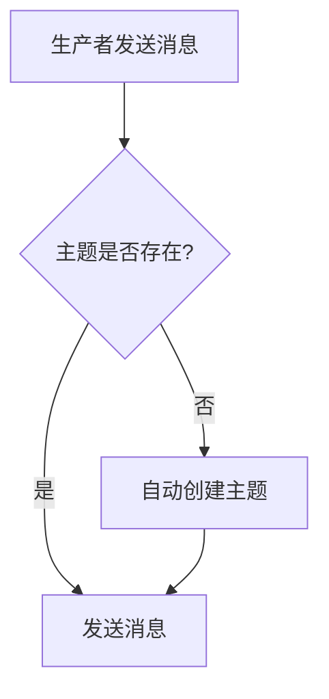

# RocketMQ 自动创建主题

RocketMQ 是一个分布式消息中间件，广泛应用于大规模分布式系统中。在 RocketMQ 中，主题（Topic）是消息的逻辑分类，生产者将消息发送到特定的主题，消费者从主题中订阅消息。为了简化开发流程，RocketMQ 提供了自动创建主题的功能，允许在消息发送时自动创建不存在的主题。

## 什么是自动创建主题？

自动创建主题是 RocketMQ 提供的一项便捷功能。当生产者尝试向一个不存在的主题发送消息时，RocketMQ 会自动创建该主题，而无需手动预先配置。这一功能特别适合在开发环境中使用，可以显著减少开发和测试的复杂性。

:::note
自动创建主题功能在生产环境中应谨慎使用，因为它可能会导致主题的命名不规范或产生不必要的主题。
:::

## 如何配置自动创建主题？

RocketMQ 的自动创建主题功能可以通过 Broker 的配置文件进行配置。以下是配置步骤：

1. **修改 Broker 配置文件**  
   打开 RocketMQ 的 Broker 配置文件 `broker.conf`，添加或修改以下配置项：

   ```plaintext
   autoCreateTopicEnable=true
   ```

   该配置项默认为 `true`，表示启用自动创建主题功能。如果设置为 `false`，则禁用该功能。

2. **重启 Broker**  
   修改配置文件后，需要重启 RocketQ Broker 以使配置生效。

3. **验证配置**  
   通过发送消息到一个不存在的主题，验证主题是否被自动创建。

## 代码示例

以下是一个简单的 Java 示例，展示如何使用 RocketMQ 发送消息并触发自动创建主题。

```java
import org.apache.rocketmq.client.producer.DefaultMQProducer;
import org.apache.rocketmq.common.message.Message;

public class AutoCreateTopicExample {
    public static void main(String[] args) throws Exception {
        // 创建生产者实例
        DefaultMQProducer producer = new DefaultMQProducer("ProducerGroupName");
        producer.setNamesrvAddr("localhost:9876");
        producer.start();

        // 创建消息
        Message msg = new Message("NonExistentTopic", "TagA", "Hello RocketMQ".getBytes());

        // 发送消息
        producer.send(msg);
        System.out.println("消息发送成功！");

        // 关闭生产者
        producer.shutdown();
    }
}
```

### 输出结果

如果 `autoCreateTopicEnable` 设置为 `true`，RocketMQ 会自动创建主题 `NonExistentTopic`，并成功发送消息。如果设置为 `false`，则会抛出异常，提示主题不存在。

## 实际应用场景

### 开发与测试环境

在开发和测试环境中，自动创建主题功能可以极大地简化流程。开发者无需预先配置主题，可以直接发送消息进行测试。

### 动态主题需求

在某些场景中，主题的名称可能是动态生成的（例如基于用户 ID 或时间戳）。自动创建主题功能可以支持这种动态需求，避免手动创建主题的繁琐操作。

## 总结

RocketMQ 的自动创建主题功能为开发者提供了极大的便利，尤其是在开发和测试环境中。然而，在生产环境中，建议谨慎使用该功能，以避免主题命名不规范或产生不必要的主题。

:::tip
在生产环境中，建议通过管理工具或脚本预先创建主题，以确保主题的命名规范性和系统的稳定性。
:::

## 附加资源与练习

- **官方文档**：阅读 [RocketMQ 官方文档](https://rocketmq.apache.org/docs/) 了解更多高级特性。
- **练习**：尝试在本地环境中配置 RocketMQ，并测试自动创建主题功能。观察主题的创建过程以及消息的发送和接收。



通过以上内容，您应该对 RocketMQ 的自动创建主题功能有了全面的了解。希望这篇教程能帮助您更好地使用 RocketMQ！