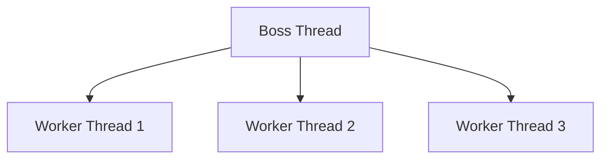

# RocketMQ 客户端线程模型

RocketMQ 是一个分布式消息中间件，广泛应用于大规模分布式系统中。为了高效处理消息的发送和接收，RocketMQ 客户端采用了多线程模型。本文将详细介绍 RocketMQ 客户端的线程模型，帮助初学者理解其工作原理及在实际开发中的应用。

## 1. 什么是线程模型？

线程模型是指系统中线程的组织方式和调度策略。在 RocketMQ 客户端中，线程模型决定了消息的发送、接收、处理等操作的并发执行方式。理解线程模型有助于我们更好地优化系统性能，避免资源竞争和死锁等问题。

## 2. RocketMQ 客户端线程模型概述

RocketMQ 客户端的线程模型主要包括以下几个部分：

- **生产者线程模型**：负责消息的发送。
- **消费者线程模型**：负责消息的接收和处理。
- **Netty 线程模型**：负责网络通信。

### 2.1 生产者线程模型

生产者在发送消息时，通常会创建一个或多个线程来执行发送操作。RocketMQ 提供了同步发送和异步发送两种方式：

- **同步发送**：发送线程会阻塞，直到收到 Broker 的响应。
- **异步发送**：发送线程不会阻塞，通过回调函数处理响应。

以下是一个同步发送消息的示例代码：

```java
DefaultMQProducer producer = new DefaultMQProducer("ProducerGroupName");
producer.start();

Message msg = new Message("TopicTest", "TagA", "Hello RocketMQ".getBytes());
SendResult sendResult = producer.send(msg);
System.out.println(sendResult);

producer.shutdown();
```

### 2.2 消费者线程模型

消费者在接收消息时，通常会创建一个线程池来处理消息。RocketMQ 提供了两种消费模式：

- **集群消费**：同一个 ConsumerGroup 中的消费者共同消费消息。
- **广播消费**：同一个 ConsumerGroup 中的每个消费者都会消费所有消息。

以下是一个集群消费的示例代码：

```java
DefaultMQPushConsumer consumer = new DefaultMQPushConsumer("ConsumerGroupName");
consumer.subscribe("TopicTest", "*");

consumer.registerMessageListener((MessageListenerConcurrently) (msgs, context) -> {
    for (MessageExt msg : msgs) {
        System.out.println(new String(msg.getBody()));
    }
    return ConsumeConcurrentlyStatus.CONSUME_SUCCESS;
});

consumer.start();
```

### 2.3 Netty 线程模型

RocketMQ 使用 Netty 作为网络通信框架。Netty 的线程模型基于 Reactor 模式，主要包括以下几个线程：

- **Boss 线程**：负责接收客户端连接。
- **Worker 线程**：负责处理 I/O 事件。

以下是一个简化的 Netty 线程模型图：



## 3. 实际应用场景

### 3.1 高并发消息发送

在高并发场景下，生产者可以通过异步发送消息来提高吞吐量。例如，电商系统在秒杀活动中，可以使用异步发送来快速处理大量订单消息。

### 3.2 消息顺序消费

在某些场景下，消息需要按照顺序消费。RocketMQ 提供了顺序消费的支持，消费者可以通过设置 `MessageQueueSelector` 来保证消息的顺序性。

## 4. 总结

RocketMQ 客户端的线程模型是其高效处理消息的关键。通过理解生产者、消费者和 Netty 的线程模型，我们可以更好地优化系统性能，满足不同场景的需求。

## 5. 附加资源与练习

- **官方文档**：[RocketMQ 官方文档](https://rocketmq.apache.org/docs/)
- **练习**：尝试实现一个简单的 RocketMQ 生产者和消费者，并观察线程的行为。

:::tip
在实际开发中，合理配置线程池大小和线程模型参数，可以有效提升系统性能。
:::