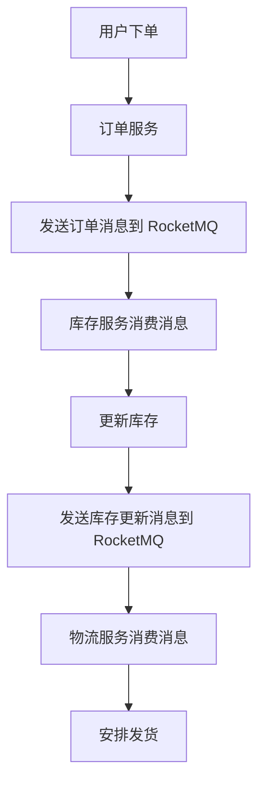

# RocketMQ Python客户端

RocketMQ 是一个分布式消息中间件，广泛应用于大规模分布式系统中。Python 客户端为开发者提供了与 RocketMQ 交互的接口，使得在 Python 项目中集成消息队列变得简单易行。本文将详细介绍如何使用 RocketMQ Python 客户端进行开发。

## 1. 安装 RocketMQ Python 客户端

首先，我们需要安装 RocketMQ 的 Python 客户端库。可以通过 pip 来安装：

```bash
pip install rocketmq-client-python
```

安装完成后，您可以在 Python 脚本中导入 `rocketmq` 模块：

```python
import rocketmq
```

## 2. 配置 RocketMQ 客户端

在使用 RocketMQ Python 客户端之前，您需要配置客户端以连接到 RocketMQ 服务器。通常，您需要指定 NameServer 的地址：

```python
from rocketmq.client import Producer, Message

# 配置 NameServer 地址
producer = Producer('YourProducerGroup')
producer.set_namesrv_addr('127.0.0.1:9876')
producer.start()
```

:::note
确保 `127.0.0.1:9876` 是您的 RocketMQ NameServer 的实际地址。
:::

## 3. 发送消息

配置好客户端后，您可以开始发送消息。以下是一个简单的示例，展示如何发送一条消息到指定的 Topic：

```python
# 创建消息
msg = Message('YourTopic', 'YourTag', 'Hello, RocketMQ!'.encode('utf-8'))

# 发送消息
result = producer.send_sync(msg)
print(f"Send result: {result}")
```

:::tip
`send_sync` 方法会阻塞直到消息发送成功或失败。如果您需要异步发送消息，可以使用 `send_oneway` 或 `send_async` 方法。
:::

## 4. 接收消息

接收消息通常通过消费者来实现。以下是一个简单的消费者示例：

```python
from rocketmq.client import PushConsumer, ConsumeStatus

def callback(msg):
    print(f"Received message: {msg.body.decode('utf-8')}")
    return ConsumeStatus.CONSUME_SUCCESS

# 配置消费者
consumer = PushConsumer('YourConsumerGroup')
consumer.set_namesrv_addr('127.0.0.1:9876')
consumer.subscribe('YourTopic', callback)
consumer.start()
```

:::caution
确保 `YourConsumerGroup` 和 `YourTopic` 与生产者的配置一致，否则无法接收到消息。
:::

## 5. 实际应用场景

RocketMQ 在分布式系统中有着广泛的应用场景。以下是一个实际案例，展示如何在电商系统中使用 RocketMQ 进行订单处理：



在这个场景中，订单服务将订单信息发送到 RocketMQ，库存服务和物流服务分别消费这些消息，完成库存更新和发货安排。

## 6. 总结

通过本文，您已经学习了如何使用 RocketMQ Python 客户端进行消息的发送和接收。RocketMQ 提供了强大的消息队列功能，能够帮助您构建高效、可靠的分布式系统。

## 7. 附加资源与练习

- **官方文档**: 访问 [RocketMQ 官方文档](https://rocketmq.apache.org/docs/) 获取更多详细信息。
- **练习**: 尝试在本地搭建一个 RocketMQ 环境，并使用 Python 客户端实现一个简单的消息生产者和消费者。

:::warning
在实际生产环境中，请确保对 RocketMQ 进行适当的配置和监控，以保证系统的稳定性和可靠性。
:::