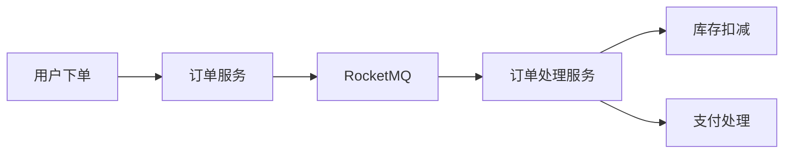

# RocketMQ Node.js客户端

RocketMQ 是一个分布式消息中间件，广泛应用于大规模分布式系统中。Node.js 是一个基于 Chrome V8 引擎的 JavaScript 运行时，非常适合构建高性能的网络应用。通过 RocketMQ 的 Node.js 客户端，开发者可以轻松地将 RocketMQ 集成到 Node.js 应用中。

## 1. 安装 RocketMQ Node.js 客户端

首先，我们需要安装 RocketMQ 的 Node.js 客户端库。可以通过 npm 来安装：

```bash
npm install rocketmq-client
```

安装完成后，你可以在项目中引入该库：

```javascript
const { Producer, Consumer } = require('rocketmq-client');
```

## 2. 配置 RocketMQ 客户端

在使用 RocketMQ 客户端之前，我们需要配置一些基本参数，例如 NameServer 地址、生产者组和消费者组等。

### 生产者配置

```javascript
const producer = new Producer({
  nameServer: '127.0.0.1:9876',
  groupName: 'myProducerGroup',
});
```

### 消费者配置

```javascript
const consumer = new Consumer({
  nameServer: '127.0.0.1:9876',
  groupName: 'myConsumerGroup',
  topic: 'myTopic',
});
```

## 3. 发送消息

配置好生产者后，我们可以开始发送消息。以下是一个简单的示例：

```javascript
(async () => {
  await producer.start();

  const message = {
    topic: 'myTopic',
    tags: 'myTag',
    keys: 'myKey',
    body: 'Hello, RocketMQ!',
  };

  const result = await producer.send(message);
  console.log('Message sent:', result);

  await producer.shutdown();
})();
```

### 输出

```plaintext
Message sent: { messageId: '...', sendStatus: 'SEND_OK' }
```

## 4. 消费消息

配置好消费者后，我们可以开始消费消息。以下是一个简单的示例：

```javascript
(async () => {
  await consumer.start();

  consumer.on('message', async (msg) => {
    console.log('Received message:', msg.body.toString());
    await consumer.commitMessage(msg);
  });

  console.log('Consumer started, waiting for messages...');
})();
```

### 输出

```plaintext
Consumer started, waiting for messages...
Received message: Hello, RocketMQ!
```

## 5. 实际应用场景

### 场景：订单处理系统

假设我们有一个电商平台，需要处理用户的订单。我们可以使用 RocketMQ 来解耦订单的生成和处理过程。

1. **订单生成**：当用户下单时，订单服务将订单信息发送到 RocketMQ 的 `orderTopic`。
2. **订单处理**：订单处理服务从 `orderTopic` 中消费消息，并进行后续处理，例如库存扣减、支付处理等。



## 6. 总结

通过本教程，我们学习了如何使用 RocketMQ 的 Node.js 客户端来发送和消费消息。我们首先安装了客户端库，然后配置了生产者和消费者，最后通过实际案例展示了如何在实际应用中使用 RocketMQ。

## 7. 附加资源与练习

- **官方文档**：访问 [RocketMQ 官方文档](https://rocketmq.apache.org/docs/) 获取更多信息。
- **练习**：尝试在本地搭建一个 RocketMQ 环境，并使用 Node.js 客户端实现一个简单的消息队列系统。

:::tip
在实际开发中，建议将 RocketMQ 的配置参数（如 NameServer 地址）放在环境变量中，以便在不同环境中灵活切换。
:::

:::caution
确保在生产环境中正确处理消息的消费失败情况，避免消息丢失或重复消费。
:::