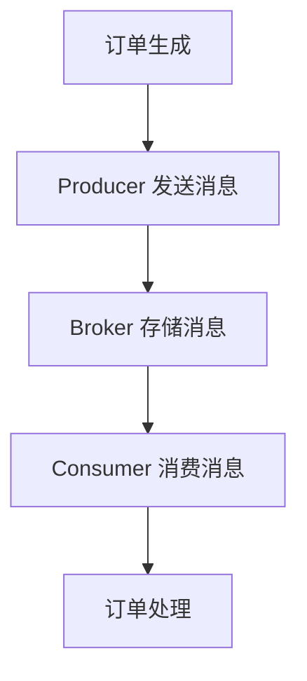
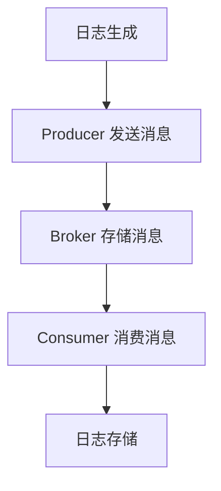

# RocketMQ Broker性能优化

RocketMQ 是一个分布式消息中间件，广泛应用于大规模分布式系统中。Broker 是 RocketMQ 的核心组件之一，负责消息的存储和转发。为了确保 RocketMQ 在高并发、大数据量场景下的稳定性和高效性，对 Broker 进行性能优化是至关重要的。

## 1. 理解 RocketMQ Broker

Broker 是 RocketMQ 的消息存储和转发节点，负责接收生产者发送的消息并将其存储到磁盘，同时将消息推送给消费者。Broker 的性能直接影响到整个消息系统的吞吐量和延迟。

### 1.1 Broker 的主要职责

- **消息存储**：将生产者发送的消息持久化到磁盘。
- **消息转发**：将存储的消息推送给消费者。
- **消息过滤**：根据消费者的订阅条件过滤消息。
- **事务管理**：支持分布式事务消息的处理。

## 2. Broker 性能优化的关键点

### 2.1 消息存储优化

消息存储是 Broker 的核心功能之一，优化存储性能可以显著提升整体系统的吞吐量。

#### 2.1.1 使用 SSD 硬盘

SSD 硬盘的读写速度远高于传统机械硬盘，使用 SSD 可以显著减少消息存储和读取的延迟。

```bash
# 配置 RocketMQ 使用 SSD 硬盘
storePathCommitLog=/ssd/rocketmq/store/commitlog
```

#### 2.1.2 调整 CommitLog 文件大小

CommitLog 是 RocketMQ 存储消息的核心文件，适当调整其大小可以减少文件切换的频率，从而提升性能。

```bash
# 设置 CommitLog 文件大小为 1GB
mapedFileSizeCommitLog=1073741824
```

### 2.2 消息转发优化

消息转发是 Broker 将消息推送给消费者的过程，优化转发性能可以减少消息的延迟。

#### 2.2.1 增加 Consumer 线程数

增加 Consumer 线程数可以并行处理更多的消息，提升消息消费的速度。

```bash
# 设置 Consumer 线程数为 64
consumerThreadMin=64
consumerThreadMax=64
```

#### 2.2.2 使用批量消费

批量消费可以减少网络通信的开销，提升消费效率。

```java
// 设置批量消费的消息数量
consumer.setConsumeMessageBatchMaxSize(32);
```

### 2.3 网络优化

网络通信是 Broker 与 Producer 和 Consumer 之间的桥梁，优化网络性能可以减少消息传输的延迟。

#### 2.3.1 调整网络缓冲区大小

适当增加网络缓冲区的大小可以减少网络传输的延迟。

```bash
# 设置网络缓冲区大小为 256KB
serverSocketRcvBufSize=262144
serverSocketSndBufSize=262144
```

#### 2.3.2 使用高性能网络协议

使用高性能的网络协议（如 TCP_NODELAY）可以减少网络传输的延迟。

```bash
# 启用 TCP_NODELAY
tcpNoDelay=true
```

## 3. 实际案例

### 3.1 案例：电商订单系统

在一个电商订单系统中，订单消息的实时性要求非常高。通过优化 Broker 的存储和转发性能，订单消息的处理延迟从 500ms 降低到了 100ms，显著提升了用户体验。



### 3.2 案例：日志收集系统

在一个日志收集系统中，日志消息的量非常大。通过调整 Broker 的 CommitLog 文件大小和增加 Consumer 线程数，系统的吞吐量从 10,000 条/秒提升到了 50,000 条/秒。



## 4. 总结

通过对 RocketMQ Broker 的性能优化，可以显著提升消息系统的吞吐量和降低延迟。关键点包括优化消息存储、消息转发和网络通信。实际案例展示了这些优化策略在真实场景中的应用效果。

## 5. 附加资源与练习

- **资源**：
  - [RocketMQ 官方文档](https://rocketmq.apache.org/docs/)
  - [RocketMQ 性能调优指南](https://rocketmq.apache.org/docs/performance-tuning/)

- **练习**：
  - 尝试在自己的 RocketMQ 环境中调整 CommitLog 文件大小，观察性能变化。
  - 使用批量消费功能，测试不同批量大小对消费速度的影响。

:::tip
在进行性能优化时，建议逐步调整参数并监控系统性能，避免一次性调整过多参数导致系统不稳定。
:::