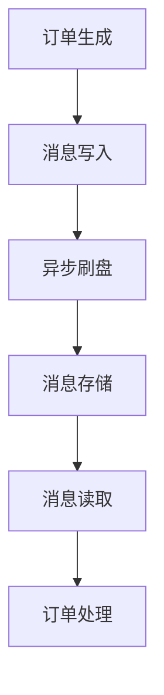
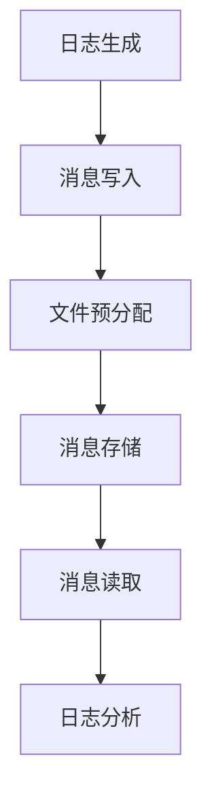

# RocketMQ 存储性能优化

RocketMQ 是一个高性能、高吞吐量的分布式消息中间件，广泛应用于大规模分布式系统中。存储性能是 RocketMQ 的核心之一，直接影响消息的写入、读取和持久化效率。本文将详细介绍如何通过优化 RocketMQ 的存储机制来提升其性能。

## 1. 存储机制简介

RocketMQ 的存储机制主要依赖于 CommitLog 和 ConsumeQueue 两个核心组件：

- **CommitLog**：存储所有消息的原始数据，按顺序写入磁盘。
- **ConsumeQueue**：存储消息的索引信息，用于快速定位消息。

通过优化这两个组件的存储方式，可以显著提升 RocketMQ 的性能。

## 2. 存储性能优化策略

### 2.1 异步刷盘与同步刷盘

RocketMQ 提供了两种刷盘方式：异步刷盘和同步刷盘。

- **异步刷盘**：消息写入内存后立即返回成功，后台线程定期将数据刷入磁盘。这种方式性能较高，但存在数据丢失的风险。
- **同步刷盘**：消息写入内存后，等待数据刷入磁盘后再返回成功。这种方式数据安全性高，但性能较低。

```java
// 异步刷盘配置
DefaultMQProducer producer = new DefaultMQProducer("ProducerGroupName");
producer.setNamesrvAddr("localhost:9876");
producer.setSendMsgTimeout(3000);
producer.setRetryTimesWhenSendFailed(3);
producer.start();
```

:::tip
在高吞吐量场景下，建议使用异步刷盘以提高性能。在数据安全性要求较高的场景下，使用同步刷盘。
:::

### 2.2 文件预分配与零拷贝

RocketMQ 通过文件预分配和零拷贝技术来优化磁盘 I/O 性能。

- **文件预分配**：在消息写入之前，预先分配固定大小的文件，避免频繁的文件扩展操作。
- **零拷贝**：通过直接内存映射（MappedByteBuffer）减少数据在用户空间和内核空间之间的拷贝次数。

```java
// 零拷贝示例
MappedFile mappedFile = new MappedFile("filePath", 1024 * 1024);
mappedFile.appendMessage("message".getBytes());
```

:::note
零拷贝技术可以显著减少 CPU 和内存的开销，提升消息写入和读取的效率。
:::

### 2.3 消息压缩

对于大消息或批量消息，RocketMQ 支持消息压缩以减少网络传输和存储开销。

```java
// 消息压缩示例
Message message = new Message("TopicTest", "TagA", "Hello RocketMQ".getBytes());
message.setCompressed(true);
```

:::caution
消息压缩会增加 CPU 的开销，因此在 CPU 资源紧张的情况下需谨慎使用。
:::

## 3. 实际案例

### 3.1 电商订单系统

在一个电商订单系统中，订单消息需要快速写入和读取。通过以下优化措施，系统性能得到了显著提升：

1. **异步刷盘**：提高消息写入速度，确保订单消息能够快速处理。
2. **零拷贝技术**：减少磁盘 I/O 开销，提升消息读取效率。
3. **消息压缩**：减少网络传输和存储开销，特别是在大促期间。



### 3.2 日志收集系统

在一个日志收集系统中，日志消息量巨大，存储性能是关键。通过以下优化措施，系统性能得到了显著提升：

1. **文件预分配**：减少文件扩展操作，提高写入效率。
2. **消息压缩**：减少存储空间占用，降低存储成本。



## 4. 总结

通过优化 RocketMQ 的存储机制，可以显著提升消息队列的性能。本文介绍了异步刷盘、同步刷盘、文件预分配、零拷贝和消息压缩等优化策略，并通过实际案例展示了这些策略的应用场景。

## 5. 附加资源与练习

- **附加资源**：
  - [RocketMQ 官方文档](https://rocketmq.apache.org/docs/)
  - [RocketMQ 源码解析](https://github.com/apache/rocketmq)

- **练习**：
  1. 配置一个 RocketMQ 生产者，使用异步刷盘方式发送消息。
  2. 尝试使用零拷贝技术优化消息读取性能。
  3. 在本地环境中模拟一个高吞吐量场景，测试消息压缩的效果。

通过以上学习和实践，您将能够更好地理解和应用 RocketMQ 的存储性能优化策略。