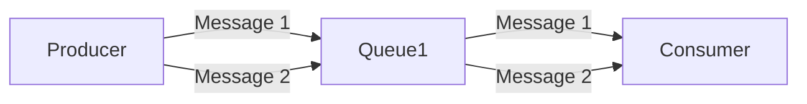

# RocketMQ 可靠性设计

RocketMQ 是一款高性能、高可用的分布式消息中间件，广泛应用于大规模分布式系统中。为了确保消息传递的可靠性，RocketMQ 设计了一系列机制来保障消息的稳定性和一致性。本文将详细介绍 RocketMQ 的可靠性设计，帮助初学者理解其核心原理和实现方式。

## 什么是消息可靠性？

在分布式系统中，消息可靠性指的是消息从生产者发送到消费者过程中，确保消息不丢失、不重复、且按顺序传递的能力。RocketMQ 通过多种机制来保障消息的可靠性，包括消息持久化、消息重试、事务消息等。

## RocketMQ 可靠性设计的关键机制

### 1. 消息持久化

RocketMQ 通过将消息持久化到磁盘来确保消息不会因为系统崩溃或重启而丢失。消息持久化是 RocketMQ 可靠性设计的基石。

```java
// 生产者发送消息示例
DefaultMQProducer producer = new DefaultMQProducer("ProducerGroupName");
producer.start();
Message msg = new Message("TopicTest", "TagA", "Hello RocketMQ".getBytes());
SendResult sendResult = producer.send(msg);
producer.shutdown();
```

在上述代码中，消息会被持久化到磁盘，确保即使在系统崩溃的情况下，消息也不会丢失。

### 2. 消息重试机制

RocketMQ 提供了消息重试机制，当消息发送失败时，生产者会自动重试发送消息，直到消息成功发送或达到最大重试次数。

```java
// 设置消息重试次数
producer.setRetryTimesWhenSendFailed(3);
```

:::tip
默认情况下，RocketMQ 会重试发送消息 2 次，开发者可以根据需要调整重试次数。
:::

### 3. 事务消息

RocketMQ 支持事务消息，确保在分布式事务场景下，消息的发送和业务操作的一致性。事务消息通过两阶段提交（2PC）机制来实现。

```java
// 事务消息示例
TransactionMQProducer producer = new TransactionMQProducer("TransactionProducerGroup");
producer.setTransactionListener(new TransactionListener() {
    @Override
    public LocalTransactionState executeLocalTransaction(Message msg, Object arg) {
        // 执行本地事务
        return LocalTransactionState.COMMIT_MESSAGE;
    }

    @Override
    public LocalTransactionState checkLocalTransaction(MessageExt msg) {
        // 检查本地事务状态
        return LocalTransactionState.COMMIT_MESSAGE;
    }
});
producer.start();
Message msg = new Message("TopicTest", "TagA", "Hello RocketMQ Transaction".getBytes());
SendResult sendResult = producer.sendMessageInTransaction(msg, null);
producer.shutdown();
```

:::note
事务消息的核心思想是：先发送消息到 Broker，然后执行本地事务，最后根据本地事务的执行结果决定是否提交或回滚消息。
:::

### 4. 消息顺序性

RocketMQ 通过队列（Queue）机制来保证消息的顺序性。每个队列中的消息按照 FIFO（先进先出）的顺序进行处理。



:::caution
在分布式环境下，消息的顺序性可能会受到多个消费者并发处理的影响。RocketMQ 通过队列锁定机制来确保同一队列的消息由同一个消费者处理，从而保证顺序性。
:::

### 5. 消息确认机制

RocketMQ 提供了消息确认机制（ACK），消费者在处理完消息后，需要向 Broker 发送确认消息，Broker 才会将该消息标记为已消费。

```java
// 消费者处理消息示例
DefaultMQPushConsumer consumer = new DefaultMQPushConsumer("ConsumerGroupName");
consumer.registerMessageListener(new MessageListenerConcurrently() {
    @Override
    public ConsumeConcurrentlyStatus consumeMessage(List<MessageExt> msgs, ConsumeConcurrentlyContext context) {
        for (MessageExt msg : msgs) {
            System.out.println(new String(msg.getBody()));
        }
        return ConsumeConcurrentlyStatus.CONSUME_SUCCESS; // 确认消息已消费
    }
});
consumer.start();
```

:::warning
如果消费者未发送确认消息，Broker 会认为消息未被成功消费，并在一定时间后重新投递该消息。
:::

## 实际应用场景

### 电商订单系统

在电商订单系统中，订单创建、支付、发货等操作需要保证消息的可靠传递。RocketMQ 的事务消息机制可以确保订单创建和支付操作的一致性，避免因系统故障导致的订单状态不一致问题。

### 日志收集系统

在日志收集系统中，日志消息的可靠性和顺序性至关重要。RocketMQ 的持久化和顺序性机制可以确保日志消息不丢失且按顺序处理，便于后续的日志分析和排查问题。

## 总结

RocketMQ 通过消息持久化、重试机制、事务消息、顺序性保障和消息确认机制等多种设计，确保了消息传递的可靠性。这些机制使得 RocketMQ 在大规模分布式系统中表现出色，广泛应用于各种高并发、高可用的场景中。

## 附加资源

- [RocketMQ 官方文档](https://rocketmq.apache.org/docs/)
- [RocketMQ GitHub 仓库](https://github.com/apache/rocketmq)
- [分布式消息队列设计模式](https://www.oreilly.com/library/view/designing-distributed-systems/9781491983638/)

## 练习

1. 编写一个 RocketMQ 生产者程序，发送 10 条消息到 Broker，并确保消息持久化。
2. 实现一个 RocketMQ 消费者程序，处理消息并发送确认消息。
3. 尝试使用 RocketMQ 的事务消息机制，模拟一个分布式事务场景。

通过以上练习，你将更深入地理解 RocketMQ 的可靠性设计及其在实际应用中的重要性。