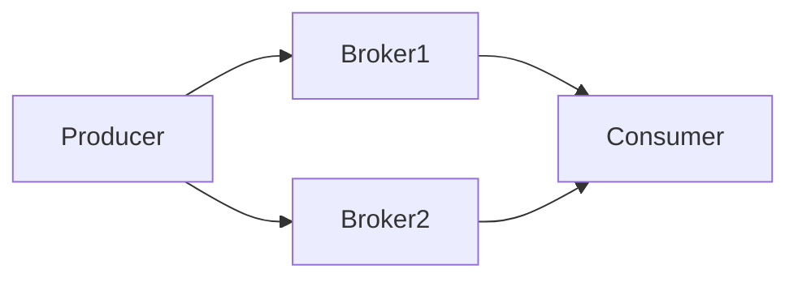

# RocketMQ 消息存储可靠性

RocketMQ 是一个分布式消息中间件，广泛应用于高并发、高吞吐量的场景。为了确保消息在传输和存储过程中的可靠性，RocketMQ 提供了多种机制来保障消息的持久化和一致性。本文将详细介绍 RocketMQ 的消息存储可靠性机制，帮助初学者理解其工作原理。

## 什么是消息存储可靠性？

消息存储可靠性是指消息在发送到 RocketMQ 后，能够被持久化存储，并且在需要时能够被准确无误地消费。RocketMQ 通过多种技术手段来确保消息的可靠性，包括消息的持久化存储、消息的冗余备份、以及消息的故障恢复机制。

## RocketMQ 消息存储机制

### 1. 消息持久化

RocketMQ 将消息持久化存储在磁盘上，确保即使系统崩溃或重启，消息也不会丢失。消息存储的主要组件是 CommitLog，它是一个顺序写入的文件，所有消息都会先写入 CommitLog 中。


### 2. 消息冗余备份

为了提高消息的可靠性，RocketMQ 支持消息的冗余备份。每个消息会被复制到多个 Broker 上，确保即使某个 Broker 发生故障，消息仍然可以从其他 Broker 上获取。



### 3. 消息故障恢复

RocketMQ 提供了消息故障恢复机制。当某个 Broker 发生故障时，RocketMQ 会自动将消息从其他 Broker 上恢复，确保消息的连续性和完整性。

## 实际案例

假设我们有一个电商系统，用户下单后需要发送订单消息到 RocketMQ，然后由库存系统消费该消息进行库存扣减。为了确保订单消息的可靠性，我们可以使用 RocketMQ 的消息存储机制。

```java
// 生产者发送消息
DefaultMQProducer producer = new DefaultMQProducer("OrderProducerGroup");
producer.start();
Message msg = new Message("OrderTopic", "OrderTag", "OrderID12345", "OrderContent".getBytes());
SendResult sendResult = producer.send(msg);
producer.shutdown();

// 消费者消费消息
DefaultMQPushConsumer consumer = new DefaultMQPushConsumer("OrderConsumerGroup");
consumer.subscribe("OrderTopic", "*");
consumer.registerMessageListener((MessageListenerConcurrently) (msgs, context) -> {
    for (MessageExt msg : msgs) {
        System.out.println("Received message: " + new String(msg.getBody()));
    }
    return ConsumeConcurrentlyStatus.CONSUME_SUCCESS;
});
consumer.start();
```

在这个案例中，订单消息会被持久化存储在 RocketMQ 的 CommitLog 中，并且会被复制到多个 Broker 上。即使某个 Broker 发生故障，库存系统仍然可以从其他 Broker 上获取消息进行库存扣减。

## 总结

RocketMQ 通过消息持久化、冗余备份和故障恢复机制，确保了消息的存储可靠性。这些机制使得 RocketMQ 在高并发、高吞吐量的场景下，能够稳定可靠地处理消息。

## 附加资源

- [RocketMQ 官方文档](https://rocketmq.apache.org/docs/)
- [RocketMQ 源码解析](https://github.com/apache/rocketmq)

## 练习

1. 尝试在自己的环境中搭建一个 RocketMQ 集群，并测试消息的持久化和冗余备份机制。
2. 编写一个简单的生产者和消费者程序，模拟消息的发送和消费过程，观察消息的存储和恢复机制。

:::tip
在学习和使用 RocketMQ 时，建议多参考官方文档和社区资源，深入理解其内部机制和最佳实践。
:::