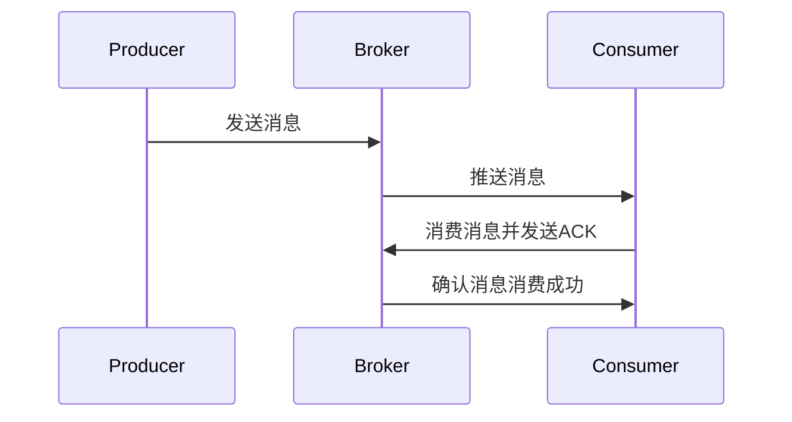

# RocketMQ 消息消费可靠性

RocketMQ 是一款高性能、高可用的分布式消息中间件，广泛应用于大规模分布式系统中。消息消费的可靠性是 RocketMQ 的核心特性之一，它确保了消息在传输过程中不会丢失，并且能够被消费者正确消费。本文将详细介绍 RocketMQ 如何保障消息消费的可靠性，并通过实际案例帮助初学者理解这一概念。

## 1. 消息消费可靠性的基本概念

在分布式系统中，消息队列的主要作用是解耦生产者和消费者，确保消息能够在系统之间可靠地传递。RocketMQ 通过多种机制来保障消息消费的可靠性，包括：

- **消息持久化**：消息在发送到 RocketMQ 后会被持久化到磁盘，确保即使在系统崩溃的情况下，消息也不会丢失。
- **消息重试机制**：如果消费者未能成功处理消息，RocketMQ 会自动进行消息重试，直到消息被成功消费或达到最大重试次数。
- **消息确认机制**：消费者在处理完消息后，需要向 RocketMQ 发送确认（ACK），告知消息已被成功消费。如果消费者未发送 ACK，RocketMQ 会认为消息未被成功消费，并进行重试。

## 2. 消息消费流程

为了更好地理解 RocketMQ 的消息消费可靠性，我们先来看一下消息的消费流程：



1. **生产者发送消息**：生产者将消息发送到 RocketMQ 的 Broker。
2. **Broker 推送消息**：Broker 将消息推送给消费者。
3. **消费者消费消息**：消费者接收到消息并进行处理。
4. **消费者发送 ACK**：消费者处理完消息后，向 Broker 发送 ACK，确认消息已被成功消费。
5. **Broker 确认消费成功**：Broker 收到 ACK 后，确认消息已被成功消费。

## 3. 消息重试机制

RocketMQ 提供了消息重试机制，以确保消息在消费失败时能够被重新处理。默认情况下，RocketMQ 会进行 16 次重试，每次重试的间隔时间逐渐增加。

:::note
**注意**：如果消息在最大重试次数后仍未成功消费，RocketMQ 会将消息放入死信队列（DLQ），供后续处理。
:::

### 代码示例：消息重试

以下是一个简单的消费者代码示例，展示了如何处理消息并触发重试机制：

```java
public class ConsumerExample {
    public static void main(String[] args) throws Exception {
        DefaultMQPushConsumer consumer = new DefaultMQPushConsumer("example_group");
        consumer.setNamesrvAddr("localhost:9876");
        consumer.subscribe("example_topic", "*");

        consumer.registerMessageListener((MessageListenerConcurrently) (msgs, context) -> {
            for (MessageExt msg : msgs) {
                try {
                    // 处理消息
                    System.out.println("Received message: " + new String(msg.getBody()));
                    // 模拟消费失败
                    throw new RuntimeException("Consume failed");
                } catch (Exception e) {
                    // 返回重试状态
                    return ConsumeConcurrentlyStatus.RECONSUME_LATER;
                }
            }
            return ConsumeConcurrentlyStatus.CONSUME_SUCCESS;
        });

        consumer.start();
    }
}
```

在这个示例中，如果消费者在处理消息时抛出异常，RocketMQ 会将消息标记为需要重试，并在稍后重新推送该消息。

## 4. 消息确认机制

RocketMQ 的消息确认机制是保障消息消费可靠性的关键。消费者在处理完消息后，必须向 Broker 发送 ACK，告知消息已被成功消费。如果消费者未发送 ACK，RocketMQ 会认为消息未被成功消费，并进行重试。

### 代码示例：消息确认

以下是一个消费者代码示例，展示了如何手动发送 ACK：

```java
public class ConsumerAckExample {
    public static void main(String[] args) throws Exception {
        DefaultMQPushConsumer consumer = new DefaultMQPushConsumer("example_group");
        consumer.setNamesrvAddr("localhost:9876");
        consumer.subscribe("example_topic", "*");

        consumer.registerMessageListener((MessageListenerConcurrently) (msgs, context) -> {
            for (MessageExt msg : msgs) {
                try {
                    // 处理消息
                    System.out.println("Received message: " + new String(msg.getBody()));
                    // 手动发送ACK
                    return ConsumeConcurrentlyStatus.CONSUME_SUCCESS;
                } catch (Exception e) {
                    // 返回重试状态
                    return ConsumeConcurrentlyStatus.RECONSUME_LATER;
                }
            }
            return ConsumeConcurrentlyStatus.CONSUME_SUCCESS;
        });

        consumer.start();
    }
}
```

在这个示例中，消费者在处理完消息后，手动返回 `ConsumeConcurrentlyStatus.CONSUME_SUCCESS`，表示消息已被成功消费。

## 5. 实际应用场景

### 场景：电商订单系统

在一个电商订单系统中，订单消息需要被可靠地处理。假设订单系统使用 RocketMQ 来处理订单创建、支付、发货等消息。如果消费者在处理订单支付消息时失败，RocketMQ 会自动进行消息重试，直到支付消息被成功处理或达到最大重试次数。

:::tip
**提示**：在实际应用中，建议根据业务需求调整消息重试次数和重试间隔时间，以确保系统的高可用性和可靠性。
:::

## 6. 总结

RocketMQ 通过消息持久化、消息重试机制和消息确认机制，确保了消息在分布式系统中的可靠消费。理解这些机制对于构建高可用的分布式系统至关重要。希望通过本文的介绍和示例代码，初学者能够更好地掌握 RocketMQ 的消息消费可靠性。

## 7. 附加资源与练习

- **练习**：尝试在自己的项目中实现一个简单的 RocketMQ 消费者，并模拟消息消费失败的情况，观察 RocketMQ 的重试机制。
- **资源**：阅读 RocketMQ 官方文档，了解更多关于消息可靠性的高级配置和最佳实践。

:::caution
**注意**：在实际生产环境中，建议对 RocketMQ 进行充分的测试和调优，以确保系统的稳定性和可靠性。
:::