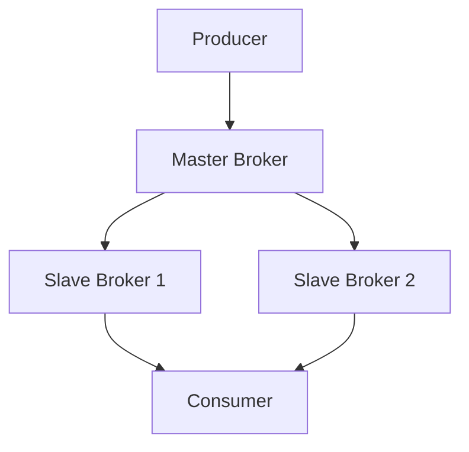
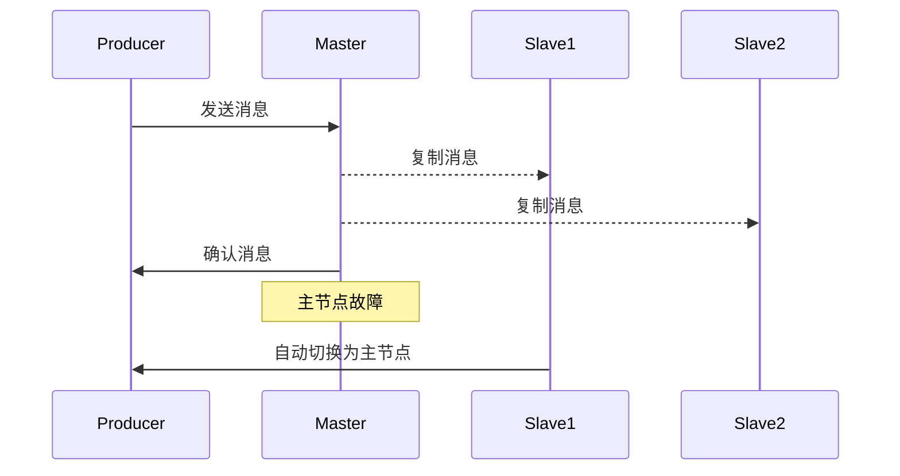

# RocketMQ 高可用机制

RocketMQ 是一个分布式消息中间件，广泛应用于大规模分布式系统中。为了确保消息的可靠传递，RocketMQ 提供了多种高可用机制。本文将详细介绍这些机制，并通过实际案例帮助你理解它们的工作原理。

## 什么是高可用机制？

高可用机制是指系统在面对硬件故障、网络问题或其他异常情况时，仍能保持正常运行的能力。对于消息中间件来说，高可用性意味着即使在部分节点失效的情况下，消息仍然能够被可靠地发送和接收。

## RocketMQ 的高可用机制

RocketMQ 通过以下几种机制来保证高可用性：

1. **主从复制（Master-Slave Replication）**
2. **消息存储的高可用**
3. **消息消费的高可用**
4. **故障自动切换（Failover）**

### 1. 主从复制（Master-Slave Replication）

RocketMQ 使用主从复制机制来确保消息的可靠性。每个 Broker（消息存储服务器）都有一个主节点（Master）和多个从节点（Slave）。主节点负责处理所有的写操作，而从节点则通过复制主节点的数据来提供读服务。



在上图中，Producer 将消息发送到 Master Broker，Master Broker 会将消息复制到 Slave Broker 1 和 Slave Broker 2。当 Consumer 需要读取消息时，可以从任意一个 Slave Broker 读取。

### 2. 消息存储的高可用

RocketMQ 使用 CommitLog 来存储所有的消息。CommitLog 是一个顺序写入的文件，所有的消息都会追加到这个文件中。为了提高存储的可靠性，RocketMQ 支持将 CommitLog 同步到多个磁盘上。

```java
// 示例：配置多个存储路径
DefaultMessageStore store = new DefaultMessageStore(
    new MessageStoreConfig(),
    new BrokerStatsManager("brokerName")
);
store.setStorePathCommitLog("/path/to/commitlog1,/path/to/commitlog2");
```

在上面的代码中，`store.setStorePathCommitLog` 方法允许你配置多个存储路径，以确保即使一个磁盘发生故障，消息仍然可以从其他磁盘读取。

### 3. 消息消费的高可用

RocketMQ 通过消费者组（Consumer Group）来实现消息消费的高可用。一个消费者组可以包含多个消费者实例，这些实例可以分布在不同的机器上。当某个消费者实例失效时，其他实例可以接管其消费任务。

```java
// 示例：创建消费者组
DefaultMQPushConsumer consumer = new DefaultMQPushConsumer("ConsumerGroupName");
consumer.subscribe("TopicTest", "*");
consumer.registerMessageListener(new MessageListenerConcurrently() {
    @Override
    public ConsumeConcurrentlyStatus consumeMessage(List<MessageExt> msgs, ConsumeConcurrentlyContext context) {
        // 处理消息
        return ConsumeConcurrentlyStatus.CONSUME_SUCCESS;
    }
});
consumer.start();
```

在上面的代码中，`ConsumerGroupName` 是消费者组的名称。多个消费者实例可以共享同一个组名，从而实现高可用。

### 4. 故障自动切换（Failover）

RocketMQ 支持故障自动切换机制。当主节点发生故障时，系统会自动将一个从节点提升为新的主节点，以确保服务的连续性。



在上面的序列图中，当主节点发生故障时，Slave1 会自动切换为主节点，继续处理消息。

## 实际案例

假设你正在开发一个电商系统，订单服务需要将订单消息发送到 RocketMQ，库存服务需要消费这些消息来更新库存。为了确保订单消息的可靠传递，你可以使用 RocketMQ 的高可用机制。

1. **主从复制**：订单服务将消息发送到主 Broker，主 Broker 将消息复制到多个从 Broker。
2. **消息存储的高可用**：CommitLog 存储在多个磁盘上，即使一个磁盘发生故障，消息仍然可以从其他磁盘读取。
3. **消息消费的高可用**：库存服务的多个消费者实例组成一个消费者组，即使某个实例失效，其他实例可以继续消费消息。
4. **故障自动切换**：如果主 Broker 发生故障，系统会自动将一个从 Broker 提升为新的主 Broker，确保订单消息的持续处理。

## 总结

RocketMQ 通过主从复制、消息存储的高可用、消息消费的高可用以及故障自动切换等机制，确保了消息的可靠传递。这些机制使得 RocketMQ 在大规模分布式系统中表现出色，能够应对各种异常情况。

## 附加资源

- [RocketMQ 官方文档](https://rocketmq.apache.org/docs/)
- [RocketMQ GitHub 仓库](https://github.com/apache/rocketmq)

## 练习

1. 配置一个 RocketMQ 集群，包含一个主 Broker 和两个从 Broker。
2. 编写一个生产者程序，向 RocketMQ 发送消息，并确保消息被复制到所有从 Broker。
3. 编写一个消费者程序，使用消费者组来消费消息，并模拟一个消费者实例失效的情况，观察其他实例是否能够接管消费任务。

通过以上练习，你将更深入地理解 RocketMQ 的高可用机制。