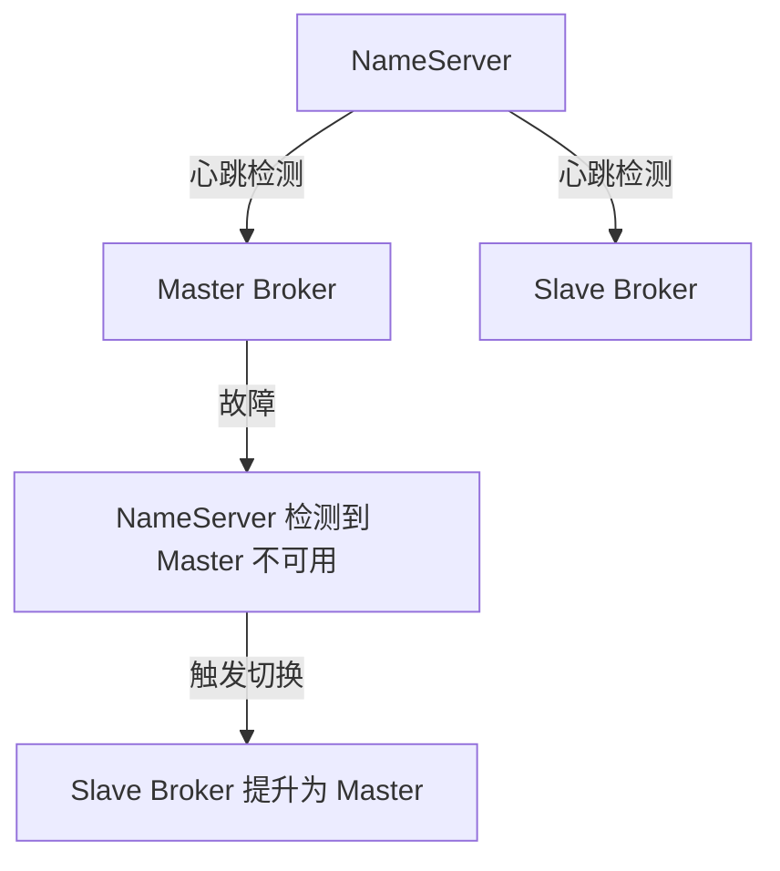

# RocketMQ 主从切换

RocketMQ 是一个分布式消息中间件，广泛应用于高并发、高可用的场景中。为了保证消息的可靠性和系统的高可用性，RocketMQ 采用了主从架构。主从切换是 RocketMQ 高可用性的核心机制之一，它能够在主节点发生故障时，自动或手动将从节点提升为主节点，从而保证服务的连续性。

## 什么是主从切换？

在 RocketMQ 中，每个 Broker（消息存储服务器）都可以配置为主节点（Master）和从节点（Slave）。主节点负责处理所有的读写请求，而从节点则负责同步主节点的数据，并在主节点发生故障时接管服务。

主从切换是指当主节点不可用时，系统自动或手动将从节点提升为主节点的过程。这一过程确保了消息系统的持续可用性，避免了单点故障。

## 主从切换的实现方式

RocketMQ 的主从切换可以通过以下两种方式实现：

1. **自动切换**：当主节点发生故障时，RocketMQ 会自动检测到主节点的不可用状态，并将从节点提升为主节点。这种方式适用于对高可用性要求较高的场景。
2. **手动切换**：在某些情况下，管理员可能需要手动触发主从切换，例如进行系统维护或升级时。手动切换可以通过 RocketMQ 的管理命令或 API 来实现。

### 自动切换的实现

RocketMQ 的自动切换依赖于心跳检测机制。每个 Broker 都会定期向 NameServer（命名服务器）发送心跳包，NameServer 会根据心跳包的状态来判断 Broker 的健康状况。如果主节点的心跳包丢失或超时，NameServer 会认为主节点不可用，并触发从节点的切换。



### 手动切换的实现

手动切换可以通过 RocketMQ 提供的管理命令或 API 来实现。以下是一个使用 RocketMQ 管理命令进行手动切换的示例：

```bash
# 查看当前 Broker 状态
sh mqadmin clusterList -n localhost:9876

# 手动切换主从节点
sh mqadmin updateBrokerConfig -b broker-a -n localhost:9876 -k brokerRole -v SLAVE
```

在上面的示例中，`broker-a` 是当前的主节点，通过 `updateBrokerConfig` 命令将其角色从 `MASTER` 切换为 `SLAVE`，从而触发从节点的提升。

## 实际应用场景

### 场景一：主节点故障

假设在一个电商系统中，RocketMQ 用于处理订单消息。某天，主节点由于硬件故障突然宕机，导致订单消息无法处理。此时，RocketMQ 的自动切换机制会立即检测到主节点的不可用状态，并将从节点提升为主节点，确保订单消息的持续处理。

### 场景二：系统维护

在进行系统维护时，管理员可能需要暂时停止主节点的服务。为了避免服务中断，管理员可以手动触发主从切换，将从节点提升为主节点，待维护完成后再将主节点切换回来。

## 总结

RocketMQ 的主从切换机制是保证消息系统高可用性的重要手段。通过自动切换和手动切换两种方式，RocketMQ 能够在主节点发生故障时快速恢复服务，确保消息的可靠传递。

:::tip
在实际生产环境中，建议定期测试主从切换机制，确保在真正发生故障时能够顺利切换。
:::

## 附加资源

- [RocketMQ 官方文档](https://rocketmq.apache.org/docs/)
- [RocketMQ 高可用性设计](https://rocketmq.apache.org/docs/high-availability/)

## 练习

1. 尝试在本地搭建一个 RocketMQ 集群，并模拟主节点故障，观察自动切换的过程。
2. 使用 RocketMQ 管理命令手动触发主从切换，并记录切换前后的 Broker 状态。