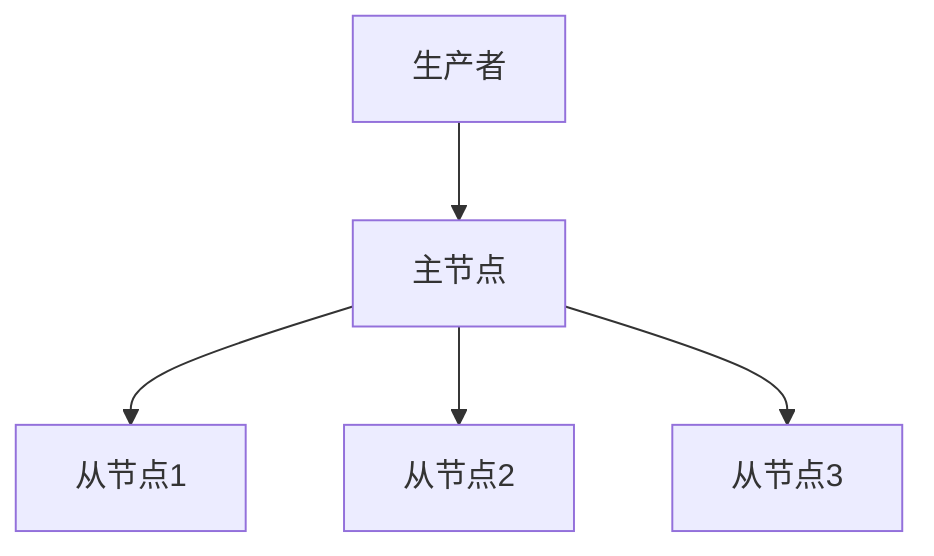

# RocketMQ 数据一致性

RocketMQ 是一款高性能、高可用的分布式消息中间件，广泛应用于大规模分布式系统中。在分布式系统中，数据一致性是一个关键问题。RocketMQ 通过其独特的架构和机制，确保了消息的可靠传递和数据的一致性。本文将详细介绍 RocketMQ 如何实现数据一致性，并通过实际案例帮助初学者理解这一概念。

## 什么是数据一致性？

在分布式系统中，数据一致性指的是在多个节点之间保持数据的同步和一致。对于消息队列来说，数据一致性意味着消息在发送、存储和消费的过程中，不会丢失、重复或乱序。

RocketMQ 通过以下几种机制来确保数据一致性：

1. **消息持久化**：消息在发送到 Broker 后，会被持久化到磁盘，确保即使系统崩溃，消息也不会丢失。
2. **主从复制**：RocketMQ 采用主从复制机制，主节点将消息同步到从节点，确保在主节点故障时，从节点可以继续提供服务。
3. **消息确认机制**：生产者在发送消息后，会等待 Broker 的确认，确保消息已被成功接收和存储。
4. **消费确认机制**：消费者在消费消息后，会向 Broker 发送确认，确保消息已被成功处理。

## RocketMQ 的数据一致性机制

### 1. 消息持久化

RocketMQ 将消息持久化到磁盘，确保消息在系统崩溃或重启后仍然可用。消息持久化的过程如下：

1. 生产者发送消息到 Broker。
2. Broker 将消息写入 CommitLog（一个顺序写入的文件）。
3. 消息被异步刷盘到磁盘。

```java
// 生产者发送消息示例
DefaultMQProducer producer = new DefaultMQProducer("ProducerGroupName");
producer.start();
Message msg = new Message("TopicTest", "TagA", "Hello RocketMQ".getBytes());
SendResult sendResult = producer.send(msg);
System.out.println("消息发送结果: " + sendResult);
producer.shutdown();
```

### 2. 主从复制

RocketMQ 的主从复制机制确保了消息的高可用性。主节点负责接收和存储消息，并将消息同步到从节点。如果主节点发生故障，从节点可以接管服务，确保消息不丢失。



### 3. 消息确认机制

生产者在发送消息后，会等待 Broker 的确认。如果 Broker 成功接收并存储了消息，生产者会收到确认响应。如果 Broker 未能成功接收消息，生产者会重试发送。

```java
// 生产者发送消息并等待确认
SendResult sendResult = producer.send(msg);
if (sendResult.getSendStatus() == SendStatus.SEND_OK) {
    System.out.println("消息发送成功");
} else {
    System.out.println("消息发送失败");
}
```

### 4. 消费确认机制

消费者在消费消息后，会向 Broker 发送确认。如果消费者未能成功处理消息，Broker 会重新投递消息，确保消息被正确处理。

```java
// 消费者消费消息并发送确认
DefaultMQPushConsumer consumer = new DefaultMQPushConsumer("ConsumerGroupName");
consumer.registerMessageListener((MessageListenerConcurrently) (msgs, context) -> {
    for (MessageExt msg : msgs) {
        System.out.println("收到消息: " + new String(msg.getBody()));
    }
    return ConsumeConcurrentlyStatus.CONSUME_SUCCESS;
});
consumer.start();
```

## 实际案例

假设我们有一个电商系统，用户下单后，系统需要发送订单消息到 RocketMQ，库存服务消费该消息并更新库存。为了确保数据一致性，我们需要：

1. 订单服务发送订单消息到 RocketMQ，并等待 Broker 的确认。
2. 库存服务消费订单消息，并更新库存。
3. 如果库存服务处理失败，RocketMQ 会重新投递消息，直到库存更新成功。

```java
// 订单服务发送订单消息
Message orderMsg = new Message("OrderTopic", "OrderTag", orderInfo.getBytes());
SendResult sendResult = producer.send(orderMsg);
if (sendResult.getSendStatus() == SendStatus.SEND_OK) {
    System.out.println("订单消息发送成功");
} else {
    System.out.println("订单消息发送失败");
}

// 库存服务消费订单消息
consumer.registerMessageListener((MessageListenerConcurrently) (msgs, context) -> {
    for (MessageExt msg : msgs) {
        String orderInfo = new String(msg.getBody());
        // 更新库存
        boolean success = updateInventory(orderInfo);
        if (success) {
            System.out.println("库存更新成功");
            return ConsumeConcurrentlyStatus.CONSUME_SUCCESS;
        } else {
            System.out.println("库存更新失败，等待重试");
            return ConsumeConcurrentlyStatus.RECONSUME_LATER;
        }
    }
    return ConsumeConcurrentlyStatus.CONSUME_SUCCESS;
});
```

## 总结

RocketMQ 通过消息持久化、主从复制、消息确认机制和消费确认机制，确保了消息在分布式系统中的可靠传递和数据一致性。这些机制使得 RocketMQ 成为处理高并发、大规模数据的理想选择。

:::tip 提示
在实际应用中，确保数据一致性还需要考虑网络分区、节点故障等复杂情况。建议深入学习 RocketMQ 的高级特性，如事务消息、顺序消息等。
:::

## 附加资源

- [RocketMQ 官方文档](https://rocketmq.apache.org/docs/)
- [分布式系统一致性模型](https://en.wikipedia.org/wiki/Consistency_model)
- [RocketMQ 源码解析](https://github.com/apache/rocketmq)

## 练习

1. 编写一个简单的 RocketMQ 生产者和消费者程序，模拟订单消息的发送和消费过程。
2. 尝试在主节点故障的情况下，观察从节点如何接管服务并确保消息不丢失。
3. 修改消费者程序，模拟消息处理失败的情况，观察 RocketMQ 如何重新投递消息。

通过以上练习，你将更深入地理解 RocketMQ 的数据一致性机制。