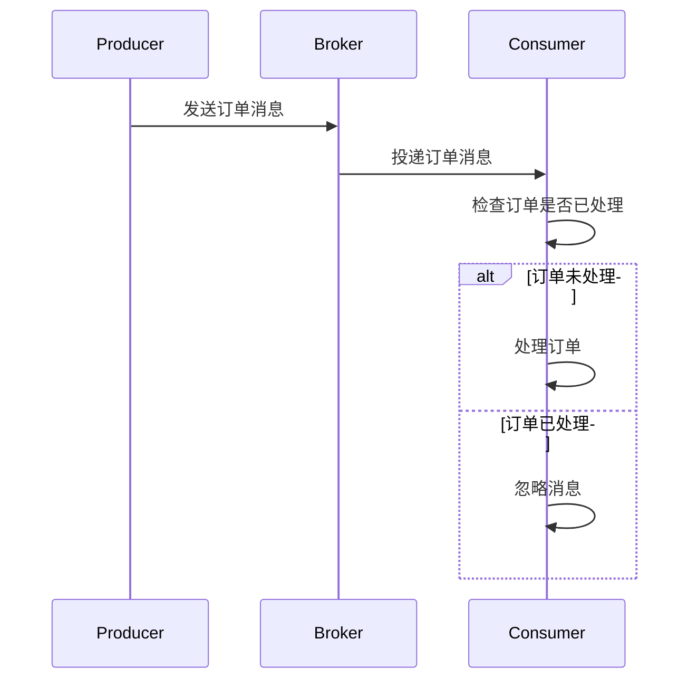

# RocketMQ 消息重复处理

在分布式消息系统中，消息重复是一个常见的问题。RocketMQ作为一款高性能、高可靠的消息中间件，提供了多种机制来保障消息的可靠性。然而，由于网络抖动、客户端重试等原因，消息重复仍然可能发生。本文将详细介绍RocketMQ中消息重复的原因、影响以及如何处理消息重复问题。

## 什么是消息重复？

消息重复指的是同一条消息被消费者多次处理。这种情况通常发生在消息系统无法保证“恰好一次”投递时。RocketMQ默认提供“至少一次”的投递保证，这意味着在某些情况下，消费者可能会收到重复的消息。

:::note
“至少一次”投递保证意味着消息不会丢失，但可能会重复。
:::

## 消息重复的原因

1. **生产者重试**：当生产者发送消息后未收到Broker的确认响应时，可能会重试发送消息，导致消息重复。
2. **消费者重试**：消费者在处理消息时，如果未能在规定时间内提交消费偏移量（offset），Broker会认为消息未被成功处理，从而重新投递消息。
3. **网络抖动**：网络不稳定可能导致消息重复投递。

## 如何处理消息重复？

### 1. 幂等性设计

幂等性是指无论操作执行多少次，结果都相同。在消息处理中，设计幂等性操作是避免消息重复的关键。

#### 示例：幂等性处理订单

假设我们有一个处理订单的系统，订单ID是唯一的。我们可以通过检查订单是否已处理来避免重复处理。

```java
public void processOrder(Order order) {
    if (orderService.isOrderProcessed(order.getId())) {
        return; // 订单已处理，直接返回
    }
    // 处理订单逻辑
    orderService.process(order);
}
```

### 2. 使用消息的唯一标识

RocketMQ为每条消息分配了一个唯一的`Message ID`，消费者可以利用这个ID来检测重复消息。

#### 示例：使用Message ID检测重复

```java
public void handleMessage(MessageExt message) {
    String messageId = message.getMsgId();
    if (processedMessages.contains(messageId)) {
        return; // 消息已处理，直接返回
    }
    // 处理消息逻辑
    processMessage(message);
    processedMessages.add(messageId); // 记录已处理的消息ID
}
```

### 3. 事务消息

RocketMQ支持事务消息，通过事务机制可以确保消息的最终一致性，减少消息重复的可能性。

#### 示例：事务消息处理

```java
public void sendTransactionMessage() {
    TransactionMQProducer producer = new TransactionMQProducer("group_name");
    producer.setTransactionListener(new TransactionListener() {
        @Override
        public LocalTransactionState executeLocalTransaction(Message msg, Object arg) {
            // 执行本地事务
            return LocalTransactionState.COMMIT_MESSAGE;
        }

        @Override
        public LocalTransactionState checkLocalTransaction(MessageExt msg) {
            // 检查本地事务状态
            return LocalTransactionState.COMMIT_MESSAGE;
        }
    });
    producer.sendMessageInTransaction(new Message("topic", "tag", "body".getBytes()), null);
}
```

## 实际案例

### 电商订单系统

在电商系统中，订单创建是一个关键操作。如果订单消息被重复处理，可能会导致重复扣款或重复发货。通过设计幂等性操作和使用消息的唯一标识，可以有效避免这些问题。



## 总结

消息重复是分布式消息系统中不可避免的问题，但通过合理的幂等性设计、使用消息的唯一标识以及事务消息机制，可以有效减少消息重复带来的影响。在实际应用中，开发者需要根据业务场景选择合适的策略来处理消息重复问题。

## 附加资源

- [RocketMQ官方文档](https://rocketmq.apache.org/docs/)
- [分布式系统中的幂等性设计](https://en.wikipedia.org/wiki/Idempotence)

## 练习

1. 设计一个简单的订单处理系统，确保订单消息的幂等性。
2. 使用RocketMQ的事务消息机制，实现一个可靠的消息投递系统。
