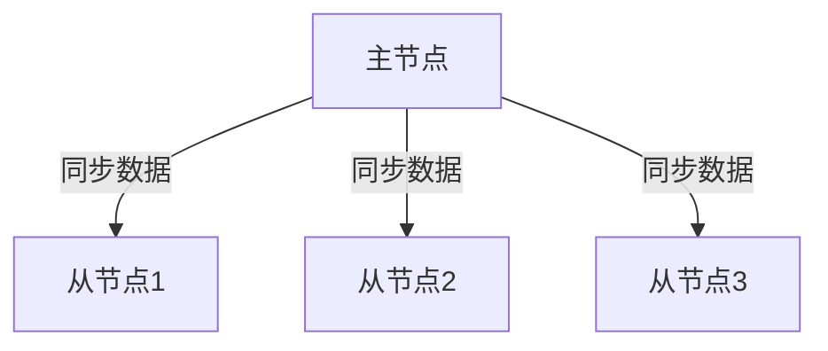
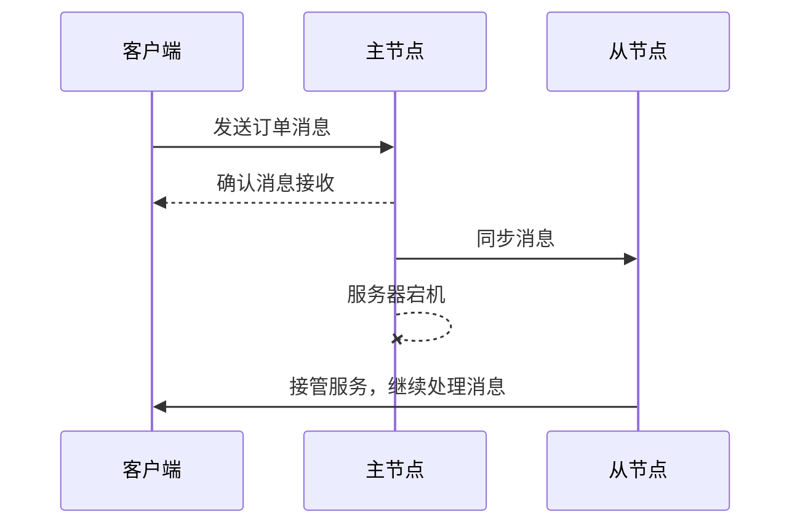

# RocketMQ 灾难恢复

在现代分布式系统中，灾难恢复（Disaster Recovery, DR）是确保系统高可用性和数据完整性的关键部分。RocketMQ作为一款高性能、高可用的分布式消息队列，提供了多种机制来应对灾难场景，确保在故障发生时能够快速恢复并继续提供服务。

## 什么是灾难恢复？

灾难恢复是指在系统发生严重故障（如硬件故障、网络中断、数据中心宕机等）时，通过预先设计的策略和机制，快速恢复系统的正常运行，并尽可能减少数据丢失和服务中断时间。对于消息队列系统来说，灾难恢复的核心目标是确保消息不丢失、不重复，并且能够快速恢复消息的发送和消费。

## RocketMQ 的灾难恢复机制

RocketMQ通过以下几种机制来实现灾难恢复：

1. **消息持久化**：RocketMQ将消息持久化到磁盘，确保即使在系统崩溃的情况下，消息也不会丢失。
2. **主从复制**：RocketMQ支持主从复制机制，主节点负责处理消息的写入和读取，从节点则作为备份，在主节点发生故障时接管服务。
3. **自动故障切换**：RocketMQ的Broker集群支持自动故障切换，当主节点不可用时，从节点会自动提升为主节点，继续提供服务。
4. **数据同步**：RocketMQ通过同步或异步的方式将消息从主节点复制到从节点，确保数据的一致性。

### 消息持久化

RocketMQ将消息存储在磁盘上，确保即使在系统崩溃的情况下，消息也不会丢失。消息的持久化是通过CommitLog文件实现的，所有消息都按顺序写入CommitLog文件，然后通过索引文件快速定位消息。

```java
// 示例：发送持久化消息
DefaultMQProducer producer = new DefaultMQProducer("producer_group");
producer.setNamesrvAddr("127.0.0.1:9876");
producer.start();

Message msg = new Message("TopicTest", "TagA", "Hello RocketMQ".getBytes());
SendResult sendResult = producer.send(msg);
System.out.println("消息发送结果: " + sendResult);

producer.shutdown();
```

### 主从复制

RocketMQ的主从复制机制确保了在主节点发生故障时，从节点可以接管服务。主节点负责处理消息的写入和读取，从节点则作为备份，定期从主节点同步数据。



### 自动故障切换

当主节点发生故障时，RocketMQ会自动将从节点提升为主节点，继续提供服务。这个过程对客户端是透明的，客户端无需手动切换连接。

```java
// 示例：配置自动故障切换
DefaultMQPushConsumer consumer = new DefaultMQPushConsumer("consumer_group");
consumer.setNamesrvAddr("127.0.0.1:9876");
consumer.subscribe("TopicTest", "*");
consumer.registerMessageListener((MessageListenerConcurrently) (msgs, context) -> {
    for (MessageExt msg : msgs) {
        System.out.println("收到消息: " + new String(msg.getBody()));
    }
    return ConsumeConcurrentlyStatus.CONSUME_SUCCESS;
});
consumer.start();
```

### 数据同步

RocketMQ通过同步或异步的方式将消息从主节点复制到从节点。同步复制确保消息在主节点和从节点都写入成功后才返回成功，而异步复制则允许消息在主节点写入成功后立即返回，从节点在后台异步复制数据。

:::note
同步复制提供了更高的数据一致性，但可能会影响性能；异步复制则提供了更高的吞吐量，但在主节点故障时可能会有少量数据丢失。
:::

## 实际案例

假设我们有一个电商系统，使用RocketMQ来处理订单消息。在某个繁忙的购物节期间，主节点所在的服务器突然宕机。由于RocketMQ配置了主从复制和自动故障切换，系统能够快速将从节点提升为主节点，继续处理订单消息，确保购物节的顺利进行。



## 总结

RocketMQ通过消息持久化、主从复制、自动故障切换和数据同步等机制，提供了强大的灾难恢复能力。这些机制确保了在系统发生故障时，消息不会丢失，服务能够快速恢复，从而保证了系统的高可用性和数据完整性。

## 附加资源

- [RocketMQ官方文档](https://rocketmq.apache.org/docs/)
- [RocketMQ GitHub仓库](https://github.com/apache/rocketmq)
- [分布式系统灾难恢复策略](https://en.wikipedia.org/wiki/Disaster_recovery)

## 练习

1. 配置一个RocketMQ集群，模拟主节点故障，观察从节点如何接管服务。
2. 使用同步复制和异步复制分别发送消息，比较两者的性能差异。
3. 编写一个简单的消费者程序，测试在故障切换过程中消息的消费情况。

通过以上练习，你将更深入地理解RocketMQ的灾难恢复机制，并能够在实际项目中应用这些知识。