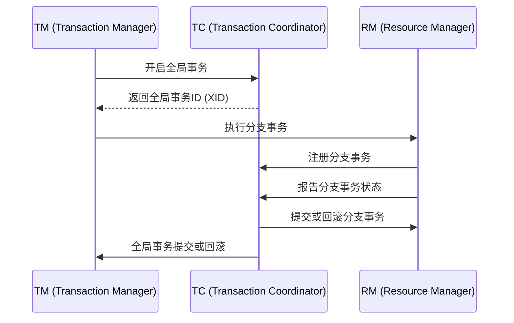

# Seata 简介

## 什么是Seata？

Seata（Simple Extensible Autonomous Transaction Architecture）是一款开源的分布式事务解决方案，旨在解决微服务架构下的分布式事务问题。它提供了高性能、易用且功能强大的分布式事务管理能力，支持多种事务模式，如AT（自动补偿事务）、TCC（Try-Confirm-Cancel）、Saga等。

Seata的核心目标是简化分布式事务的开发，让开发者能够专注于业务逻辑，而无需过多关注事务管理的复杂性。

## Seata 的核心组件

Seata主要由以下几个核心组件组成：

1. **TC（Transaction Coordinator）**：事务协调器，负责全局事务的提交和回滚。
2. **TM（Transaction Manager）**：事务管理器，负责开启、提交或回滚全局事务。
3. **RM（Resource Manager）**：资源管理器，负责管理分支事务的资源，如数据库连接。

这些组件协同工作，确保分布式事务的一致性和可靠性。

## Seata 的工作原理

Seata的工作原理可以简单概括为以下几个步骤：

1. **全局事务开启**：TM向TC发起全局事务的开启请求，TC生成全局事务ID（XID）。
2. **分支事务注册**：RM向TC注册分支事务，并与全局事务ID关联。
3. **分支事务提交**：RM执行本地事务，并向TC报告事务状态。
4. **全局事务提交或回滚**：TC根据所有分支事务的状态，决定全局事务是提交还是回滚。



## Seata 的实际应用场景

假设我们有一个电商系统，用户下单时需要同时扣减库存和创建订单。这两个操作分别由库存服务和订单服务处理，属于不同的微服务。为了保证数据一致性，我们需要使用分布式事务。

### 代码示例

以下是一个简单的Seata使用示例，展示了如何在Spring Boot项目中集成Seata。

```java
// 库存服务
@Service
public class InventoryService {

    @Autowired
    private InventoryMapper inventoryMapper;

    @GlobalTransactional
    public void deductInventory(String productId, int quantity) {
        inventoryMapper.deduct(productId, quantity);
    }
}

// 订单服务
@Service
public class OrderService {

    @Autowired
    private OrderMapper orderMapper;

    @GlobalTransactional
    public void createOrder(String orderId, String productId, int quantity) {
        orderMapper.create(orderId, productId, quantity);
    }
}
```

在这个示例中，`@GlobalTransactional`注解用于标记一个全局事务。当用户下单时，库存服务和订单服务会分别执行本地事务，Seata会确保这两个事务要么全部提交，要么全部回滚。

## 总结

Seata是一个强大的分布式事务解决方案，适用于微服务架构下的复杂事务场景。通过Seata，开发者可以轻松管理分布式事务，确保数据的一致性和可靠性。

## 附加资源

- [Seata官方文档](https://seata.io/zh-cn/docs/overview/what-is-seata.html)
- [Seata GitHub仓库](https://github.com/seata/seata)

## 练习

1. 尝试在本地搭建一个简单的Spring Boot项目，并集成Seata。
2. 模拟一个分布式事务场景，如用户下单时同时扣减库存和创建订单，观察Seata如何处理事务的提交和回滚。

:::tip
在学习和使用Seata时，建议从简单的场景入手，逐步深入理解其工作原理和应用场景。
:::