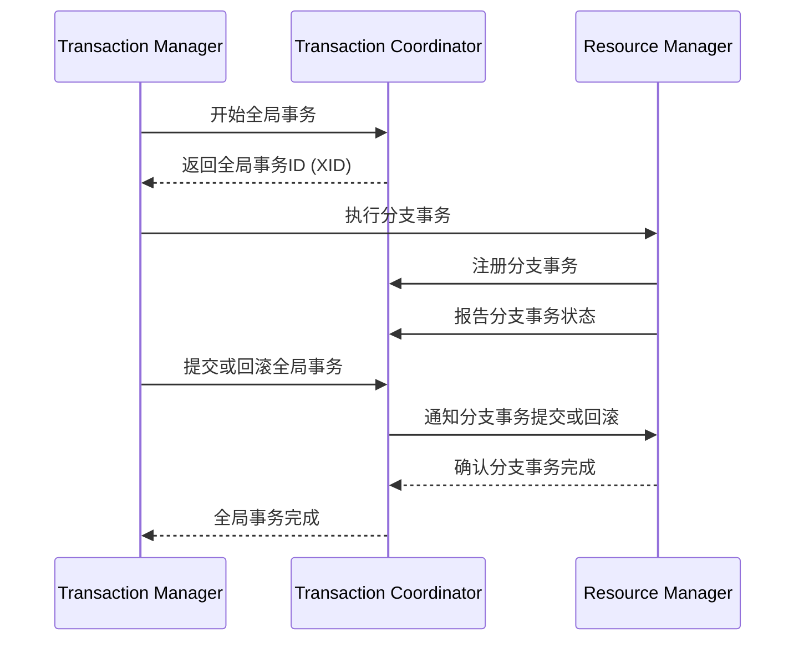

# Seata 核心组件

Seata（Simple Extensible Autonomous Transaction Architecture）是一款开源的分布式事务解决方案，旨在解决微服务架构下的分布式事务问题。Seata通过其核心组件，提供了高效、可靠的分布式事务管理能力。本文将详细介绍Seata的核心组件及其工作原理。

## 1. 什么是Seata？

Seata是一个分布式事务框架，支持AT（自动补偿型事务）、TCC（Try-Confirm-Cancel）、Saga等多种事务模式。它的核心目标是通过简化分布式事务的管理，帮助开发者在微服务架构中实现数据一致性。

## 2. Seata的核心组件

Seata的核心组件包括以下几个部分：

### 2.1 Transaction Coordinator (TC)

**Transaction Coordinator（TC）** 是Seata的核心组件之一，负责全局事务的管理。它协调各个分支事务的执行，确保事务的原子性和一致性。

- **作用**：TC负责全局事务的创建、提交、回滚等操作。
- **特点**：TC是无状态的，可以水平扩展，支持高并发场景。

### 2.2 Transaction Manager (TM)

**Transaction Manager（TM）** 是事务的发起者，负责定义全局事务的边界。TM与TC交互，发起全局事务的提交或回滚。

- **作用**：TM负责全局事务的开始、提交或回滚。
- **特点**：TM通常嵌入在业务逻辑中，与具体的业务代码紧密耦合。

### 2.3 Resource Manager (RM)

**Resource Manager（RM）** 负责管理分支事务的资源，与TC和TM协同工作，确保分支事务的正确执行。

- **作用**：RM负责分支事务的注册、提交、回滚等操作。
- **特点**：RM与具体的数据库或资源管理器交互，负责资源的锁定和释放。

## 3. Seata的工作流程

Seata的工作流程可以分为以下几个步骤：

1. **全局事务开始**：TM向TC发起全局事务的开始请求，TC生成全局事务ID（XID）。
2. **分支事务注册**：RM向TC注册分支事务，TC记录分支事务的状态。
3. **分支事务执行**：RM执行分支事务，并将执行结果报告给TC。
4. **全局事务提交或回滚**：TM根据分支事务的执行结果，向TC发起全局事务的提交或回滚请求。
5. **事务完成**：TC协调所有分支事务的提交或回滚，确保事务的原子性。



## 4. 实际案例

假设我们有一个电商系统，用户下单时需要同时扣减库存和生成订单。这两个操作分别由库存服务和订单服务处理，属于不同的微服务。我们可以使用Seata来确保这两个操作的原子性。

### 4.1 代码示例

```java
// 库存服务
@GlobalTransactional
public void reduceStock(String productId, int quantity) {
    // 扣减库存
    stockService.reduce(productId, quantity);
    // 生成订单
    orderService.createOrder(productId, quantity);
}
```

在这个例子中，`@GlobalTransactional`注解标识了一个全局事务。如果库存扣减成功但订单生成失败，Seata会自动回滚库存扣减操作，确保数据一致性。

## 5. 总结

Seata通过其核心组件（TC、TM、RM）实现了分布式事务的管理，确保了微服务架构下的数据一致性。通过理解Seata的核心组件及其工作流程，开发者可以更好地应用Seata解决分布式事务问题。

## 6. 附加资源

- [Seata官方文档](https://seata.io/zh-cn/docs/overview/what-is-seata.html)
- [Seata GitHub仓库](https://github.com/seata/seata)

## 7. 练习

1. 尝试在自己的项目中集成Seata，并实现一个简单的分布式事务场景。
2. 阅读Seata的源码，深入理解TC、TM、RM的实现细节。
