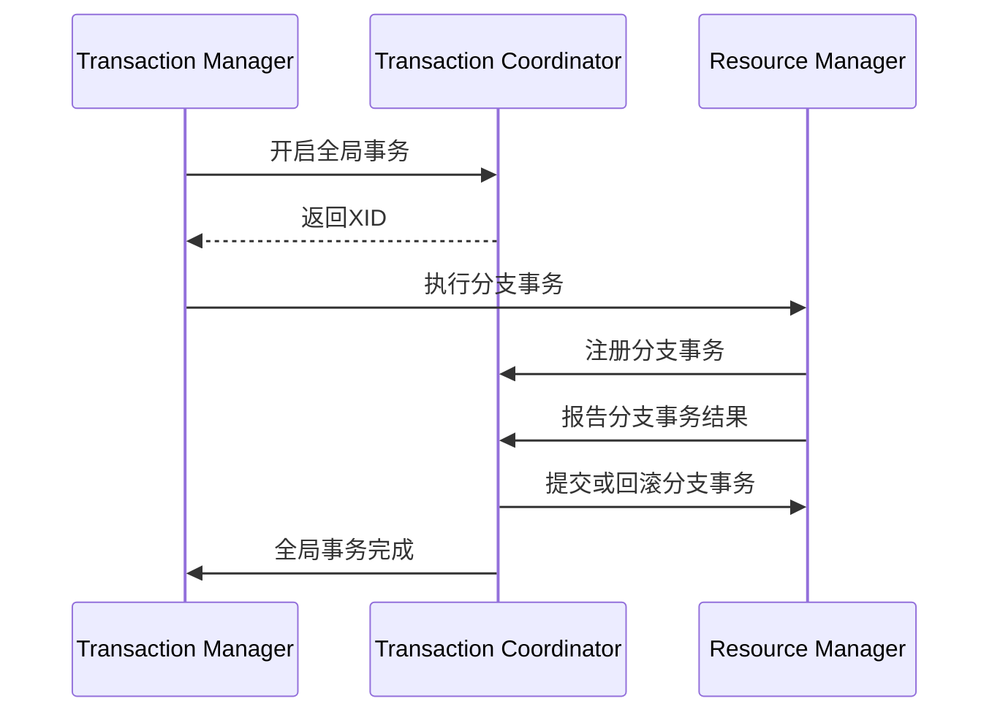

# Seata 工作原理

## 介绍

Seata（Simple Extensible Autonomous Transaction Architecture）是一个开源的分布式事务解决方案，旨在解决微服务架构下的分布式事务问题。它通过提供全局事务管理、分支事务管理和事务日志存储等功能，确保多个微服务之间的数据一致性。本文将详细介绍Seata的工作原理，帮助你理解其核心机制。

## Seata 的核心组件

Seata的核心组件包括：

1. **Transaction Coordinator (TC)**：事务协调器，负责全局事务的提交和回滚。
2. **Transaction Manager (TM)**：事务管理器，负责开启、提交或回滚全局事务。
3. **Resource Manager (RM)**：资源管理器，负责管理分支事务的资源，如数据库连接。

## Seata 的工作流程

Seata的工作流程可以分为以下几个步骤：

1. **全局事务的开启**：TM向TC发起全局事务的开启请求，TC生成一个全局事务ID（XID）。
2. **分支事务的注册**：RM向TC注册分支事务，并将XID传递给RM。
3. **分支事务的执行**：RM执行本地事务，并将执行结果报告给TC。
4. **全局事务的提交或回滚**：TC根据所有分支事务的执行结果，决定全局事务是提交还是回滚。



## 代码示例

以下是一个简单的Seata使用示例，展示了如何在Spring Boot项目中集成Seata。

```java
@RestController
public class OrderController {

    @Autowired
    private OrderService orderService;

    @PostMapping("/order")
    public String createOrder(@RequestBody Order order) {
        orderService.createOrder(order);
        return "Order created successfully";
    }
}

@Service
public class OrderService {

    @GlobalTransactional
    public void createOrder(Order order) {
        // 调用库存服务
        inventoryService.decreaseStock(order.getProductId(), order.getQuantity());
        // 调用账户服务
        accountService.deductBalance(order.getUserId(), order.getAmount());
        // 保存订单
        orderRepository.save(order);
    }
}
```

在这个示例中，`@GlobalTransactional`注解用于标记一个全局事务。当`createOrder`方法被调用时，Seata会自动管理这个全局事务，确保所有分支事务（库存服务、账户服务和订单保存）要么全部提交，要么全部回滚。

## 实际应用场景

假设你正在开发一个电商系统，用户下单时需要同时减少库存、扣减账户余额并生成订单。如果任何一个操作失败，整个事务需要回滚，以确保数据的一致性。使用Seata可以轻松实现这一需求，避免手动处理复杂的分布式事务逻辑。

## 总结

Seata通过其核心组件（TC、TM、RM）和简洁的工作流程，为微服务架构下的分布式事务提供了强大的支持。通过本文的学习，你应该对Seata的工作原理有了初步的了解，并能够在实际项目中应用它来解决分布式事务问题。

## 附加资源

- [Seata官方文档](https://seata.io/zh-cn/docs/overview/what-is-seata.html)
- [Seata GitHub仓库](https://github.com/seata/seata)

## 练习

1. 尝试在本地环境中搭建一个简单的Seata项目，模拟一个分布式事务场景。
2. 修改代码，使其在某个分支事务失败时触发全局事务回滚，观察系统的行为。

:::tip
在学习和使用Seata时，建议先从简单的场景入手，逐步深入理解其工作机制和配置细节。
:::